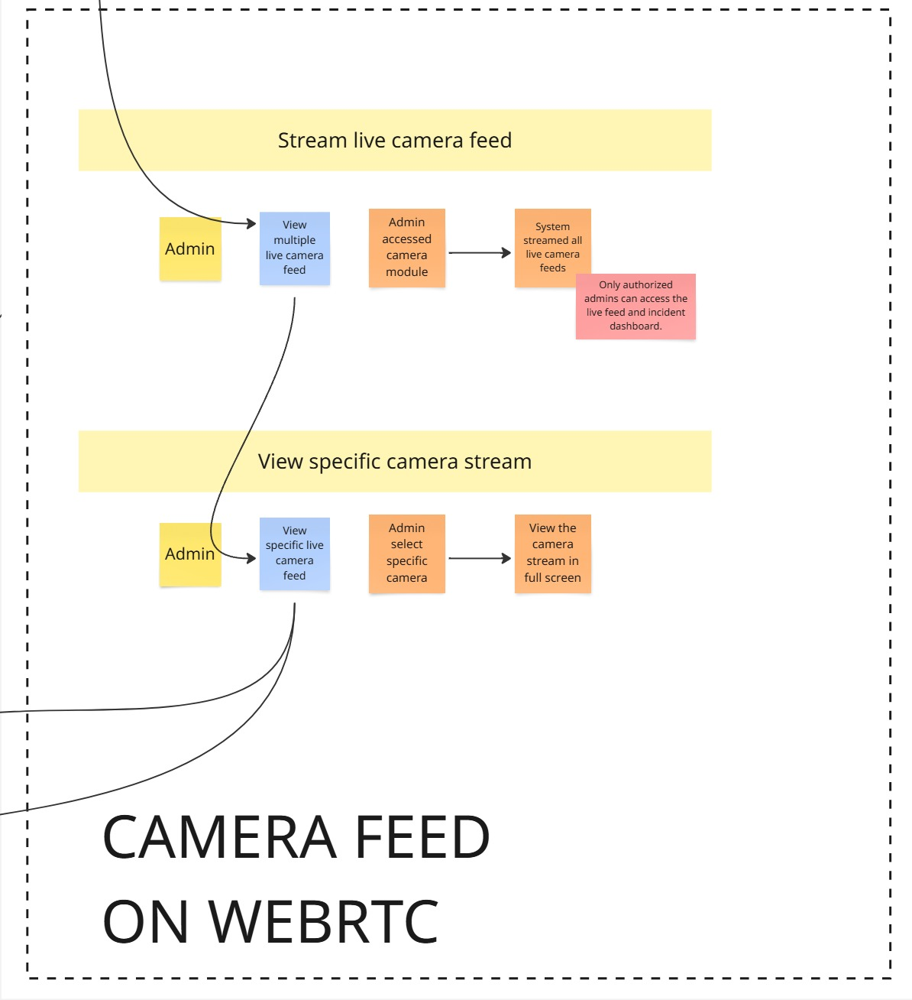
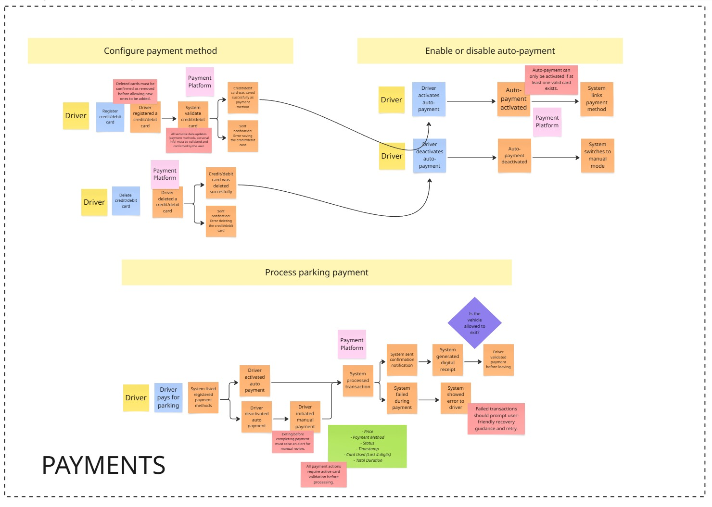
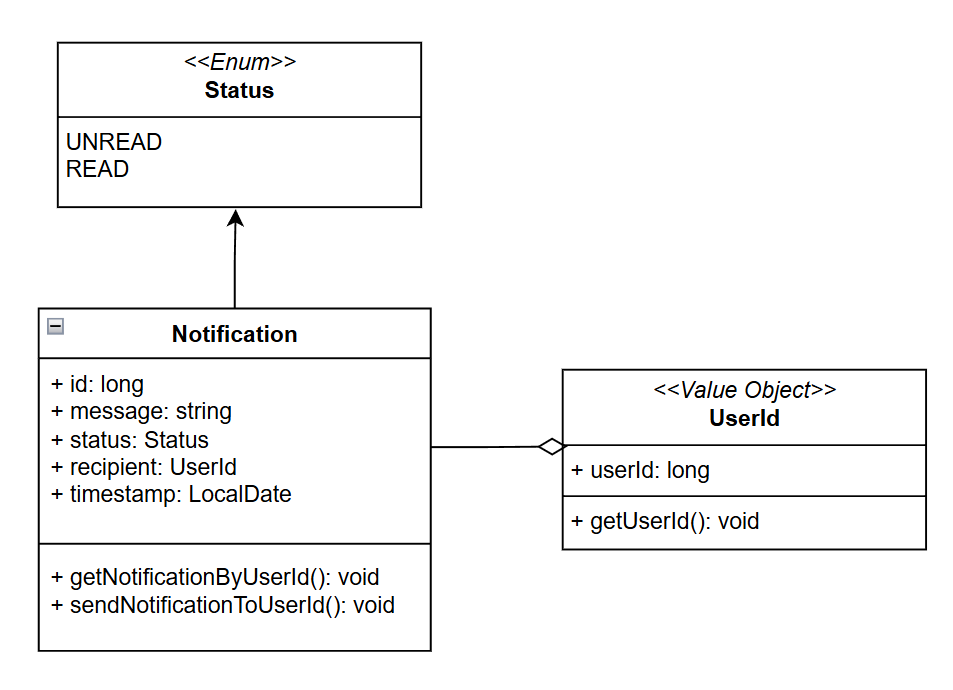
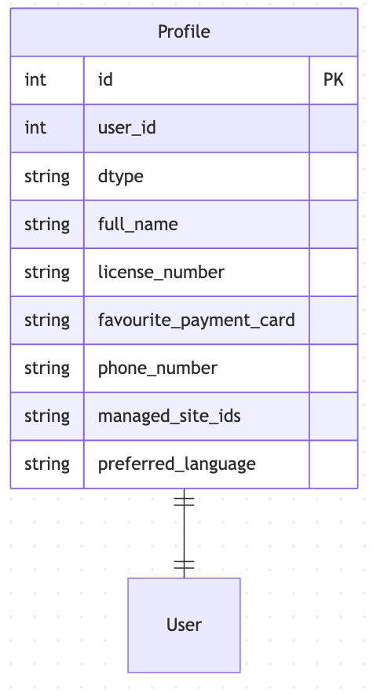

    <strong>Universidad Peruana de Ciencias Aplicadas</strong> 
     </img> 
     
    <strong>Ingeniería de Software - 2025-01</strong> 
     
    <strong>1ASI0572 - DESARROLLO DE SOLUCIONES IOT - 2941</strong>   
     
    <strong>Profesor: Marco Antonio Leon Baca</strong> 
      <strong>INFORME DE TRABAJO 1 - TB1</strong> 

    <strong>Startup: Find&Park</strong> 
    <strong>Producto: ParkUp</strong>

<h3 align="center" >Team Members:</h3>

    <table align="center">
        <tr>
            <th style="text-align:center;">Miembro</th>
            <th style="text-align:center;">Código</th>
        </tr>
        <tr>
            <td>Vargas Revollé, Ariana</td>
            <td>u20221a928</td>
        </tr>
        <tr>
            <td>Obispo Rios, Lucero Abigail</td>
            <td>u202111465</td>
        </tr>
        <tr>
            <td>Cuevas Rios, Eric Fernando</td>
            <td>u202112766</td>
        </tr>
        <tr>
            <td>Elsner De La Torre Ugarte, Julio Esteban</td>
            <td>u202211654</td>
        </tr>
        <tr>
            <td>Herrera González, Luis Eduardo</td>
            <td>u202218227</td>
        </tr>
    </table>

 

---

# Registro de Versiones del Informe

| Versión | Fecha | Autor | Descripción de modificación | 
|:-------:|:-----:|:-----:|:----------------------------| 
|TB1| 25/05/25  |   Vargas Revollé, Ariana   Obispo Rios, Lucero Abigail   Cuevas Rios, Eric Fernando   Elsner De La Torre Ugarte, Julio Esteban   Herrera González, Luis Eduardo    | Investigación de mercado y del problema, obtención y análisis de requisitos, especificación de requisitos, y diseño de la solución de software.                           |
|TP| 15/05/25  |   Vargas Revollé, Ariana   Obispo Rios, Lucero Abigail   Cuevas Rios, Eric Fernando   Elsner De La Torre Ugarte, Julio Esteban   Herrera González, Luis Eduardo    | Diseño de la solución UX/UI. Implementación, validación y despliegue del producto para el Sprint 1.                          |
|TB2| 21/06/2025  |   Vargas Revollé, Ariana   Obispo Rios, Lucero Abigail   Cuevas Rios, Eric Fernando   Elsner De La Torre Ugarte, Julio Esteban   Herrera González, Luis Eduardo    | Desarrollo de las aplicaciones de la solucion y despliegue para el sprint 2             |

---

# Contenido
## Tabla de Contenidos
### [Registro de versiones del informe](#registro-de-versiones-del-informe)
### [Contenido](#contenido)
### [Student Outcome](#student-outcome)
### [Capítulo I: Presentación](#capítulo-i-presentación)
- [1.1. Startup Profile](#11-startup-profile)
    - [1.1.1. Descripción de la Startup](#111-descripción-de-la-startup)
    - [1.1.2. Perfiles de integrantes del equipo](#112-perfiles-de-integrantes-del-equipo)
- [1.2. Solution Profile](#12-solution-profile)
    - [1.2.1. Antecedentes y problemática](#121-antecedentes-y-problemática)
    - [1.2.2. Lean UX Process](#122-lean-ux-process)
        - [1.2.2.1. Lean UX Problem Statements](#1221-lean-ux-problem-statements)
        - [1.2.2.2. Lean UX Assumptions](#1222-lean-ux-assumptions)
        - [1.2.2.3. Lean UX Hypothesis Statements](#1223-lean-ux-hypothesis-statements)
        - [1.2.2.4. Lean UX Canvas](#1224-lean-ux-canvas)
- [1.3. Segmentos objetivo](#13-segmentos-objetivo)

### [Capítulo II: Needfinding](#capítulo-ii-needfinding)
- [2.1. Competidores](#21-competidores)
    - [2.1.1. Análisis competitivo](#211-análisis-competitivo)  
    - [2.1.2. Estrategias y tácticas frente a competidores](#212-estrategias-y-tácticas-frente-a-competidores)
- [2.2. Entrevistas](#22-entrevistas)
    - [2.2.1. Diseño de entrevistas](#221-diseño-de-entrevistas)
    - [2.2.2. Registro de entrevistas](#222-registro-de-entrevistas)
    - [2.2.3. Análisis de entrevistas](#223-análisis-de-entrevistas)
- [2.3. Needfinding](#23-needfinding)
    - [2.3.1. User Personas](#231-user-personas)
    - [2.3.2. User Task Matrix](#232-user-task-matrix)
    - [2.3.3. User Journey Mapping](#233-user-journey-mapping)
    - [2.3.4. Empathy Mapping](#234-empathy-mapping)
    - [2.3.5. As-is Scenario Mapping](#235-as-is-scenario-mapping)
- [2.4. Ubiquitous Language](#24-ubiquitous-language)

### [Capítulo III: Requirements Specification](#capítulo-iii-requirements-specification)
- [3.1. To-Be Scenario Mapping](#31-to-be-scenario-mapping)
- [3.2. User Stories](#32-user-stories)
- [3.3. Impact Mapping](#33-impact-mapping)
- [3.4. Product Backlog](#34-product-backlog)

### [Capítulo IV: Solution Software Design](#capítulo-iv-solution-software-design)
- [4.1. Strategic-Level Domain-Driven Design](#41-strategic-level-domain-driven-design)
    - [4.1.1. EventStorming](#411-eventstorming)
        - [4.1.1.1. Candidate Context Discovery](#4111-candidate-context-discovery)
        - [4.1.1.2 Domain Message Flows Modeling](#4112-domain-message-flows-modeling)
        - [4.1.1.3 Bounded Context Canvases](#4112-bounded-context-canvases)
    - [4.1.2. Context Mapping](#412-context-mapping)
    - [4.1.3. Software Architecture](#413-software-architecture)
      - [4.1.3.1. Software Architecture System Landscape Diagram](#4131-software-architecture-system-landscape-diagram)
      - [4.1.3.2. Software Architecture Context Level Diagrams](#4132-software-architecture-context-level-diagrams)
      - [4.1.3.3. Software Architecture Container Level Diagrams](#4133-software-architecture-container-level-diagrams)
      - [4.1.3.4. Software Architecture Deployment Diagrams](#4124-software-architecture-deployment-diagrams)
- [4.2.X. Bounded Context: <Bounded Context Name>](#42X-bounded-context-bounded-context-name)
    - [4.2.X.1. Domain Layer](#42X1-domain-layer)
    - [4.2.X.2. Interface Layer](#42X2-interface-layer)
    - [4.2.X.3. Application Layer](#42X3-application-layer)
    - [4.2.X.4. Infrastructure Layer](#42X4-application-layer)
    - [4.2.X.5. Bounded Context Software Architecture Component Level Diagrams](#42X5-bounded-context-software-architecture-component-level-diagrams)
    - [4.2.X.6. Bounded Context Software Architecture Code Level Diagrams](#42X6-bounded-context-software-architecture-code-level-diagrams)
      - [4.2.X.6.1, Bounded Context Domain Layer Class Diagrams](#42X61-bounded-context-domain-layer-class-diagrams)
      - [4.2.X.6.2, Bounded Context Database Design Diagram](#42X62-bounded-context-database-design-diagram)

### [Capítulo V: Solution UI/UX Design](#capítulo-v-solution-ui-ux-design)
- [5.1. Style Guidelines](#51-style-guidelines)
  - [5.1.1. General Style Guidelines](#511-general-style-guidelines)
  - [5.1.2. Web, Mobile and IoT Style Guidelines](#512-web-mobile-and-iot-style-guidelines)
- [5.2. Information Architecture](#52-information-architecture)
  - [5.2.1. Organization Systems](#521-organization-systems)
  - [5.2.2. Labeling Systems](#522-labeling-systems)
  - [5.2.3. SEO Tags and Meta Tags](#523-seo-tags-and-meta-tags)
  - [5.2.4. Searching Systems](#524-searching-systems)
  - [5.2.5. Navigation Systems](#525-navigation-systems)
- [5.3. Landing Page UI Design](#53-landing-page-ui-design)
  - [5.3.1. Landing Page Wireframe](#531-landing-page-wireframe)
  - [5.3.2. Landing Page Mock-up](#532-landing-page-mock-up)
- [5.4. Applications UX/UI Design](#54-applications-ux-ui-design)
  - [5.4.1. Applications Wireframes](#541-applications-wireframes)
  - [5.4.2. Applications Wireflow Diagrams](#542-applications-wireflow-diagrams)
  - [5.4.3. Applications User Flow Diagrams](#543-applications-user-flow-diagrams)
- [5.5. Applications Prototyping](#55-applications-prototyping)

### [Capítulo VI: Product Implementation & Validation](#capítulo-vi-product-implementation-validation)
- [6.1. Software Configuration Management](#61-software-configuration-management)
    - [6.1.1. Software Development Environment Configuration](#611-software-development-environment-configuration)
    - [6.1.2. Source Code Management](#612-source-code-management)
    - [6.1.3. Source Code Style Guide & Conventions](#613-source-code-style-guide-conventions)
    - [6.1.4. Software Deployment Configuration](#614-software-deployment-configuration)
- [6.2. Landing Page, Services & Applications Implementation](#62-landing-page-services-applications-implementation)
    - [6.2.1. Sprint 1](#621-sprint-1)
        - [6.2.1.1. Sprint Planning 1](#6211-sprint-planning-1)
        - [6.2.1.2. Aspect Leaders and Collaborators](#6212-aspect-leaders-and-collaborators)
        - [6.2.1.3. Sprint Backlog 1](#6213-sprint-backlog-1)
        - [6.2.1.4. Development Evidence for Sprint Review](#6214-development-evidence-for-sprint-review)
        - [6.2.1.5. Testing Suite Evidence for Sprint Review](#6215-testing-suite-evidence-for-sprint-review)
        - [6.2.1.6. Execution Evidence for Sprint Review](#6216-execution-evidence-for-sprint-review)
        - [6.2.1.7. Services Documentation Evidence for Sprint Review](#6217-services-documentation-evidence-for-sprint-review)
        - [6.2.1.8. Software Deployment Evidence for Sprint Review](#6218-software-deployment-evidence-for-sprint-review)
        - [6.2.1.9. Team Collaboration Insights during Sprint](#6219-team-collaboration-insights-during-sprint)
  - [6.2.2. Sprint 2](#622-sprint-2)
      - [6.2.2.1. Sprint Planning 2](#6221-sprint-planning-2)
      - [6.2.2.2. Aspect Leaders and Collaborators](#6222-aspect-leaders-and-collaborators)
      - [6.2.2.3. Sprint Backlog 2](#6223-sprint-backlog-2)
      - [6.2.2.4. Development Evidence for Sprint Review](#6224-development-evidence-for-sprint-review)
      - [6.2.2.5. Testing Suite Evidence for Sprint Review](#6225-testing-suite-evidence-for-sprint-review)
      - [6.2.2.6. Execution Evidence for Sprint Review](#6226-execution-evidence-for-sprint-review)
      - [6.2.2.7. Services Documentation Evidence for Sprint Review](#6227-services-documentation-evidence-for-sprint-review)
      - [6.2.2.8. Software Deployment Evidence for Sprint Review](#6228-software-deployment-evidence-for-sprint-review)
      - [6.2.2.9. Team Collaboration Insights during Sprint](#6229-team-collaboration-insights-during-sprint)
- [6.3. Validation Interviews](#63-validation-interviews)
    - [6.3.1. Diseño de Entrevistas](#631-diseno-de-entrevistas)
    - [6.3.2. Registro de Entrevistas](#632-registro-de-entrevistas)
    - [6.3.3. Evaluaciones según Heurísticas](#633-evaluaciones-segun-heuristicas)
- [6.4. Video About the Product](#64-video-about-the-product)

### [Conclusiones](#conclusiones)
- [Conclusiones y Recomendaciones](#conclusiones-y-recomendaciones)
- [Video About-the-Team](#video-about-the-team)
### [Bibliografía](#bibliografía)
### [Anexos](#anexos)

---

# Student Outcome

    
El curso contribuye al cumplimiento del Student Outcome ABET:

**ABET – EAC - Student Outcome 5**

Criterio: La capacidad de funcionar efectivamente en un equipo cuyos miembros juntos proporcionan liderazgo, crean un entorno de colaboración e inclusivo, establecen objetivos, planifican tareas y cumplen objetivos. En el siguiente cuadro se describe las acciones realizadas y enunciados de conclusiones por parte del grupo, que permiten sustentar el haber alcanzado el logro del *ABET – EAC - Student Outcome 5.*

| Criterio específico                                                                             | Acciones realizadas                                                                                                                                                                                                                                                                                                                                                                                                                                                                                                                                                                                                                                                                                                                                                                                                                                                                                                                                                                                                                                                   | Conclusiones                                                                                                                                                                                                                                                                                                                                                                                                                    |
| ----------------------------------------------------------------------------------------------- | --------------------------------------------------------------------------------------------------------------------------------------------------------------------------------------------------------------------------------------------------------------------------------------------------------------------------------------------------------------------------------------------------------------------------------------------------------------------------------------------------------------------------------------------------------------------------------------------------------------------------------------------------------------------------------------------------------------------------------------------------------------------------------------------------------------------------------------------------------------------------------------------------------------------------------------------------------------------------------------------------------------------------------------------------------------------- | ------------------------------------------------------------------------------------------------------------------------------------------------------------------------------------------------------------------------------------------------------------------------------------------------------------------------------------------------------------------------------------------------------------------------------- |
| Trabaja en equipo para proporcionar liderazgo en forma conjunta                                 | **Obispo Rios, Lucero Abigail**:  TB1 Participar en reuniones de equipo para definir el alcance del proyecto y la arquitectura.  TP El desarrollo de las guías de estilo y la arquitectura de información permitió establecer una base sólida para la Landing Page y Página Web, asegurando coherencia visual y una navegación intuitiva. Se logró aplicar buenas prácticas de SEO y diseño responsive, cumpliendo con los estándares definidos.  TB2 Desarrollé la aplicación móvil, desde el diseño de pantallas hasta la integración con los servicios backend, implementando funcionalidades principales y validando su funcionamiento en conjunto con el equipo.  **Cuevas Rios, Eric Fernando**:  TB1 Participar en la repartición de tareas así como en el diseño y formulación del proyecto.  TP Se apoyó en el desarrollo del wireframe y mock-up de la Landing Page, y validándolo con feedback del equipo.  TB2 Mejoré la web app, implementando nuevas funcionalidades y optimizando la experiencia de usuario, asegurando la integración de los módulos desarrollados durante este sprint.  **Vargas Revollé, Ariana**:  TB1 Desarrollo del análisis competitivo y colaboré en decisiones estratégicas, facilitando acuerdos y direccionando al equipo hacia objetivos comunes durante el diseño de la solución.  TP Desarrollé los wireframes y mockups de la Página Web, considerando los requerimientos de usabilidad y experiencia de usuario.  TB2 Desarrollé el backend, definiendo la arquitectura de los servicios, modelos y endpoints necesarios para la integración de la web app, mobile app y edge node. Resolví retos técnicos para garantizar la escalabilidad y seguridad del sistema.  **Elsner De La Torre Ugarte, Julio Esteban**:  TB1 Brindar ideas en reuniones cada semana del equipo con la finalidad de realizar retroalimentación y mejora de aspectos del informe.  TP Se diseñaron los wireflows y userflows, garantizando una experiencia intuitiva. Se compartieron los flujos con el equipo para recibir feedback.  TB2 Desarrollé el edge node encargado de la comunicación entre los dispositivos IoT y el backend, asegurando su correcto funcionamiento e integración dentro del sistema.  **Herrera González, Luis Eduardo**:  TB1 Coordiné reuniones y tareas para agilizar el avance del proyecto, promoví la participación y acuerdos del equipo para mejorar el informe y cumplir los objetivos.  TP Se configuró el entorno de desarrollo y se gestionó el control de versiones con Git, evitando conflictos en el código. Los despliegues se realizaron sin errores gracias a la documentación.  TB2 Desarrollé el código de los dispositivos IoT, implementando la comunicación con el edge node y el backend, y asegurando el monitoreo y registro de datos en tiempo real.   | TB1: Todos los integrantes participaron activamente en reuniones de equipo, aportando ideas, colaborando en la toma de decisiones estratégicas y facilitando acuerdos. Esto fortaleció el liderazgo conjunto y permitió dirigir al grupo hacia objetivos claros y comunes, asegurando así una coordinación efectiva en el diseño y desarrollo del proyecto.  TP: En el Sprint #1 se logró implementar con éxito la landing page y página web funcional. El equipo trabajó coordinadamente para integrar las funcionalidades core alineadas a los requisitos funcionales de valor para los usuarios finales. La colaboración permitió resolver desafíos técnicos y alinear los diferentes aspectos del proyecto, desde el diseño hasta la implementación final.  TB2: Durante este sprint se logró la integración completa de los diferentes módulos del sistema, incluyendo mejoras en la web app, el desarrollo de la aplicación móvil, la creación del backend, el edge node y la programación de los dispositivos IoT. El trabajo conjunto y la comunicación constante permitieron entregar una solución robusta y funcional, alineada a los objetivos propuestos y lista para pruebas en un entorno real.  |
| Crea un entorno colaborativo e inclusivo, establece metas, planifica tareas y cumple objetivos. | **Obispo Rios, Lucero Abigail**:  TB1 Participar en el proceso de asignación de tareas y cumplir con las actividades asignadas en relación a las entrevistas, To-Be y As-Is Scenario Mapping, Journey Mapping, Historias de Usuario, EventStorming, entre otros.  TP Participé activamente en las sesiones de arquitectura de información, aportando ideas para los sistemas de navegación y etiquetado SEO que mejoraron la usabilidad del proyecto.  TB2 Planifiqué y organicé el desarrollo de la aplicación móvil, asignando tareas prioritarias y asegurando la colaboración del equipo para cumplir los objetivos establecidos en el sprint.  **Cuevas Rios, Eric Fernando**:  TB1 Realicé los puntos asignados, siendo estos los bounded context de Monitoring y ticket validation, así como el software configuration management.  TP Documenté el proceso de despliegue, configuración e implementación, para replicar estos procesos fácilmente y sin errores para el próximo sprint.  TB2 Organicé y documenté las mejoras de la web app, gestionando las prioridades y asegurando el cumplimiento de los entregables definidos.  **Vargas Revollé, Ariana**:  TB1 Contribuí a la planificación de tareas clave como el Impact Mapping, entrevistas y definición de contextos, asegurando un ambiente de trabajo inclusivo y la entrega puntual de resultados.  TP Trabajé en conjunto con el equipo de desarrollo para diseñar los mockups e implementar funcionalidades core en la aplicación web.  TB2 Organicé las tareas relacionadas al backend, planificando sprints cortos para garantizar entregas continuas y fomentando la colaboración entre los distintos módulos.  **Elsner De La Torre Ugarte, Julio Esteban**:  TB1 Elaboré con mis compañeros el proceso de event storming, AS-IS, C4, entre otros procesos clave para la culminación de la TB1.  TP Diseñé los wireflows y diagramas de flujo de usuario que guiaron la implementación de las interfaces de la aplicación.  TB2 Planifiqué y coordiné el desarrollo del edge node, gestionando las tareas y asegurando la integración efectiva con los dispositivos IoT y el backend.  **Herrera González, Luis Eduardo**:  TB1 Organicé y planifiqué tareas clave, establecí metas claras y aseguré un entorno de trabajo inclusivo para cumplir con los objetivos del proyecto.  TP Colaboré en la implementación y despliegue de la página web, asegurando que el diseño final coincidiera con los prototipos aprobados.  TB2 Gestioné el desarrollo del software para los dispositivos IoT, asegurando la planificación y cumplimiento de entregables, y promoviendo la colaboración técnica con los demás módulos del sistema.   | TB1: Cada miembro del equipo contribuyó en la planificación, asignación y cumplimiento de tareas específicas, promoviendo un ambiente inclusivo y de trabajo colaborativo. La participación activa en actividades como entrevistas, EventStorming, mapeos de escenarios y definición de contextos permitió alcanzar los objetivos propuestos de manera puntual y organizada, fortaleciendo la eficiencia y cohesión del equipo.  TP: El despliegue exitoso de la landing page y página web se logró mediante una planificación colaborativa donde cada integrante aportó con sus habilidades. Se establecieron metas claras para el diseño, desarrollo e implementación, cumpliendo con los objetivos planteados para este sprint inicial.  TB2: La colaboración continua y la planificación estructurada permitieron cumplir los objetivos del sprint, integrando de manera efectiva los nuevos módulos al sistema. El ambiente inclusivo, la comunicación y la responsabilidad en el seguimiento de tareas fueron claves para lograr una solución integral y lista para pruebas funcionales. |

# Capítulo I: Presentación

## 1.1. Startup Profile

### 1.1.1. Descripción de la Startup

En el contexto actual de crecimiento urbano y aumento del parque automotor, encontrar estacionamiento se ha convertido en una experiencia tediosa, lenta e ineficiente para miles de conductores en ciudades como Lima. La mayoría de soluciones tradicionales aún dependen de tickets físicos, interacciones manuales y procesos poco claros que afectan directamente la comodidad del usuario.

**ParkUp** nace como una respuesta a este problema. Es una aplicación móvil peruana que transforma por completo la experiencia de estacionamiento, integrando tecnología de lectura de placas, vinculación inteligente entre QR, vehículo y usuario, y un sistema de pago completamente automatizado. Todo esto se realiza sin necesidad de sacar el celular, después del escaneo inicial. ParkUp reduce los tiempos de entrada, elimina errores y simplifica el proceso de estacionarse con una interfaz moderna y centrada en el usuario.

La propuesta de valor de ParkUp se diferencia claramente de otras aplicaciones disponibles en el mercado peruano, ofreciendo una experiencia sin contacto, eficiente y totalmente digital, adaptada a la vida urbana moderna.  
  
Misión:  
Facilitar y modernizar la experiencia de estacionamiento en entornos urbanos mediante soluciones tecnológicas automatizadas, seguras y sin contacto, que integren al usuario con el sistema de manera intuitiva, eficiente y confiable.  

Visión:  
Convertirnos en la plataforma líder de estacionamiento inteligente en Perú, siendo referentes en innovación, automatización y experiencia de usuario, para transformar la manera en que las personas se movilizan y estacionan.  

### 1.1.2. Perfiles de integrantes del equipo 

| Foto | Perfil de Integrante |
|------|----------------------|
| 

 | 
<strong>Obispo Rios, Lucero Abigail</strong>    <em>U202111465 - Ingeniería de Software</em>     Para este proyecto, puedo aportar mis habilidades de redacción, diseño y programación. Además, estoy dispuesta a capacitarme con las herramientas que se consideren necesarias. Por otro lado, me considero una persona responsable y comprometida con el proyecto.
 |
| 

 | 
<strong>Vargas Revollé, Ariana</strong>    <em>U20221A928 - Ingeniería de Software</em>     Me interesa el rubro de ciberseguridad y me gusta leer sobre nuevas tecnologías y su impacto en la vida de las personas. Me gusta trabajar en equipo y aprender de otras personas.
 |
| 

 | 
<strong>Cuevas Rios, Eric Fernando</strong>    <em>U202112766 - Ingeniería de Software</em>     Soy capaz de brindar mi experiencia en redacción, diseño de soluciones y programación móvil para ayudar a obtener las metas del grupo. Además, soy bueno brindando puntualidad y organización a los proyectos de los que tomo parte, lo que espero sirva al resto de mis compañeros de equipo.
 |
| 

 | 
<strong>Elsner De La Torre Ugarte, Julio Esteban</strong>    <em>U202111654 - Ingeniería de Software</em>     Para este proyecto, puedo aportar con habilidades de indagación y pensamiento crítico, diseño de prototipo en Figma y programación back-End. Añadido a esto, me es grato poder aprender de mis demás compañeros y de sus habilidades individuales. Me considero una persona responsable y que cumple con los plazos establecidos en una entrega.
 |
| 

 | 
<strong>Herrera González, Luis Eduardo</strong>    <em>U202218227 - Ingeniería de Software</em>     Soy estudiante del séptimo ciclo de la carrera de Ingeniería de Software. Me apasiona el desarrollo de aplicaciones web y de escritorio eficientes, utilizando tecnologías modernas como Bun, Tauri y Lit. También cuento con experiencia en frameworks ampliamente adoptados como Next.js, Angular y Spring Boot. Además, tengo un gran interés en el área de Machine Learning, trabajando con CUDA, C++ y MLX para crear soluciones de alto rendimiento. Me considero una persona curiosa, enfocada en la innovación tecnológica y comprometida a aportar mis habilidades técnicas para el éxito del equipo.
 |
                                        

## 1.2. Solution Profile

### 1.2.1. Antecedentes y problemática  

##### 1. Who (¿Quién?)
Conductores urbanos en Perú, especialmente en Lima Metropolitana, que necesitan estacionar de manera rápida, eficiente y sin complicaciones. También incluye operadores de playas de estacionamiento interesados en digitalizar y automatizar sus procesos.

##### 2. What (¿Qué?)
Una aplicación móvil que automatiza la experiencia de estacionamiento mediante lectura de placas, vinculación digital entre vehículo y usuario, y pago sin contacto. Desde el ingreso hasta la salida, el proceso es rápido, seguro y sin necesidad de intervención manual.

##### 3. When (¿Cuándo?)
En el momento en que el conductor necesita ingresar, estacionar o salir de un establecimiento. ParkUp opera en tiempo real, desde que el usuario escanea un QR para iniciar la experiencia, hasta que se le autoriza la salida sin tener que usar su celular nuevamente.

##### 4. Where (¿Dónde?)
En playas de estacionamiento privadas o públicas ubicadas en zonas urbanas de Lima y, próximamente, en otras ciudades del Perú. También se accede desde cualquier dispositivo móvil (iOS o Android).

##### 5. Why (¿Por qué?)
Porque el proceso actual de estacionamiento es lento, anticuado y genera fricciones innecesarias. ParkUp ofrece una alternativa moderna y automatizada que mejora la experiencia del usuario y optimiza la operación para los dueños de los estacionamientos.

##### 6. How (¿Cómo?)
- El usuario escanea un QR al llegar.
- El sistema vincula automáticamente su placa, usuario y sesión.
- Al estacionarse, se valida su presencia con lectura de placa.
- El usuario puede pagar automáticamente o convalidar/pagar manualmente.
- Sale del estacionamiento sin necesidad de tickets ni intervención adicional.

##### 7. How much (¿Cuánto?)
El uso de ParkUp puede ser gratuito para el usuario final (dependiendo del modelo de negocio), mientras que el operador del estacionamiento paga una comisión por transacción o un plan mensual por digitalizar su sistema. El costo para el usuario es el mismo que pagaría tradicionalmente, pero con mejor experiencia.  

### 1.2.2. Lean UX Process

#### 1.2.2.1. Lean UX Problem Statements

El problema se presenta cuando los conductores en zonas urbanas del Perú deben enfrentarse a procesos de estacionamiento poco eficientes, con sistemas manuales, colas, tickets físicos, métodos de pago limitados y una experiencia general poco amigable.

Actualmente, el mercado peruano carece de soluciones de estacionamiento verdaderamente automatizadas que permitan una experiencia fluida, sin contacto, rápida y vinculada a la tecnología móvil y sistemas IoT.

ParkUp busca aprovechar esta oportunidad, ofreciendo una solución moderna que transforma radicalmente la experiencia de estacionarse, al digitalizar por completo el proceso: desde la lectura de placas y vinculación del usuario, hasta el pago y salida.

Hemos observado que los usuarios valoran cada vez más la comodidad y rapidez en sus desplazamientos. La experiencia actual de estacionamiento representa una fricción innecesaria en su día a día, mientras que los operadores de playas buscan alternativas para optimizar sus operaciones y digitalizar su infraestructura.

**Pregunta clave:**
¿Cómo podemos automatizar, simplificar y mejorar la experiencia de estacionamiento urbano para los conductores peruanos a través de tecnología sin contacto, moderna e intuitiva?

#### 1.2.2.2. Lean UX Assumptions  

## Business Assumptions

1. **Creemos que nuestros clientes necesitan:**  
Una manera eficiente, rápida y sin contacto para estacionar su vehículo sin depender de tickets ni procesos manuales.

2. **Estas necesidades se pueden resolver con:**  
Una app que automatiza el ingreso, pago y salida del estacionamiento mediante lectura de placas, escaneo de QR y confirmación automática de estacionamiento.

3. **Nuestros clientes iniciales son:**  
Conductores entre 20 y 45 años en zonas urbanas (principalmente Lima), con uso activo de smartphones y afinidad por soluciones digitales. También operadores de playas de estacionamiento que buscan digitalizar sus operaciones.

4. **El valor #1 que un cliente quiere obtener de nuestro servicio es:**  
Rapidez, comodidad y una experiencia completamente sin contacto al estacionar.

5. **El cliente también puede tener estos beneficios adicionales:**  
- Acceso a promociones o beneficios por uso frecuente.  
- Seguimiento de historial de estacionamientos y gastos.  
- Posibilidad de recibir recomendaciones de zonas con alta disponibilidad.

6. **Vamos a adquirir la mayoría de nuestros clientes a través de:**  
Marketing digital (Instagram, TikTok, YouTube), alianzas con playas de estacionamiento y activaciones presenciales.

7. **Haremos dinero a través de:**  
Comisiones por transacción de pago, planes de suscripción mensual para operadores, y potencial venta de soluciones integradas (software + hardware IoT).

8. **Nuestra principal competencia en el mercado será:**  
Otras apps de estacionamiento como Apparka y Parkealo. Los superaremos gracias a nuestra propuesta de automatización total y experiencia sin contacto desde el ingreso hasta la salida.

9. **El mayor riesgo del producto es:**  
Resistencia al cambio por parte de operadores tradicionales y poca educación digital en algunos usuarios.

10. **Resolveremos esto a través de:**  
Una interfaz extremadamente intuitiva, onboarding simple, pilotos en zonas de alta rotación vehicular y soporte técnico continuo a operadores.

## User Assumptions

- **¿Quién es el usuario?**  
Conductores entre 20 y 45 años con acceso a smartphones, que se mueven frecuentemente en zonas urbanas de alta congestión vehicular.

- **¿Dónde encaja nuestro producto en su vida?**  
Se integra en su rutina diaria de transporte y estacionamiento, eliminando una de las partes más tediosas del día: buscar dónde y cómo estacionar.

- **¿Qué problemas resuelve nuestro producto?**  
Falta de automatización, pérdida de tiempo al ingresar/salir, pagos manuales, tickets físicos, falta de información en tiempo real y métodos de pago limitados.

- **¿Cuándo y cómo se utiliza nuestro producto?**  
Desde el momento en que se acerca al estacionamiento: escanea el QR, se le lee la placa, se confirma el ingreso, se valida el estacionamiento y se paga al salir (o automáticamente si está configurado).

- **¿Qué características son importantes?**  
Automatización, seguridad, precisión en lectura de placas, rapidez, facilidad de uso y compatibilidad con múltiples formas de pago.

- **¿Cómo debe verse y comportarse nuestro producto?**  
Moderno, confiable, limpio visualmente y tan intuitivo que requiera mínima intervención. Compatible con múltiples dispositivos y adaptable a diversos perfiles de usuario.

#### 1.2.2.3. Lean UX Hypothesis Statements

**Hypothesis Statement 01:**  
Creemos que los usuarios iniciales serán conductores entre 20 y 45 años con alto uso de tecnología, que estacionan regularmente en zonas de alta congestión urbana.  
Sabremos que hemos tenido éxito cuando este grupo represente al menos el 60% de los usuarios activos en nuestra app durante los primeros 6 meses.

**Hypothesis Statement 02:**  
Creemos que nuestros ingresos vendrán por una combinación de comisiones por transacción, suscripciones mensuales a operadores y venta de hardware IoT.  
Sabremos que hemos tenido éxito cuando el 30% de los estacionamientos afiliados estén usando un plan de suscripción y tengamos una conversión de al menos 50% de usuarios que pagan mediante la app.

**Hypothesis Statement 03:**  
Creemos que los usuarios valorarán altamente la experiencia de estacionamiento sin contacto, especialmente si no necesitan sacar su celular después del ingreso.  
Sabremos que hemos tenido éxito cuando al menos el 70% de usuarios completen el flujo completo sin necesidad de asistencia manual, y reporten una experiencia positiva en encuestas de satisfacción.

#### 1.2.2.4. Lean UX Canvas
  

  
## 1.3. Segmentos objetivo

Se plantearon 2 segmentos claramente diferenciados.
 
#### 1. Conductores Urbanos

##### Descripción del segmento:
- Personas entre 20 y 45 años.
- Se movilizan frecuentemente en ciudades como Lima Metropolitana.
- Poseen vehículo propio.
- Estacionan regularmente en centros comerciales, oficinas, clínicas, universidades u otras zonas de alta demanda.
- Son usuarios activos de smartphones y pagos digitales (Yape, Plin, tarjeta).

#### 2. Operadores de Estacionamientos

##### Descripción del segmento:
- Administradores o propietarios de playas de estacionamiento, edificios corporativos, centros comerciales o negocios con espacios de estacionamiento.
- Actualmente utilizan sistemas manuales o semiautomáticos.
- Buscan digitalizar y optimizar su operación.

# Capítulo II: Needfinding

## 2.1. Competidores

### 2.1.1. Análisis competitivo
  
| ¿Por qué llevar a cabo este análisis? | Conocer mejor a los competidores y visualizar las ventajas/desventajas que tenemos sobre ellos. |
|---------------------------------------|---------------------------------------------------------------------------|

|                                       | **ParkUp** | **Apparka** | **Parkealo** | **Parkner PE** |
|---------------------------------------|----------------|------------------|------------------|------------------|
| **Perfil**                            |                                                                                                                                                         |                                      |                                      |                                     |
| Overview                              | Aplicación móvil que automatiza el estacionamiento con lectura de placas, pagos automáticos y vinculación de usuarios. Ideal para conductores que buscan eficiencia. | App móvil con reservas y monedero digital.          | Marketplace para reservar estacionamientos.       | Plataforma de alquiler de espacios privados. |
| **Perfil de Marketing**               |                                                                                                                                                         |                                      |                                      |                                     |
| Ventaja competitiva                   | **Tecnología avanzada**: Proceso 100% automatizado (sin contacto). **Rapidez**: Reduce tiempos vs competidores. **Experiencia premium**: Interfaces intuitivas.      | Múltiples métodos de pago integrados.               | Conexión amplia con estacionamientos.            | Flexibilidad para alquilar espacios privados. |
| Mercado objetivo                      | Conductores en Lima que valoran tecnología, eficiencia y pagos sin fricciones.                                                                          | Conductores ocasionales y frecuentes.               | Propietarios y conductores.                      | Dueños de espacios y conductores en zonas premium. |
| Estrategias de marketing              | - Campañas en redes sociales destacando la automatización. - Alianzas con centros comerciales y empresas. - Programa de referidos con beneficios. | Publicidad en apps de movilidad.                    | Promoción en estacionamientos asociados.         | Enfoque en propietarios de espacios. |
| **Perfil de Producto**                |                                                                                                                                                         |                                      |                                      |                                     |
| Productos & Servicios                 | - App móvil con lectura de placas. - Pagos automáticos. - Integración con IoT.                                                                    | Reservas + "Apparka Wallet".                        | Reservas + gestión para propietarios.            | Alquiler de espacios privados.      |
| Precios & Costos                      | Tarifas dinámicas basadas en demanda. Costos operativos reducidos por automatización.                                                                   | Comisión por reserva.                               | Comisión por transacción.                        | Comisión por alquiler.              |
| Canales de distribución               | - App Android/iOS. - Integración con sistemas de estacionamientos.                                                                                   | App Android/iOS.                                    | App + web para gestión.                          | Plataforma web + app.               |
| **Análisis SWOT**                     |                                                                                                                                                         |                                      |                                      |                                     |
| Fortalezas                            | - Tecnología patentada. - Experiencia de usuario superior. - Red de socios estratégicos.                                                          | Monedero propio.                                    | Amplia base de estacionamientos.                 | Enfoque en espacios privados.       |
| Debilidades                           | - Dependencia de infraestructura IoT. - Menor reconocimiento de marca vs competidores.                                                               | Limitada a Lima.                                    | Interfaz menos intuitiva.                        | Cobertura geográfica reducida.      |
| Oportunidades                         | - Expansión a otras ciudades. - Integración con municipios para estacionamientos públicos.                                                           | Alianzas con bancos.                                | Crecimiento en segmento corporativo.             | Internacionalización.               |
| Amenazas                              | - Competidores con mayor financiamiento. - Resistencia al cambio por parte de usuarios tradicionales.                                                | Nuevos entrants con soluciones similares.           | Regulaciones municipales.                        | Saturación de mercado.              |
  
### 2.1.2. Estrategias y tácticas frente a competidores  

## Afrontando las fortalezas de nuestros competidores

### Fortalezas identificadas en los competidores:
- Amplia base de usuarios y presencia consolidada (ej. Apparka con Los Portales).
- Interfaces simples con información clara de tarifas y horarios.
- Variedad de métodos de pago y facilidad de uso.
- Disponibilidad en zonas céntricas y de alta demanda.

### Fortalezas propias de ParkUp:
- Flujo 100% automatizado: desde lectura de placa hasta pago sin intervención del usuario.
- Experiencia sin contacto y sin tickets.
- Vinculación inteligente entre QR, usuario y vehículo.
- Interfaz moderna orientada a usuarios tech-savvy.
- Posibilidad de integración con sistemas de parking y dispositivos IoT.

### Estrategia:
Desarrollar una ventaja basada en tecnología de automatización y UX fluida, que reduzca la fricción del usuario al mínimo, superando a las apps tradicionales que aún requieren intervención manual.

### Tácticas:
- Potenciar campañas que comuniquen la experiencia “sin sacar el celular” como propuesta de valor diferenciadora.
- Implementar mejoras constantes en lectura de placas y eficiencia del flujo de entrada/salida.
- Incluir comparativas visuales en redes sociales entre la experiencia ParkUp vs. tickets o apps tradicionales.

## Afrontando las oportunidades de nuestros competidores

### Oportunidades detectadas en el mercado:
- Expansión geográfica a más distritos y ciudades con alto tráfico.
- Alianzas con centros comerciales, supermercados, clínicas y universidades.
- Posibilidad de convertirse en plataforma de referencia para movilidad urbana.

### Oportunidades propias de ParkUp:
- Crecimiento de la demanda de soluciones sin contacto post-pandemia.
- Interés creciente en eficiencia tecnológica en ciudades como Lima.
- Nicho aún poco explotado de “parking inteligente” con automatización completa.

### Estrategia:
Expandir ParkUp como solución plug & play para estacionamientos medianos y pequeños que aún no están digitalizados, empezando por zonas donde otras apps no tienen cobertura.

### Tácticas:
- Identificar distritos con alta densidad vehicular pero baja presencia de apps de parking (ej. Lince, Surquillo, Breña).
- Ofrecer planes B2B a propietarios con sistemas antiguos para integrar ParkUp con hardware mínimo.
- Asistir a ferias de tecnología urbana y movilidad para visibilizar el modelo.
  
## Afrontando las amenazas de nuestros competidores

### Amenazas comunes del mercado:
- Dominio de marcas ya establecidas con alianzas estratégicas.
- Preferencia de usuarios por apps conocidas o vinculadas a marcas inmobiliarias.
- Sensibilidad al precio o al modelo tradicional de ticket físico.

### Amenazas particulares de ParkUp:
- Ser percibidos como “demasiado nuevo” o complejo en comparación a soluciones tradicionales.
- Requiere más educación del usuario sobre su modelo automatizado.

### Estrategia:
Adoptar una estrategia de comunicación educativa y experiencial, donde el usuario descubra el valor de ParkUp al vivirlo (más que solo leerlo).

### Tácticas:
- Crear contenido en redes mostrando el paso a paso de un usuario real usando ParkUp (incluyendo el "no sacar el celular").
- Incentivar recomendaciones con recompensas por referidos.
- Generar alianzas con pequeños operadores para mostrar casos de éxito reales.  
  
## 2.2. Entrevistas

Hacer entrevistas es fundamental porque permite ir más allá de suposiciones y conocer la realidad de los usuarios desde su propia voz. A través del diálogo directo, se descubren necesidades latentes, frustraciones no evidentes y oportunidades de mejora que no se pueden detectar solo con observación o datos cuantitativos. Las entrevistas aportan contexto, profundidad y empatía al proceso de diseño, asegurando que la solución tecnológica responda a problemas reales y sea aceptada por quienes la utilizarán.

### 2.2.1. Diseño de entrevistas

Diseñar las entrevistas de manera estructurada es importante porque permite obtener información clara, comparable y útil según el perfil de cada tipo de usuario. Un buen diseño garantiza que las preguntas estén alineadas con los objetivos del proyecto, evite sesgos y facilite la identificación de patrones en las respuestas. Además, permite adaptar el enfoque según el segmento (conductores o administradores), asegurando que se profundice en los aspectos clave de su experiencia con el sistema de parqueo.

#### Propósito de las entrevistas

El propósito de las entrevistas es comprender en profundidad las necesidades, hábitos, frustraciones y expectativas de los usuarios clave involucrados en el uso y gestión de estacionamientos: conductores y administradores de parqueo. Esta etapa forma parte de un proceso de needfinding o identificación de necesidades, clave para diseñar una solución tecnológica que realmente aporte valor.

Las entrevistas están diseñadas para:

- Identificar los puntos de dolor actuales en el uso de estacionamientos, tanto desde el lado del usuario como del administrador.

- Detectar oportunidades de mejora mediante tecnología, como la automatización del pago, reconocimiento de placas o monitoreo en tiempo real.

- Evaluar la aceptación y confianza en soluciones tecnológicas propuestas, como el pago automático o el registro digital de ingresos/salidas.

- Recoger insumos para el diseño de una app o plataforma web centrada en el usuario, orientada a una experiencia eficiente, segura y confiable.

##### Preguntas de introducción (Para todos los segmentos):
1. ¿Cuál es su nombre?
2. ¿Cuántos años tiene?
3. ¿En qué cuidad del Perú reside?
   
##### Segmento 1: Conductores
1. ¿Con qué frecuencia utilizas estacionamientos privados durante tu semana?
2. ¿Cómo describirías tu experiencia ideal al momento de ingresar, estacionar y salir de un parqueo?
3. ¿Puedes contarme sobre una experiencia positiva o negativa que hayas tenido al pagar por un servicio de estacionamiento?
4. ¿Alguna vez se te ha perdido el ticket de estacionamiento?
5. ¿Alguna vez ha ido a algún parking sin portar el celular?
6. ¿Qué método de pago prefieres cuando pagas estacionamiento? (Ej. tarjeta, Yape, Plin, efectivo)
7. ¿Qué preocupaciones tendrías al usar un sistema que lee tu placa y automatiza el pago del estacionamiento?
8. ¿Te seria útil visualizar en la aplicación sobre que espacios hay libres antes de entrar al parking? 
9. ¿Qué esperas ver o saber en la app al momento de estacionarte? ¿Qué información sería útil para ti?

##### Segmento 2: Administradores de parking
1. ¿Con qué frecuencia revisan cámaras de seguridad para el monitoreo de vehículos?
2. ¿Cuál es el protocolo actual ante una emergencia o incidente de seguridad?
3. ¿Qué tipo de información te resulta más útil visualizar a diario para monitorear el funcionamiento del estacionamiento?
4. ¿Cómo se gestiona actualmente los errores o problemas en el sistema de validación o cobro del estacionamiento?
5. ¿Qué funcionalidades consideras esenciales en una plataforma web para administrar y monitorear espacios de parqueo?
6. ¿Qué herramientas usas hoy para controlar los vehículos que entran y salen?
7. ¿Qué información consideras más importante tener a la mano mientras gestionas el estacionamiento?
8. ¿Qué tan importante sería para ti poder ver en tiempo real quién está estacionado y quién ha pagado?
9. ¿Te sentirías cómodo con un sistema que detecta automáticamente las placas y realiza los cobros sin que tú intervengas?

### 2.2.2. Registro de entrevistas

Con el objetivo de comprender en profundidad las necesidades, preferencias y problemáticas de los distintos actores involucrados en el uso y gestión de estacionamientos, se realizaron entrevistas estructuradas a usuarios conductores y administradores de parqueo. Estas entrevistas permitieron identificar patrones de comportamiento, expectativas tecnológicas y desafíos operativos tanto desde la perspectiva del usuario final como del personal encargado de la administración. Los hallazgos obtenidos fueron fundamentales para definir requerimientos funcionales y no funcionales, así como oportunidades de mejora e innovación dentro del sistema de gestión de parqueos.

##### Segmento 1: Conductores
- Primera Entrevista 

Eva utiliza estacionamientos privados cinco veces por semana y valora una experiencia fluida, con espacios amplios y fáciles de encontrar. Considera la seguridad un aspecto esencial, destacando la importancia de contar con vigilancia. Siempre porta su celular, por lo que acepta el uso de aplicaciones móviles, y prefiere pagar con tarjeta. Aunque ve con buenos ojos la automatización mediante lectura de placas, le preocupa no poder validar cobros automáticos, por lo que el sistema debería ofrecer confirmación previa antes de realizar cargos. Además, considera fundamental que la aplicación muestre en tiempo real los espacios libres, priorizando los más cercanos a entradas y salidas para optimizar su tiempo.

  - Entrevistado: Eva Revollé
  
  - Residencia: Lima
  
  - Ocupación: Empresaria
  
  - Entrevistadora: Ariana Vargas

 - Enlace: [Entrevista driver Eva](https://upcedupe-my.sharepoint.com/:v:/g/personal/u20221a928_upc_edu_pe/EfYrrssrhMtJgwaB70Bbw08BUB1vmFhogew_rTpUJlsqYg?e=uiQebR&nav=eyJyZWZlcnJhbEluZm8iOnsicmVmZXJyYWxBcHAiOiJTdHJlYW1XZWJBcHAiLCJyZWZlcnJhbFZpZXciOiJTaGFyZURpYWxvZy1MaW5rIiwicmVmZXJyYWxBcHBQbGF0Zm9ybSI6IldlYiIsInJlZmVycmFsTW9kZSI6InZpZXcifX0%3D)
 
  Segunda Entrevista:
  - Entrevistado: Ian Sanchez
  - Residencia: Lima
  - Ocupación: Estudiante Universitario
  - Entrevistador: Julio Elsner
  - Enlace: [https://drive.google.com/file/d/1GZ1zA9s69y3c5qnWJaKKor_zflNRgF96/view?usp=sharing]
  

**Resumen de la entrevista:**

    0:47 - ¿Cual seria tu experiencia ideal a la hora de encontrar un sitio?
    Mi experiencia ideal al entrar a un parkeo seria muy fluida que me muestre los lugares vacios y una ruta.

    0:57 - ¿Cuál fue una de tus experiencias negativas al usar un ticket?
    Saliendo del mall mientras compraba se me cayó el ticket y fue un lió porque no tenia como salir del estacionamiento.

    2:11 - ¿Qué metodo de pago prefieres cuando pagas el estacionamiento?
    Yape o Plin son rapidos y no necesito estar llevando efectivo, casi nunca uso efectivo.

    2:28 - ¿Qué preocupaciones tendrías al usar un sistema que lee tu placa y automatiza el pago del estacionamiento?
    Me preocuparia que el sistema no identifique la placa de mi vehiculo y me cobre de más o se quede abierto el cobro, también pensaria en la seguridad de mis datos pero si esta bien implementado seria bastante comodo.

    2:54 - ¿Te seria útil visualizar en la aplicación sobre que espacios hay libres antes de entrar al parking?
    Si, eso sería ideal para no tener que estar buscando sitio y perder mi tiempo. Si la app te muestra que niveles son los que tiene mas espacio seria un Golazo.

    3:28 - ¿Qué esperas ver o saber en la app al momento de estacionarte? ¿Qué información sería útil para ti?
    Me gustaria ver si hay espacios libre, el costo por hora, tener que pagar sin tener que hacer cola. También tener que ver si hay zonas techadas o comodas.

  Tercera Entrevista:
  - Entrevistado: Oscar Garayar
  - Residencia: Lima
  - Ocupación: Contador Privado
  - Entrevistadora: Julio Elsner
  - Enlace: [https://drive.google.com/file/d/1BD9ja1CMf6CAnO4BzFJKKQvH9ArLhj36/view?usp=sharing]
  

**Resumen de la entrevista:**

    0:47 - ¿Cual seria tu experiencia ideal a la hora de encontrar un sitio?
    Que sea lo mas cerca posible de las tiendas mas conocidas para no tener que estar caminando hasta un lugar alejado.

    0:57 - ¿Puedes contarme sobre una experiencia positiva o negativa que hayas tenido al pagar por un servicio de estacionamiento?
    Una vez el sistema de un centro comercial se cayó y tuve que hacer una fila gigante para poder pagar el estacionamiento de manera fisica y sin metodos de pago online.

    2:11 - ¿Qué metodo de pago prefieres cuando pagas el estacionamiento?
    Metodos de pago como tarjeta que suelo usar mucho para evitar tener que ir cargando efectivo.

    2:28 - ¿Qué preocupaciones tendrías al usar un sistema que lee tu placa y automatiza el pago del estacionamiento?
    La verdad es que ya un montón de estacionamientos lo usan asi que no tendría problema de su uso.

    2:54 - ¿Te seria útil visualizar en la aplicación sobre que espacios hay libres antes de entrar al parking?
    Si definitivamente porque me ahorra bastante tiempo a la hora de buscar un sitio libre y estar haciendo colas o rondando por el lugar.

    3:28 - ¿Qué esperas ver o saber en la app al momento de estacionarte? ¿Qué información sería útil para ti?
    Lo mas util para mi sería visualizar los espacios libre, zonas de estacionamientos cercanos, tarifas aplicables al pago del ticket, etc.

##### Segmento 2: Administradores de parking
- Primera Entrevista:
  

  
  - Entrevistado: Jose Alberto
  
  - Residencia: Lima
  
  - Ocupación: Seguridad de Parking
  
  - Entrevistadora: Lucero Obispo
  
  - Enlace: [https://youtu.be/ebwojw4HlCo]
  
  - Resumen de la entrevista:
    0:30 - ¿Con qué frecuencia revisan cámaras de seguridad para el monitoreo de vehículos?
    Las cámaras estan vigilando en cada momento, yo también bajo para ver y verificar que los autos no se esten llevando algo de lo ajeno.

    0:57 - ¿Cuál es el protocolo actual ante una emergencia o incidente de seguridad?
    Ante un incidente de seguridad, nos comunicamos con el gerente de tienda mediante una radio

    1:13 - ¿Qué tipo de información te resulta más útil visualizar a diario para monitorear el funcionamiento del estacionamiento?
    Las cámaras y hacer las rondas para que no pase nada

    2:00 - ¿Qué funcionalidades consideras esenciales en una plataforma web para administrar y monitorear espacios de parqueo?
    Este parqueo es gratuito así que no necesitamos una plataforma web, no se visualizaría bien la información. Sin embargo, si fuera cobro, el parqueo tuviera un costo sería diferente, ahí si se podría visualizar información útil.

    2:45 - ¿Qué herramientas usas hoy para controlar los vehículos que entran y salen?
    Los tickets y un lapicero para anotar la hora que entra el cliente, la placa y apuntar también la hora que sale el vehículo.

    3:28 - ¿Qué información consideras más importante tener a la mano mientras gestionas el estacionamiento?
    Sería el ticket, la placa y el rostro del chofer.

- Segunda Entrevista: 

    

  - Entrevistado: Jorge Rosales
  - Residencia: Lima
  - Ocupación: Operador de Parking
  - Entrevistador: Eric Cuevas
  - Enlace: [https://youtu.be/BB-ZCcDnO-Q]
  - Resumen de la entrevista:
    1:05 - ¿Qué tipo de información te resulta más útil visualizar a diario para monitorear el funcionamiento del estacionamiento?
    Que personas y vehiculos ingresan, como se han estacionado y quienes estan circulando en las instalaciones.

    2:14 - ¿Qué funcionalidades consideras esenciales en una plataforma web para administrar y monitorear espacios de parqueo?
    Visión todo el día del estacionamiento, permita grabar el estado de los espacios y que se permita gestionar situaciones en los estacionamientos.

    3:00 - ¿Qué herramientas usas hoy para controlar los vehículos que entran y salen?
    Un programa contratado de facturación, el control de lo demás se hace manual

    4:48 - ¿Te sentirías cómodo con un sistema que detecta automáticamente las placas y realiza los cobros sin que tú intervengas?
    Claro, nos permitiria agilizar el trabajo.

- Tercera Entrevista:

    

    - Entrevistado: Sebastián Ramírez Hoffmann
    - Residencia: Lima
    - Ocupación: Seguridad de Parking
    - Entrevistador: Luis Herrera
    - Enlace: [https://upcedupe-my.sharepoint.com/:v:/g/personal/u202218227_upc_edu_pe/EUfQx0ozblVNoU8SJ2yKbvEB_WRjYS2x0stY1GG0cZfkyQ?e=99ONRH]
    - Resumen de la entrevista:
      2:55 – ¿Qué tipo de información te resulta más útil visualizar a diario para monitorear el funcionamiento del estacionamiento? 
      Lo más valioso es ver, en tiempo real, qué vehículos ingresan: su placa, color y características distintivas. Ese registro permite rastrear al dueño si ocurre un robo o incidente y facilita a Seguridad actuar de inmediato.

      3:40 – ¿Qué funcionalidades consideras esenciales en una plataforma web para administrar y monitorear espacios de parqueo?
      Una plataforma debería mostrar un registro automático de entrada / salida con hora exacta, vincular la placa a un perfil del propietario (DNI), y superponer la información con cámaras para ubicar cada auto en tiempo real. También pide campos visuales simples (color del vehículo, polarizado, etc.) y un tablero sin pasos extra.
      
      5:25 – ¿Qué herramientas usas hoy para controlar los vehículos que entran y salen?
      Actualmente usan un sistema de tickets / QR: al ingresar se entrega un código impreso que se escanea a la salida para identificar al conductor y calcular la tarifa. En trabajos anteriores emplearon soluciones similares, combinando pago manual y registro en papel.

      8:24 – ¿Te sentirías cómodo con un sistema que detecta automáticamente las placas y realiza los cobros sin que tú intervengas?
      Le parece una gran idea por la eficiencia y la reducción de personal a futuro; solo le preocupa la seguridad inmediata (cómo reaccionar si ocurre un delito). Mientras existan medidas para respuestas rápidas y se integre con el sistema actual, lo adoptaría con gusto.

### 2.2.3. Análisis de entrevistas
##### Segmento 1: Conductores

- Primera Entrevista (Eva Revollé):
Eva utiliza estacionamientos privados cinco veces por semana y valora una experiencia fluida, con espacios amplios, fáciles de encontrar y con alta seguridad. Resalta la necesidad de vigilancia activa. Está dispuesta a utilizar aplicaciones móviles, prefiere pagos con tarjeta y ve con buenos ojos la automatización por lectura de placas, siempre que el sistema permita confirmar cobros antes de procesarlos. Considera crucial que la app muestre en tiempo real los espacios libres, priorizando los cercanos a entradas y salidas para optimizar su tiempo.

- Segunda Entrevista (Ian Sánchez):
Ian busca una experiencia de parqueo ágil donde la app le muestre los espacios vacíos y la ruta más rápida hacia ellos. Prefiere métodos de pago digitales como Yape o Plin, ya que casi no usa efectivo. Le preocupa que la lectura de placas pueda fallar y genere cobros incorrectos, aunque valora la comodidad si se implementa bien. Considera esencial visualizar los niveles o zonas con más disponibilidad antes de entrar y dentro de la app le gustaría ver información como costo por hora y si los espacios están techados.

- Tercera Entrevista (Oscar Garayar):
Oscar prioriza estacionar cerca de tiendas conocidas para evitar caminar largas distancias. Prefiere pagar con tarjeta y ha tenido experiencias negativas cuando sistemas de pago se caen, provocando largas filas. Se siente cómodo con el uso de lectura de placas y automatización de cobros, dado que ya está acostumbrado a ellos. Encuentra muy útil que la app muestre espacios disponibles en tiempo real, así como las tarifas vigentes y zonas cercanas, para ahorrar tiempo y evitar rondar buscando sitio.

##### Segmento 2: Administradores de parking
- Primera Entrevista (Jose Alberto): El entrevistado señaló que el monitoreo se realiza principalmente mediante cámaras activas todo el tiempo y rondas presenciales para verificar el estado del parqueo. Ante emergencias, se comunica directamente con el gerente de tienda por radio, sin un protocolo formal establecido. La información más útil para su labor diaria incluye las grabaciones de las cámaras, el ticket del vehículo, la placa y el rostro del conductor. Actualmente no utilizan una plataforma web, ya que el parqueo es gratuito y no considera necesaria una visualización digital; sin embargo, si hubiera cobro, sí vería valor en implementarla. El control de ingreso y salida se realiza de forma manual con tickets y anotaciones en papel.

- Segunda Entrevista (Jorge Rosales): El entrevistado Señalo que se tienen contratado un sistema que les permite realizar las facturaciones, pero que el resto de los controles del estacionamiento los realizan manualmente y recae en los empleados aplicar los protocolos en caso de incidentes. A partir de esto señalo en las siguientes respuestas que esta interesado en adquirir un sistema que le permita automatizar más partes de la gestión del estacionamiento.

- Tercera Entrevista (Sebastian Ramirez): El entrevistado explicó que el monitoreo combina cámaras en funcionamiento continuo con personal en “postas” para actuar de inmediato si ocurre un incidente. Para emergencias, se apoya en las grabaciones y en la identificación visual del vehículo (placa, color y rasgos distintivos) a fin de rastrear rápidamente al propietario; considera indispensable vincular estos datos con los perfiles de los usuarios. La información diaria más valiosa es un registro en tiempo real de qué autos entran y salen y dónde se encuentran dentro del estacionamiento. Aunque hoy trabajan con un sistema de tickets/QR que sólo cubre el cobro, todas las verificaciones de seguridad se llevan a cabo de forma manual. El entrevistado ve gran utilidad en una plataforma web que muestre las entradas y salidas, integre las cámaras y automatice la asociación entre placa y perfil; sin embargo, advierte que debe garantizarse una respuesta rápida ante robos o siniestros. Afirma sentirse cómodo con la detección automática de placas y el cobro sin intervención humana, siempre que la solución mantenga o mejore los niveles de seguridad actuales.

## 2.3. Needfinding

### 2.3.1. User Personas

Como parte del análisis centrado en el usuario, se realizaron entrevistas semiestructuradas a personas representativas de nuestros segmentos objetivo. Estas entrevistas permitieron identificar patrones comunes en sus necesidades, comportamientos, frustraciones y expectativas en torno al proceso de entrada y salida en estacionamientos.

Se priorizó extraer información sobre los siguientes aspectos clave:

- **Frecuencia y contexto de uso del estacionamiento**, incluyendo zonas de alta congestión o acceso restringido.
- **Interacción actual con sistemas de pago**, validación o ingreso (boletos físicos, apps, sensores, etc.). 
- **Problemas recurrentes o puntos de fricción** (colas, fallos en reconocimiento de placas, confusión en las apps, tiempos muertos). 
- **Grado de familiaridad con la tecnología actual de vehículos y parking**, especialmente en relación con sensores vehiculares, apps móviles y plataformas de monitoreo. 
- **Expectativas respecto a una experiencia fluida**, sin necesidad de intervención humana o validaciones manuales.

A partir del análisis de esta información y de un benchmarking de soluciones similares en el mercado, se construyeron dos fichas de User Persona que representan a los principales usuarios de la solución propuesta:

- **Diego Luxemburgo**, conductor urbano que busca eficiencia y simplicidad al momento de estacionar.
  
- **Dina Zimbabue**, administradora de estacionamientos que necesita control, automatización y reducción de la carga operativa.

Ambos perfiles fueron elaborados utilizando la herramienta UXPressia, siguiendo las mejores prácticas en diseño UX y representando arquetipos realistas y accionables para el diseño posterior del sistema.

**1. Diego Luxemburgo**

**Preferencia de ingreso:**

**Problemas frecuentes:**

**Nivel tecnológico:**

**2. Dina Zimbabue**

**Dispositivos de gestión:**

**Problemas de gestión:**

**Nivel tecnológico:**

### 2.3.2. User Task Matrix

User Task Matrix: Diego Luxemburgo y Dina Zimbabue

Con el fin de elaborar un Task Matrix adecuado para el proyecto, se han considerado los dos segmentos objetivo, producto del análisis de entrevistas, es decir, Conductores e Administradores de parking.

**User Task Matrix – Diego Luxemburgo - Conductores:**

| **User Task**                                                  | **Frecuencia** | **Importancia** |
| -------------------------------------------------------------- | -------------- | --------------- |
| Buscar estacionamiento cercano al destino                      | Alta           | Alta            |
| Hacer fila para pagar el estacionamiento (manual o con ticket) | Alta           | Alta            |
| Retirar ticket y conservarlo hasta el pago                     | Alta           | Alta            |
| Buscar la máquina de pago en el local        | Media          | Alta            |
| Esperar a que el lector de ticket funcione correctamente       | Media          | Alta            |
| Coordinar pagos en efectivo o encontrar sencillo               | Media          | Alta            |
| Volver al vehículo antes que se venza el ticket o la tarifa    | Media          | Media           |
| Revisar si la cochera está operativa, abierta o disponible     | Baja           | Media           |
| Lidiar con problemas en la barrera de ingreso/salida           | Baja           | Alta            |
| Llamar o buscar personal de soporte del estacionamiento        | Baja           | Media           |

**User Task Matrix – Dina Zimbabue - Administradores de parking:**

| **User Task**                                                    | **Frecuencia** | **Importancia** |
| ---------------------------------------------------------------- | -------------- | --------------- |
| Supervisar el ingreso/salida del personal y visitantes           | Alta           | Alta            |
| Coordinar al personal para emitir tickets y controlar accesos    | Alta           | Alta            |
| Validar manualmente placas de vehículos conocidos                | Alta           | Alta            |
| Solucionar problemas de lectura de placas o pérdida de tickets   | Media          | Alta            |
| Redactar reportes de ingresos/salidas de forma manual o en Excel | Media          | Alta            |
| Contactar al personal de vigilancia ante incidentes              | Media          | Media           |
| Verificar la disponibilidad del local mediante rondas visuales   | Media          | Alta            |
| Atender quejas por demoras en el ingreso o salida                | Baja           | Alta            |
| Entrenar a nuevo personal en protocolos y sistemas antiguos      | Baja           | Media           |
| Buscar registros manuales para auditoría o consultas             | Baja           | Alta            |

### 2.3.3. User Journey Mapping

**User Journey Mapping: Situación As-Is**

En esta sección se presentan los User Journey Maps correspondientes a los perfiles de usuario elaborados para ParkUp. Los mapas muestran el recorrido actual de los usuarios antes de la existencia de la solución propuesta, ilustrando los puntos de contacto, frustraciones y oportunidades de mejora a lo largo del proceso.

Los User Personas fueron creados utilizando la herramienta UXPressia, y los Journey Maps a continuación se han vinculado con cada uno de ellos.

**User Journey Map - Diego Luxemburgo (Conductor):**

1. Descripción general del recorrido:

Diego es un profesional independiente con alta movilidad en Lima. Usa su auto diariamente para llegar a distintos puntos de interés. Su objetivo es estacionar rápido y continuar con su rutina sin perder tiempo en tareas manuales o esperas innecesarias. Actualmente, se enfrenta a un sistema tradicional de estacionamientos que requiere tickets físicos, pagos manuales y barreras que demoran.

2. Imagen:

**User Journey Map - Dina Zimbabue (Administradora de estacionamiento):**

1. Descripción general del recorrido:

Dina es administradora de varios estacionamientos privados y/o corporativos en Lima. Busca eficiencia operativa, minimizar la intervención humana y asegurar la seguridad vehicular sin afectar la experiencia del usuario. Actualmente, depende de procedimientos manuales, personal de vigilancia y herramientas poco automatizadas como Excel y WhatsApp para gestionar entradas y salidas.

2. Imagen:

### 2.3.4. Empathy Mapping

El empathy mapping es una herramienta de diseño centrado en el usuario que permite visualizar y comprender de manera integral lo que piensan, sienten, ven, dicen, escuchan, así como los dolores y ganancias de los usuarios respecto a un producto o servicio. Esta técnica se utiliza para empatizar con los diferentes segmentos de usuarios, identificar sus necesidades reales y diseñar soluciones efectivas que respondan a sus experiencias y expectativas.

**Empathy Mapping - Conductores:**

En el caso de los conductores, el empathy mapping revela que se sienten ansiosos y frustrados ante los procesos tradicionales basados en tickets en papel, lo que genera demoras y complicaciones como la pérdida de comprobantes. Observan entornos con largas filas, máquinas antiguas y falta de información sobre la disponibilidad de espacios y cobro de los estacionamientos. Además, sus comentarios y acciones reflejan la necesidad de contar con un método más ágil y confiable para poder estacionar y realizar el pago sin contratiempos, evidenciando el deseo de simplificar y optimizar la experiencia de estacionamiento.

**Empathy Mapping - Administradores de parking:**

Para los administradores de parking, el empathy mapping destaca la presión y el estrés derivados de gestionar un sistema manual que depende de registros en papel y anotaciones manuales. Se percibe su frustración por la ineficiencia y la vulnerabilidad de los datos, lo que a menudo dificulta la supervisión precisa del ingreso y egreso de vehículos. Asimismo, estos responsables manifiestan la necesidad de disponer de una herramienta que centralice y digitalice la información, de forma que puedan mejorar la trazabilidad, responder rápidamente a incidencias y optimizar el control general del estacionamiento.

### 2.3.5. As-is Scenario Mapping

El As-Is Scenario Mapping es una herramienta que permite visualizar el estado actual de un proceso, identificando qué hacen, piensan y sienten los usuarios en cada fase. Sirve para comprender de manera detallada los pasos, los puntos de dolor y las emociones involucradas en un flujo de trabajo tradicional, facilitando la identificación de oportunidades de mejora.

**As-is Scenario Mapping - Conductores:**

El As-is Scenario Mapping para los conductores revela un proceso tradicional basado en tickets en papel. Al ingresar, los conductores recogen un ticket físico y deben buscar manualmente un espacio de estacionamiento, enfrentándose a incertidumbre y demoras. Durante el pago y la salida, se experimentan largas filas, riesgos de extravío y frustración general por la lentitud del sistema. En cada fase, se aprecia una mezcla de rutina, preocupación y descontento ante la ineficiencia del proceso manual.

**As-is Scenario Mapping - Administradores de parking:**

Para los administradores de parking, el As-Is Scenario Mapping expone una gestión marcada por la dependencia de registros manuales y comprobantes en papel. Las tareas diarias incluyen la anotación de datos, la verificación física mediante rondas y la supervisión a través de cámaras de seguridad, lo que genera una alta carga de trabajo y vulnerabilidad en el control de la información.

## 2.4. Ubiquitous Language

Para mantener un lenguaje estándar en el equipo de trabajo y asegurar una comunicación clara entre desarrolladores, diseñadores, stakeholders y otros participantes del proyecto, se ha definido un Lenguaje Ubicuo basado en los principios de Domain-Driven Design (DDD).

Este glosario formaliza los términos clave utilizados en el dominio del sistema de estacionamiento inteligente para ParkUp, con el objetivo de evitar ambigüedades, mejorar la trazabilidad entre conceptos de negocio y su representación en el software.

1. **VehicleSession**: El ciclo completo de la presencia de un vehículo en el sistema de estacionamiento, desde que es detectado al ingresar hasta que se confirma su salida.

2. **AutoEntry**: Proceso mediante el cual un vehículo es reconocido (por placa, sensores o etiquetas) y se le permite el ingreso sin interacción manual.

3. **AutoExit**: Proceso de reconocimiento de la intención de salida del vehículo y ejecución automática de la salida, incluyendo el cálculo de tarifas y apertura de barrera si aplica.

4. **RecognitionUnit**: Subsistema (hardware y software) encargado de identificar vehículos mediante reconocimiento de placas, RFID o BLE.

5. **ParkingCredential**: Identificador virtual que permite al sistema reconocer un vehículo o usuario. Puede ser una placa, una ID móvil, una etiqueta, etc.

6. **FrictionlessFlow**: Estado del sistema en el cual los vehículos ingresan y salen sin detenerse ni interactuar físicamente o digitalmente.

7. **SmartBarrier**: Barrera conectada vía IoT que se abre automáticamente al verificar correctamente una ParkingCredential válida.

8. **AccessEvent**: Evento registrado por el sistema al detectar el ingreso o salida de un vehículo.

9. **SessionAlert**: Notificación en tiempo real al administrador ante eventos inusuales como placas no reconocidas, estancias prolongadas o intento de ingreso múltiple.

10. **Zone**: Área física definida dentro del estacionamiento (ej. Zona de Entrada, Zona de Salida, Zona de Administración), usada para lógica del sistema y mapeo de eventos.

11. **ParkingProfile**: Configuración específica por usuario que define su comportamiento en entradas, salidas, alertas, preferencias de pago y reconocimiento.

12. **FastTrackLane**: Carril dedicado para usuarios con ParkingCredential válida y alta fiabilidad de reconocimiento. Optimiza la fluidez.

13. **PlateMismatch**: Evento en el cual el sistema no puede asociar una placa detectada con ninguna ParkingCredential registrada, lo que genera un SessionAlert.

14. **AdminConsole**: Interfaz usada por administradores para monitorear AccessEvents, configurar el sistema, recibir alertas y generar reportes.

15. **ManualOverride**: Acción administrativa que omite el sistema automático debido a excepciones como fallos de reconocimiento o caídas del sistema.

16. **RecognitionConfidence**: Valor porcentual que indica el nivel de certeza con que el sistema reconoce una placa o vehículo. Se usa para decidir acciones automáticas o alertas.

17. **UserIntent**: Intención inferida del conductor al acercarse al sistema (por ejemplo: entrar, salir, detenerse brevemente), utilizada para anticipar respuestas del sistema.

18. **QueueEvacuation**: Respuesta automática para evitar congestión en entradas/salidas durante horas pico, activando todas las SmartBarriers para evacuar rápidamente.

19. **TicketlessSession**: Sesión de estacionamiento completada sin emisión de tickets físicos o virtuales.

20. **AccessAudit**: Registro detallado de todos los AccessEvents y decisiones del sistema relacionadas con una VehicleSession específica. Útil para auditoría y soporte.

21. **IdentityVerificationFallback**: Método alternativo de verificación usado cuando la ParkingCredential principal falla (ej. reconocimiento facial, confirmación vía app).

22. **FastExit**: Función para usuarios preautorizados que permite salir de inmediato gracias a credenciales y pagos almacenados, sin necesidad de detenerse.

23. **OperationalSilence**: Estado ideal del sistema donde no se requiere atención del usuario ni intervención del administrador.

24. **EntryAnomaly**: Comportamiento inusual durante el ingreso, como demoras en el reconocimiento, ingreso de múltiples vehículos, o placas conflictivas.

25. **StaffBypass**: Mecanismo que permite a personal autorizado saltarse los pasos de reconocimiento mediante credenciales especiales o interruptores manuales.

# Capítulo III: Requirements Specification

## 3.1. To-Be Scenario Mapping

El to-be scenario mapping es una herramienta que describe cómo será la experiencia ideal del usuario al interactuar con una solución propuesta, como una aplicación móvil o una plataforma web. A través de fases clave del proceso, se detallan las acciones (doing), pensamientos (thinking) y emociones (feeling) de los usuarios al usar el producto, permitiendo visualizar mejoras respecto al escenario actual (as-is). Esta herramienta ayuda a validar si la solución responde a las necesidades del usuario y facilita la identificación de oportunidades para optimizar su experiencia.

**To-Be Scenario Mapping - Conductores:**

El To-Be Scenario Mapping para conductores muestra una experiencia digital fluida y eficiente gracias al uso de la aplicación móvil. Desde el ingreso, los usuarios pueden escanear un código QR para obtener un ticket digital y acceder al sistema del estacionamiento, encontrar espacios disponibles mediante una guía interactiva, realizar pagos sin contacto desde la app y salir del estacionamiento sin fricciones. Este nuevo flujo mejora significativamente la comodidad, reduce tiempos de espera y elimina los puntos de frustración del proceso tradicional.

**To-Be Scenario Mapping - Administradores de Parking:**

El To-Be Scenario Mapping para administradores de parking muestra cómo, al usar el sistema web, pueden automatizar el registro de ingresos, monitorear en tiempo real la ocupación, verificar pagos de forma eficiente y gestionar incidencias operativas como pagos no registrados. La digitalización del proceso reduce errores y mejora el control en la gestión diaria del estacionamiento.

## 3.2. User Stories

***Epics***

| Epic                                                     | Description                                                                                                                                                                                                |
| -------------------------------------------------------------------------- | ---------------------------------------------------------------------------------------------------------------------------------------------------------------------------------------------------------- |
| EP01 (Landing Page atractiva de ParkUp)                                    | Como visitante, deseo una landing page intuitiva y atractiva que proporcione información clara sobre la aplicación de ParkUp, para facilitar mi toma de decisiones y acelerar mi uso de la plataforma.     |
| EP02 (Integración y desarrollo de Dispositivos IoT de Parking y Monitoreo) | Como developer, quiero que los sistemas de parqueo estén conectados mediante IoT, para obtener información en tiempo real sobre la disponibilidad de espacios y mejorar la experiencia de estacionamiento. |
| EP03 (Gestión de cuentas de usuarios en la Mobile App de ParkUp)           | Como conductor, quiero registrarme, iniciar sesión y gestionar mi cuenta desde la app móvil de ParkUp, para acceder de manera segura y controlar mis datos personales.                                     |
| EP04 (Entrada de parqueo)                                                  | Como conductor, quiero poder ingresar a un estacionamiento escaneando un código QR en la entrada con mi celular, para registrarse al sistema de estacionamiento virtual de mi destino.                     |
| EP05 (Notificaciones y Alertas)                                            | Como conductor, quiero recibir notificaciones y alertas confirmando mi entrada, pago y tiempo restante de tolerancias de pago, para estar informado y tomar decisiones oportunas.                          |
| EP06 (Gestión de pago en línea)                                            | Como conductor, quiero registrar mis tarjetas y preferencias de pago para pagar en línea o automáticamente por mi celular, para los momentos en qué desee retirarme del estacionamiento                    |
| EP07 (Pago y retiro del estacionamiento)                                   | Como conductor, quiero realizar el pago en línea o automático al momento de querer retirarme del estacionamiento, para poder salir de la ubicación sin hacer cola alguna.                                  |
| EP08 (Gestión de cuentas administrativas de ParkUp)                        | Como administrador, quiero obtener una cuenta, iniciar sesión y gestionar mi cuenta desde la aplicación web de ParkUp, para acceder de manera segura al sistema de monitoreo de ParkUp.                    |
| EP09 (Gestión de Información de Sistemas IoT)                              | Como administrador, quiero acceder y gestionar la información generada por los dispositivos IoT, para monitorear el sistema de parqueo y tomar decisiones basadas en datos.                                |
| EP10 (Optimización de la API)                                              | Como desarrollador, quiero implementar los protocolos de comunicación correctos de cada endpoint API para mejorar la eficiencia en la entrega de recursos y optimizar el rendimiento del sistema.          |
| EP11 (Sistema de Parking Spots)                                            | Como conductor, quiero ver los estacionamientos disponibles en mi ubicación por luz LED, para poder saber donde estacionarme.                                                                              |

| EP01 (Landing Page atractiva de ParkUp) | Como visitante, deseo una landing page intuitiva y atractiva que proporcione información clara sobre la aplicación de ParkUp, para facilitar mi toma de decisiones y acelerar mi uso de la plataforma. |
| --------------------------------------- | ------------------------------------------------------------------------------------------------------------------------------------------------------------------------------------------------------ |
| US01                                    | Barra de navegación en Landing Page                                                                                                                                                                    |
| US02                                    | Encabezado de Bienvenida de Landing Page                                                                                                                                                               |
| US03                                    | Sección Sobre Nosotros de Landing page                                                                                                                                                                 |
| US04                                    | Demostración del funcionamiento de la aplicación en el Landing Page                                                                                                                                    |
| US05                                    | Descripción de las funcionalidades de la aplicación en el Landing Page                                                                                                                                 |
| US06                                    | Reseñas en el Landing page                                                                                                                                                                             |
| US07                                    | Preguntas y Respuestas en Landing Page                                                                                                                                                                 |
| US08                                    | Sección de Clientes Satisfechos                                                                                                                                                            |
| US09                                    | Sección de Contáctanos en Landing Page                                                                                                                                                                 |
| US10                                    | Footer en Landing Page                                                                                                                                                                                 |

| EP02 (Integración y desarrollo de Sistemas IoT de Parking y Monitoreo) | Como developer, quiero que los sistemas de parqueo estén conectados mediante IoT, para obtener información en tiempo real sobre la disponibilidad de espacios y mejorar la experiencia de estacionamiento. |
| ---------------------------------------------------------------------- | ---------------------------------------------------------------------------------------------------------------------------------------------------------------------------------------------------------- |
| TS01                                                                   | Puerta de Entrada del Parking IoT con Cámara                                                                                                                                                               |
| TS02                                                                   | Puerta de Salida del Parking IoT con Cámara                                                                                                                                                                |
| TS03                                                                   | Sensores Magnéticos IoT en cada Estacionamiento                                                                                                                                                            |
| TS04                                                                   | IoT Gateway                                                                                                                                                                                                |
| TS05                                                                   | Edge Node IoT en cada Estacionamiento                                                                                                                                                                      |
| TS08                                                                   | Cámaras de Vigilancia IoT                                                                                                                                                                                  |

| EP03 (Gestión de cuentas de usuarios en la Mobile App de ParkUp) | Como conductor, quiero registrarme, iniciar sesión y gestionar mi cuenta desde la app móvil de ParkUp, para acceder de manera segura y controlar mis datos personales. |
| ---------------------------------------------------------------- | ---------------------------------------------------------------------------------------------------------------------------------------------------------------------- |
| US11                                                             | Registro de conductor como usuario                                                                                                                                     |
| US12                                                             | Inicio de sesión de conductor                                                                                                                                          |
| TS06                                                             | Autenticación basada en token JWT                                                                                                                                      |
| US13                                                             | Edición de perfil de conductor                                                                                                                                         |
| US14                                                             | Recuperación de contraseña                                                                                                                                             |
| US15                                                             | Eliminación de cuenta de conductor                                                                                                                                     |

| EP04 (Entrada de parqueo) | Como conductor, quiero poder ingresar a un estacionamiento escaneando un código QR en la entrada con mi celular, para registrarse al sistema de estacionamiento virtual de mi destino. |
| ------------------------- | -------------------------------------------------------------------------------------------------------------------------------------------------------------------------------------- |
| US16                      | Escaneo QR mediante celular por el conductor                                                                                                                                           |
| US17                      | Visualización de estacionamientos disponibles, en tiempo-real, más cercanos al conductor                                                                                               |
| US18                      | Confirmación automática o manual de estacionamiento realizado por el conductor                                                                                                         |
| US19                      | Visualización de menú de estacionamiento para el conductor                                                                                                                             |

| EP05 (Notificaciones y Alertas) | Como conductor, quiero recibir notificaciones y alertas confirmando mi entrada, pago y tiempo restante de tolerancias de pago, para estar informado y tomar decisiones oportunas. |
| ------------------------------- | --------------------------------------------------------------------------------------------------------------------------------------------------------------------------------- |
| US20                            | Notificación de entrada a estacionamiento para el conductor                                                                                                                       |
| US21                            | Notificación de pago de estacionamiento para el conductor                                                                                                                         |
| US22                            | Notificación de poco tiempo antes del fin de la tolerancia de pago de un estacionamiento para el conductor                                                                        |
| US23                            | Notificación de fin de tolerancia de pago de un estacionamiento para el conductor                                                                                                 |

| EP06 (Pago en línea al momento del retiro del estacionamiento) | Como conductor, quiero pagar en línea o automáticamente por mi celular al momento de querer retirarme del estacionamiento, para poder salir de la ubicación sin hacer cola alguna. |
| -------------------------------------------------------------- | ---------------------------------------------------------------------------------------------------------------------------------------------------------------------------------- |
| TS07                                                           | Permiso de bancas para utilizar sus datos en la pasarela de pago                                                                                                                   |
| US24                                                           | Registro de tarjeta de crédito/débito del conductor                                                                                                                                |
| US25                                                           | Eliminación de tarjeta de crédito/débito del conductor                                                                                                                             |
| US26                                                           | Visualización de listado de tarjetas de crédito/débito del conductor                                                                                                               |

| EP07 (Pago y retiro del estacionamiento) | Como conductor, quiero realizar el pago en línea o automático al momento de querer retirarme del estacionamiento, para poder salir de la ubicación sin hacer cola alguna. |
| ---------------------------------------- | ------------------------------------------------------------------------------------------------------------------------------------------------------------------------- |
| US27                                     | Activación y Desactivación de pago automático del conductor                                                                                                               |
| US28                                     | Realización de convalidación de pago del estacionamiento del conductor                                                                                                    |
| US29                                     | Realización del pago a cancelar del estacionamiento del conductor                                                                                                         |
| US30                                     | Retiro ininterrumpido del estacionamiento por pago automático                                                                                                             |
| US31                                     | Retiro posterior al pago manual del estacionamiento                                                                                                                       |
| US32                                     | Visualización de tiempo de tolerancia desde cancelación del pago del estacionamiento                                                                                      |
| US33                                     | Visualización de boleta virtual e interactiva del estacionamiento realizado                                                                                               |
| US34                                     | Visualización de listado de boletas virtuales e interactivas de estacionamientos realizados                                                                               |

| EP08 (Gestión de cuentas administrativas de ParkUp) | Como administrador, quiero obtener una cuenta, iniciar sesión y gestionar mi cuenta desde la aplicación web de ParkUp, para acceder de manera segura al sistema de monitoreo de ParkUp. |
| --------------------------------------------------- | --------------------------------------------------------------------------------------------------------------------------------------------------------------------------------------- |
| US35                                                | Obtención de cuenta administrativa de un estacionamiento                                                                                                                                |
| US36                                                | Inicio de sesión de administrador                                                                                                                                                       |
| US37                                                | Recuperación de una cuenta administrativa por correo vinculado                                                                                                                          |
| US38                                                | Servicio al cliente para edición o recuperación de una cuenta administrativa de un estacionamiento                                                                                      |
| US39                                                | Edición del perfil de una cuenta administrativa                                                                                                                                         |

| EP09 (Gestión de Información de Dispositivos IoT) | Como administrador, quiero acceder y gestionar la información generada por los dispositivos IoT, para monitorear el sistema de parqueo y tomar decisiones basadas en datos. |
| ------------------------------------------------- | --------------------------------------------------------------------------------------------------------------------------------------------------------------------------- |
| TS09                                              | Dispositivos de Monitoreo de Funcionalidad de otros Dispositivos IoT                                                                                                        |
| US40                                              | Visualización de Resumen Estadístico del uso del Estacionamiento como menú principal                                                                      |
| US41                                              | Visualización de las cámaras de seguridad del estacionamiento                                                                                                               |
| US42                                              | Visualización detallada de una cámara de seguridad del estacionamiento                                                                                                      |
| US43                                              | Visualización del listado de conductores estacionados actualmente y anteriormente                                                                                           |
| US44                                              | Visualización del listado de conductores estacionados durante un día en específico.                                                                                         |
| US45                                              | Visualización detallada de un conductor en específico.                                                                                                                      |
| US46                                              | Visualización de sistema de resolución de casos extremos en el estacionamiento                                                                                              |
| US47                                              | Cancelación manual del pago de algún conductor por caso extremo                                                                                                             |
| US48                                              | Visualización de monitoreo de la funcionalidad de los dispositivos IoT del estacionamiento                                                                                  |

| EP10 (Optimización de la API) | Como desarrollador, quiero implementar los protocolos de comunicación correctos de cada endpoint API para mejorar la eficiencia en la entrega de recursos y optimizar el rendimiento del sistema. |
|-------------------------------|---------------------------------------------------------------------------------------------------------------------------------------------------------------------------------------------------|
| TS10                          | Implementación de un servicio IAM con REST API                                                                                                                                                    |
| TS11                          | Implementación de un servicio Camera Feed con WebRTC                                                                                                                            |
| TS13                          | Implementación de un servicio Payments con REST API                                                                                                                                               |
| TS14                          | Implementación de un servicio Parking Circulation con REST API                                                                                                                                    |
| TS15                          | Implementación de un servicio Monitoring con REST API                                                                                                                                             |
| TS16                          | Implementación de un servicio Ticket Validation con REST API                                                                                                                                      |
| TS17                          | Implementación de un servicio Notifications con REST API                                                                                                                                          |
| TS18                          | Implementación de un servicio Profiles con REST API                                                                                                                                                      |

| EP11 (Sistema de Parking Spots) | Como conductor, quiero ver los estacionamientos disponibles en mi ubicación por luz LED, para poder saber donde estacionarme. |
| ------------------------------- | ----------------------------------------------------------------------------------------------------------------------------- |
| TS12                            | Implementación de un servicio Parking Spots con REST API                                                                      |
| US49                            | Cambio de luz LED cuando un carro se estaciona                                                                                |

***User Stories***

| Epic / Story ID | Título                                                                                     | Descripción                                                                                                                                                                                                                                                                     | Criterios de Aceptación                                                                                                                                                                                                                                                                                                                                                                                                                                                                                                                                                                                                                                                                                                                                                                                                                                                                                                            | Relacionado con (Epic ID) |
|----------------|--------------------------------------------------------------------------------------------|---------------------------------------------------------------------------------------------------------------------------------------------------------------------------------------------------------------------------------------------------------------------------------|------------------------------------------------------------------------------------------------------------------------------------------------------------------------------------------------------------------------------------------------------------------------------------------------------------------------------------------------------------------------------------------------------------------------------------------------------------------------------------------------------------------------------------------------------------------------------------------------------------------------------------------------------------------------------------------------------------------------------------------------------------------------------------------------------------------------------------------------------------------------------------------------------------------------------------| ------------------------- |
| US01           | Barra de navegación de Landing Page                                                        | Como visitante, quiero una barra de navegación accesible para moverme fácilmente entre las secciones principales de la landing page.                                                                                                                                            | Feature: Barra de navegación de Landing Page  Scenario: Visualización y funcionamiento de la barra de navegación Given que el visitante accede a la landing page When visualiza la parte superior del sitio Then debería ver una barra de navegación con enlaces a las secciones principales And al hacer clic en un enlace, debería desplazarse a esa sección  Scenario: Error en la carga de la barra de navegación Given que el visitante accede a la landing page When ocurre un fallo en la carga de la barra de navegación Then debería mostrarse un mensaje de error                                                                                                                                                                                                                                                                                                                       | EP01 |
| US02           | Encabezado de Bienvenida de Landing Page                                                   | Como visitante, quiero visualizar de forma inmediata un encabezado con el propósito de la aplicación ParkUp, junto con un llamado a la acción claro que me motive a explorar la plataforma.                                                                                     | Feature: Encabezado de Bienvenida de Landing Page  Scenario: Visualización del encabezado de bienvenida Given que el visitante accede a la landing page When observa la parte superior del sitio Then debería ver un encabezado claro con el propósito de la aplicación ParkUp And debería ver un llamado a la acción claro para explorar la plataforma  Scenario: Falta de visualización del encabezado Given que el visitante accede a la landing page When el encabezado no carga correctamente Then debería mostrarse un mensaje de error indicando que el encabezado no está disponible                                                                                                                                                                                                                                                                                                      | EP01 |
| US03           | Sección Sobre Nosotros de Landing Page                                                     | Como visitante, quiero conocer la misión, visión y el equipo de desarrollo de ParkUp, con el fin de generar confianza en el proyecto y comprender su impacto.                                                                                                                   | Feature: Sección Sobre Nosotros de Landing Page  Scenario: Visualización de la sección "Sobre Nosotros" Given que el visitante accede a la landing page When hace clic en el enlace de "Sobre Nosotros" en la barra de navegación Then debería visualizar la misión, visión y el equipo de desarrollo de ParkUp And la información debe estar organizada y ser clara  Scenario: Error en la carga de la sección "Sobre Nosotros" Given que el visitante accede a la landing page When ocurre un fallo en la carga de la sección "Sobre Nosotros" Then debería mostrarse un mensaje de error                                                                                                                                                                                                                                                                                                       | EP01 |
| US04           | Demostración del funcionamiento de la aplicación en la Landing Page                        | Como visitante, quiero observar una demostración visual del funcionamiento de la aplicación, para entender de manera práctica su utilidad y facilidad de uso.                                                                                                                   | Feature: Demostración del funcionamiento de la aplicación en el Landing Page  Scenario: Visualización de la demostración del funcionamiento de la aplicación Given que el visitante accede a la landing page When hace clic en el enlace de la demostración Then debería ver un video o animación visual que explique cómo funciona la aplicación ParkUp And el contenido debe ser claro y fácil de entender  Scenario: Error en la carga de la demostración Given que el visitante accede a la landing page When ocurre un fallo en la carga de la demostración Then debería mostrarse un mensaje de error                                                                                                                                                                                                                                                                                       | EP01 |
| US05           | Descripción de las funcionalidades de la aplicación en el Landing Page                     | Como visitante, quiero explorar las funcionalidades principales de ParkUp, a fin de evaluar si satisfacen mis necesidades respecto a la gestión de estacionamientos.                                                                                                            | Feature: Descripción de las funcionalidades de la aplicación en el Landing Page  Scenario: Visualización de las funcionalidades de la aplicación Given que el visitante accede a la landing page When hace clic en el enlace de "Funcionalidades" en la barra de navegación Then debería visualizar una lista clara y detallada de las funcionalidades principales de ParkUp And cada funcionalidad debe estar acompañada de una breve descripción  Scenario: Error en la carga de las funcionalidades Given que el visitante accede a la landing page When ocurre un fallo en la carga de la sección de funcionalidades Then debería mostrarse un mensaje de error                                                                                                                                                                                                                               | EP01 |
| US06           | Reseñas en el Landing Page                                                                 | Como visitante, quiero leer opiniones de otros usuarios sobre la aplicación, con el objetivo de obtener una referencia confiable sobre la efectividad del producto.                                                                                                             | Feature: Reseñas en el Landing Page  Scenario: Visualización de las reseñas de otros usuarios Given que el visitante accede a la landing page When hace clic en el enlace de "Reseñas" en la barra de navegación Then debería visualizar una lista de opiniones de otros usuarios sobre la aplicación And las reseñas deben ser verídicas y fácilmente legibles  Scenario: Error en la carga de las reseñas Given que el visitante accede a la landing page When ocurre un fallo en la carga de las reseñas Then debería mostrarse un mensaje de error                                                                                                                                                                                                                                                                                                                                            | EP01 |
| US07           | Preguntas y Respuestas en Landing Page                                                     | Como visitante, quiero acceder a una sección de preguntas frecuentes que resuelva dudas comunes de manera rápida y concisa.                                                                                                                                                     | Feature: Preguntas y Respuestas en Landing Page  Scenario: Visualización de la sección de Preguntas y Respuestas Given que el visitante accede a la landing page When hace clic en el enlace de "Preguntas y Respuestas" en la barra de navegación Then debería visualizar una lista de preguntas frecuentes con respuestas claras y concisas  Scenario: Error en la carga de las preguntas y respuestas Given que el visitante accede a la landing page When ocurre un fallo en la carga de la sección de Preguntas y Respuestas Then debería mostrarse un mensaje de error                                                                                                                                                                                                                                                                                                                         | EP01 |
| US08           | Clientes Satisfechos en Landing Page                                                       | Como visitante, quiero visualizar una sección de clientes satisfechos que muestre anteriores casos de exito para asegurarme la funcionalidad de la aplicación.                                                                                                                  | Feature: Clientes Satisfechos en Landing Page  Scenario: Visualización de la sección de Clientes Satisfechos Given que el visitante accede a la landing page When hace clic en el enlace de "Clientes Satisfechos" en la barra de navegación Then debería visualizar una lista de establecimientos y clientes usuarios del sistema.  Scenario: Error en la carga de los Clientes Satisfechos Given que el visitante accede a la landing page When ocurre un fallo en la carga de la sección de Clientes Satisfechos Then debería mostrarse un mensaje de error                                                                                                                                                                                                                                                                                                                                       | EP01 |
| US09           | Sección de Contáctanos en Landing Page                                                     | Como visitante, quiero disponer de una sección de contacto para comunicarme con el equipo de ParkUp en caso de requerir más información o asistencia.                                                                                                                           | Feature: Sección de Contáctanos en Landing Page  Scenario: Visualización de la sección de contacto Given que el visitante accede a la landing page When hace clic en el enlace de "Contáctanos" en la barra de navegación Then debería visualizar un formulario de contacto   Scenario: Error en la carga de la sección de contacto Given que el visitante accede a la landing page When ocurre un fallo en la carga de la sección de "Contáctanos" Then debería mostrarse un mensaje de error                                                                                                                                                                                                                                                                                                                                                                                                       | EP01 |
| US10           | Footer en Landing Page                                                                     | Como visitante, quiero encontrar en el pie de página enlaces útiles y de acceso rápido que complementen mi navegación por el sitio.                                                                                                                                             | Feature: Footer en Landing Page  Scenario: Visualización del pie de página Given que el visitante accede a la landing page When llega al final de la página Then debería visualizar enlaces útiles en el pie de página  And los enlaces deben ser accesibles y funcionales  Scenario: Error en la carga del pie de página Given que el visitante accede a la landing page When ocurre un fallo en la carga del pie de página Then debería mostrarse un mensaje de error                                                                                                                                                                                                                                                                                                                                                                                                                           | EP01 |
| US11           | Registro de conductor como usuario                                                         | Como developer, quiero que el conductor pueda registrarse como usuario en el sistema, para poder acceder a las funcionalidades del sistema de parqueo conectado por IoT.                                                                                                        | Feature: Registro de conductor como usuario  Scenario: Registro exitoso de conductor Given que el conductor accede al registro When ingresa sus datos personales y presiona "Registrarse" Then debería ver un mensaje de éxito indicando que el registro fue exitoso And el conductor debería recibir un correo de confirmación  Scenario: Error en el registro por datos incompletos Given que el conductor accede a la página de registro When ingresa datos incompletos y presiona "Registrarse" Then debería ver un mensaje de error indicando qué campos faltan And no debería ser registrado en el sistema                                                                                                                                                                                                                                                                               | EP01 |
| US12           | Inicio de sesión de conductor                                                              | Como developer, quiero que el conductor pueda iniciar sesión en el sistema utilizando sus credenciales, para que pueda acceder a la plataforma y gestionar su estacionamiento.                                                                                                  | Feature: Inicio de sesión de conductor  Scenario: Inicio de sesión exitoso Given que el conductor tiene una cuenta registrada When ingresa sus credenciales correctas y presiona "Iniciar sesión" Then debería ser redirigido a la página principal del sistema And debería ver un mensaje de bienvenida  Scenario: Error en el inicio de sesión por credenciales incorrectas Given que el conductor tiene una cuenta registrada When ingresa credenciales incorrectas y presiona "Iniciar sesión" Then debería ver un mensaje de error indicando que las credenciales son incorrectas And no debería acceder a la plataforma                                                                                                                                                                                                                                                                  | EP03 |
| US13           | Edición de perfil de conductor                                                             | Como developer, quiero que el conductor pueda editar su perfil, para que pueda actualizar sus datos personales y guardar su método de pago de preferencia en el sistema.                                                                                                        | Feature: Edición de perfil de conductor  Scenario: Edición exitosa del perfil Given que el conductor está autenticado en el sistema When ingresa a la sección de "Editar perfil" y actualiza su información Then debería ver un mensaje de éxito indicando que los cambios fueron guardados And los cambios deberían reflejarse en su perfil  Scenario: Error al editar perfil por datos inválidos Given que el conductor está autenticado en el sistema When ingresa datos inválidos en el formulario de perfil y presiona "Guardar cambios" Then debería ver un mensaje de error indicando qué datos son inválidos And no deberían guardarse los cambios                                                                                                                                                                                                                                     | EP03 |
| US14           | Recuperación de contraseña                                                                 | Como developer, quiero permitir que el conductor recupere su contraseña de forma segura, para que pueda recuperar el acceso a su cuenta en caso de olvidar sus credenciales.                                                                                                    | Feature: Recuperación de contraseña  Scenario: Recuperación exitosa de contraseña Given que el conductor ha olvidado su contraseña When ingresa su correo en la sección de "Recuperar contraseña" y presiona "Enviar enlace" Then debería recibir un correo con el enlace para restablecer su contraseña And debería poder ingresar una nueva contraseña  Scenario: Error en la recuperación de contraseña por correo no registrado Given que el conductor ha olvidado su contraseña When ingresa un correo no registrado en la sección de "Recuperar contraseña" Then debería ver un mensaje de error indicando que el correo no está registrado And no debería recibir un correo de recuperación                                                                                                                                                                                             | EP03 |
| US15           | Eliminación de cuenta de conductor                                                         | Como developer, quiero que el conductor pueda eliminar su cuenta de usuario, para permitirle desvincularse completamente del sistema cuando así lo desee.                                                                                                                       | Feature: Eliminación de cuenta de conductor  Scenario: Eliminación exitosa de cuenta Given que el conductor está autenticado en el sistema When solicita la eliminación de su cuenta y confirma la acción Then su cuenta debería ser eliminada permanentemente del sistema And debería ver un mensaje de confirmación indicando que la cuenta ha sido eliminada  Scenario: Error al intentar eliminar cuenta sin confirmación Given que el conductor está autenticado en el sistema When solicita la eliminación de su cuenta pero no confirma la acción Then no debería eliminarse su cuenta And debería ver un mensaje de advertencia indicando que la acción no se completó                                                                                                                                                                                                                 | EP03 |
| US16           | Escaneo QR mediante celular por el conductor                                               | Como conductor, quiero poder escanear un código QR con mi celular al llegar al estacionamiento, para poder acceder al sistema de estacionamientos del lugar.                                                                                                                    | Feature: Escaneo QR mediante celular por el conductor  Scenario: Escaneo exitoso de código QR Given que el conductor llega al estacionamiento y tiene la app instalada When escanea el código QR del estacionamiento usando su celular Then debería ser redirigido automáticamente al sistema de parqueo And debería ver la disponibilidad de espacios  Scenario: Error al escanear código QR Given que el conductor llega al estacionamiento y tiene la app instalada When intenta escanear un código QR no válido o ilegible Then debería ver un mensaje de error indicando que el código QR no es válido And no debería ser redirigido al sistema de parqueo                                                                                                                                                                                                                                | EP04 |
| US17           | Visualización de estacionamientos disponibles en tiempo real más cercanos al conductor     | Como conductor, quiero ver en tiempo real los estacionamientos disponibles más cercanos, para poder tomar decisiones rápidas sobre dónde estacionar.                                                                                                                            | Feature: Visualización de estacionamientos disponibles, en tiempo real, más cercanos al conductor  Scenario: Visualización exitosa de estacionamientos cercanos Given que el conductor está autenticado en el sistema  When solicita ver los estacionamientos disponibles cercanos a su ubicación Then debería ver una lista de los estacionamientos disponibles más cercanos  Scenario: Error al visualizar estacionamientos disponibles Given que el conductor está autenticado en el sistema When el sistema no puede obtener la información de estacionamientos disponibles por problemas de red  Then debería ver un mensaje de error indicando que no se pueden mostrar los estacionamientos And no debería ver una lista de estacionamientos                                                                                                                                               | EP04 |
| US18           | Confirmación automática o manual de estacionamiento realizado por el conductor             | Como conductor, quiero que el sistema confirme automáticamente o me permita confirmar manualmente que he estacionado en el lugar exacto, para garantizar que mi acción sea registrada correctamente.                                                                            | Feature: Confirmación automática o manual de estacionamiento realizado por el conductor  Scenario: Confirmación exitosa de estacionamiento Given que el conductor ha estacionado su vehículo When el sistema detecta automáticamente que el vehículo ha sido estacionado o el conductor lo confirma manualmente Then debería ver un mensaje indicando que el estacionamiento ha sido registrado correctamente And el sistema debería actualizar el estado del espacio de estacionamiento como ocupado  Scenario: Error en la confirmación de estacionamiento Given que el conductor ha estacionado su vehículo When el sistema no puede detectar el estacionamiento debido a un error de IoT o el conductor no confirma manualmente Then debería ver un mensaje de error indicando que el estacionamiento no ha sido registrado correctamente And no debería actualizarse el estado del espacio | EP04 |
| US19           | Visualización de menú de estacionamiento para el conductor                                 | Como conductor, quiero tener acceso a un menú de opciones dentro del sistema de estacionamiento, para gestionar acciones como pago, convalidación y solicitudes adicionales.                                                                                                    | Feature: Visualización de menú de estacionamiento para el conductor  Scenario: Visualización exitosa del menú de estacionamiento Given que el conductor está autenticado en el sistema When accede al sistema de estacionamiento Then debería ver un menú de opciones con acciones como pago, convalidación y solicitudes adicionales  Scenario: Error al cargar el menú de estacionamiento Given que el conductor está autenticado en el sistema When ocurre un fallo al cargar el menú de estacionamiento Then debería ver un mensaje de error indicando que no se pudo cargar el menú And el conductor no debería tener acceso a las opciones                                                                                                                                                                                                                                                  | EP04 |
| US20           | Notificación de entrada a estacionamiento para el conductor                                | Como conductor, quiero recibir una notificación confirmando mi entrada al estacionamiento, para estar seguro de que mi registro ha sido exitoso y la placa de mi vehículo se haya obtenido correctamente.                                                                       | Feature: Notificación de entrada a estacionamiento para el conductor  Scenario: Notificación exitosa de entrada al estacionamiento Given que el conductor ha ingresado al estacionamiento y su placa ha sido registrada correctamente When el sistema procesa la entrada del vehículo Then el conductor debería recibir una notificación confirmando su entrada al estacionamiento  Scenario: Error en la notificación de entrada al estacionamiento Given que el conductor ha ingresado al estacionamiento When hay un problema al registrar la entrada del vehículo Then el conductor debería ver un mensaje de error indicando que la entrada no ha sido procesada correctamente And no debería recibir la notificación de entrada                                                                                                                                                             | EP04 |
| US21           | Notificación de pago de estacionamiento para el conductor                                  | Como conductor, quiero recibir una notificación que confirme el pago de mi estacionamiento, para saber que mi transacción ha sido procesada correctamente.                                                                                                                      | Feature: Notificación de pago de estacionamiento para el conductor  Scenario: Notificación exitosa de pago realizado Given que el conductor ha realizado el pago del estacionamiento When el sistema procesa el pago correctamente Then el conductor debería recibir una notificación confirmando que el pago ha sido procesado  Scenario: Error en la notificación de pago Given que el conductor ha intentado realizar el pago del estacionamiento When hay un problema con el pago Then el conductor debería ver un mensaje de error indicando que el pago no ha sido procesado And no debería recibir la notificación de pago exitoso                                                                                                                                                                                                                                                         | EP05 |
| US22           | Notificación de poco tiempo antes del fin de la tolerancia de pago                         | Como conductor, quiero recibir una notificación cuando el tiempo de tolerancia esté por terminar, y si supero ese tiempo, el sistema automáticamente me solicitará realizar un nuevo pago, para asegurar que el estacionamiento continúe registrado y evitar problemas al salir. | Feature: Notificación de poco tiempo antes del fin de la tolerancia de pago de un estacionamiento para el conductor  Scenario: Notificación exitosa antes de que termine el tiempo de tolerancia Given que el conductor ha pagado el estacionamiento When el tiempo de tolerancia está por finalizar Then el conductor debería recibir una notificación indicando que el tiempo de tolerancia está por terminar  Scenario: Error en la notificación de tiempo de tolerancia Given que el conductor ha pagado el estacionamiento When el sistema no puede calcular correctamente el tiempo de tolerancia restante Then el conductor debería recibir un mensaje de error o no recibir la notificación a tiempo                                                                                                                                                                                         | EP05 |
| US23           | Notificación de fin de tolerancia de pago de un estacionamiento                            | Como conductor, quiero recibir una notificación cuando el tiempo de tolerancia de pago haya terminado, para saber qué debo pagar de nuevo.                                                                                                                                      | Feature: Notificación de fin de tolerancia de pago de un estacionamiento para el conductor  Scenario: Notificación exitosa de fin de tolerancia Given que el conductor ha pagado el estacionamiento When el tiempo de tolerancia ha terminado Then el conductor debería recibir una notificación indicando que debe realizar un nuevo pago  Scenario: Error en la notificación de fin de tolerancia Given que el conductor ha pagado el estacionamiento When el sistema no puede procesar correctamente el tiempo de tolerancia Then el conductor debería ver un mensaje de error indicando que no se pudo enviar la notificación                                                                                                                                                                                                                                                                    | EP05 |
| US24           | Registro de tarjeta de crédito/débito del conductor                                        | Como conductor, quiero registrar mi tarjeta de crédito/débito en el sistema, para poder realizar pagos automáticos cuando desee retirar el vehículo del estacionamiento.                                                                                                        | Feature: Registro de tarjeta de crédito/débito del conductor  Scenario: Registro exitoso de tarjeta de crédito/débito Given que el conductor está autenticado en el sistema When ingresa los detalles de su tarjeta de crédito/débito y confirma Then la tarjeta debería ser registrada en el sistema And el conductor debería ver un mensaje de éxito  Scenario: Error al registrar tarjeta de crédito/débito Given que el conductor está autenticado en el sistema When ingresa datos incorrectos o incompletos para registrar su tarjeta Then debería ver un mensaje de error indicando que los datos no son válidos And no se debería registrar la tarjeta en el sistema                                                                                                                                                                                                                   | EP06 |
| US25           | Eliminación de tarjeta de crédito/débito del conductor                                     | Como conductor, quiero poder eliminar mi tarjeta de crédito/débito del sistema, para asegurarme de que no se mantengan mis datos de pago almacenados si ya no los necesito.                                                                                                     | Feature: Eliminación de tarjeta de crédito/débito del conductor  Scenario: Eliminación exitosa de tarjeta de crédito/débito Given que el conductor tiene una tarjeta de crédito/débito registrada When solicita eliminar la tarjeta y confirma la acción Then la tarjeta debería ser eliminada del sistema And el conductor debería recibir un mensaje de confirmación  Scenario: Error al intentar eliminar tarjeta de crédito/débito Given que el conductor tiene una tarjeta de crédito/débito registrada When solicita eliminar la tarjeta pero no confirma la acción Then la tarjeta no debería ser eliminada And el conductor debería ver un mensaje indicando que la eliminación no se realizó                                                                                                                                                                                          | EP06 |
| US26           | Visualización de listado de tarjetas de crédito/débito del conductor                       | Como conductor, quiero visualizar un listado de las tarjetas de crédito/débito registradas en mi perfil, para poder elegir cuál utilizar al momento de realizar el pago en línea.                                                                                               | Feature: Visualización de listado de tarjetas de crédito/débito del conductor  Scenario: Visualización exitosa del listado de tarjetas Given que el conductor tiene varias tarjetas registradas When accede a la sección de "Tarjetas de crédito/débito" en su perfil Then debería ver un listado de las tarjetas registradas con su tipo y último dígito  Scenario: Error al intentar visualizar las tarjetas registradas Given que el conductor tiene tarjetas registradas When hay un fallo en la carga del listado de tarjetas Then debería ver un mensaje de error indicando que no se pueden cargar las tarjetas And no debería ver el listado                                                                                                                                                                                                                                              | EP06 |
| US27           | Activación y Desactivación de pago automático del conductor                                | Como conductor, quiero poder activar o desactivar el pago automático para mis futuras transacciones de estacionamiento, para decidir cómo realizar el pago al momento de retirarme.                                                                                             | Feature: Activación y Desactivación de pago automático del conductor  Scenario: Activación exitosa de pago automático Given que el conductor está autenticado en el sistema When activa la opción de "Pago automático" en su perfil Then el pago automático debería quedar habilitado para sus futuras transacciones And el conductor debería recibir un mensaje de confirmación  Scenario: Error al intentar activar el pago automático Given que el conductor está autenticado en el sistema When hay un fallo en la activación del pago automático Then debería ver un mensaje de error indicando que no se pudo activar la opción And el pago automático no debería ser activado                                                                                                                                                                                                           | EP06 |
| US28           | Realización de convalidación de pago del estacionamiento del conductor                     | Como conductor, quiero realizar la convalidación de mi pago de estacionamiento, para confirmar que mi transacción ha sido procesada correctamente antes de salir.                                                                                                               | Feature: Realización de convalidación de pago del estacionamiento del conductor  Scenario: Convalidación exitosa del pago Given que el conductor ha realizado el pago del estacionamiento When solicita realizar la convalidación del pago Then el sistema debería confirmar que la transacción ha sido procesada correctamente And el conductor debería ver una notificación de confirmación  Scenario: Error al realizar la convalidación de pago Given que el conductor ha intentado realizar la convalidación del pago When hay un problema con el proceso de convalidación Then el conductor debería ver un mensaje de error indicando que la convalidación no fue exitosa And no debería quedar registrado el pago                                                                                                                                                                       | EP07 |
| US29           | Realización del pago a cancelar del estacionamiento del conductor                          | Como conductor, quiero realizar el pago correspondiente al estacionamiento mediante una opción manual o automática, para completar mi transacción y poder retirarme sin problemas.                                                                                              | Feature: Realización del pago a cancelar del estacionamiento del conductor  Scenario: Pago exitoso realizado por el conductor Given que el conductor desea pagar por su estacionamiento When realiza el pago mediante el sistema Then el sistema debería procesar el pago correctamente y actualizar el estado del estacionamiento  Scenario: Error al realizar el pago Given que el conductor desea pagar por su estacionamiento When hay un problema al procesar el pago Then el conductor debería ver un mensaje de error indicando que el pago no fue exitoso And el estado del estacionamiento no debe actualizarse                                                                                                                                                                                                                                                                          | EP07 |
| US30           | Retiro ininterrumpido del estacionamiento por pago automático                              | Como conductor, quiero poder retirar mi vehículo sin interrupciones después de haber realizado el pago automático, para no tener que hacer ninguna acción adicional.                                                                                                            | Feature: Retiro ininterrumpido del estacionamiento por pago automático  Scenario: Retiro exitoso después de pago automático Given que el conductor ha activado el pago automático y el pago ha sido procesado correctamente When el conductor llega a la salida del estacionamiento Then debería poder retirar su vehículo sin interrupciones ni acciones adicionales  Scenario: Error al retirar el vehículo después de pago automático Given que el conductor ha activado el pago automático y el pago ha sido procesado correctamente When el sistema no permite el retiro del vehículo por un fallo en la validación de pago Then el conductor debería ver un mensaje de error indicando que no puede retirar el vehículo And el vehículo no debería salir del estacionamiento                                                                                                                | EP07 |
| US31           | Retiro posterior al pago manual del estacionamiento                                        | Como conductor, quiero poder retirar mi vehículo después de realizar el pago manual, asegurándome de que la transacción esté confirmada antes de salir del estacionamiento.                                                                                                     | Feature: Retiro posterior al pago manual del estacionamiento  Scenario: Retiro exitoso después de pago manual Given que el conductor ha realizado un pago manual y la transacción ha sido confirmada When el conductor llega a la salida del estacionamiento Then debería poder retirar su vehículo sin problemas, tras confirmar el pago  Scenario: Error al retirar el vehículo después de pago manual Given que el conductor ha realizado un pago manual y la transacción ha sido confirmada When el sistema no valida correctamente el pago del conductor Then el conductor debería ver un mensaje de error indicando que la transacción no ha sido confirmada And no debería poder retirar su vehículo hasta que el problema sea solucionado                                                                                                                                                 | EP07 |
| US32           | Visualización de tiempo de tolerancia desde cancelación del pago                           | Como conductor, quiero visualizar el tiempo de tolerancia después de cancelar el pago del estacionamiento, para saber cuánto tiempo tengo antes de que se genere una penalización o multa.                                                                                      | Feature: Visualización del tiempo de tolerancia después del pago  Scenario: Conductor visualiza el tiempo de tolerancia restante Given que el conductor ha realizado un pago exitoso When accede a la pantalla de tiempo de tolerancia Then el sistema muestra una cuenta regresiva con el tiempo restante  Scenario: Conductor intenta ver tolerancia sin haber pagado Given que el conductor no ha realizado un pago When intenta acceder al tiempo de tolerancia Then el sistema muestra un mensaje indicando que no hay tolerancia activa                                                                                                                                                                                                                                                                                                                                                        | EP07 |
| US33           | Visualización de boleta virtual e interactiva del estacionamiento realizado                | Como conductor, quiero ver una boleta virtual e interactiva del estacionamiento realizado, para consultar los detalles de mi uso del estacionamiento de forma clara y digital.                                                                                                  | Feature: Visualización de boleta virtual interactiva del estacionamiento  Scenario: Conductor accede a su boleta reciente Given que el conductor tiene una boleta generada When accede al módulo de boleta Then el sistema muestra los detalles del estacionamiento (hora, pago, ubicación)  Scenario: No hay boleta disponible para mostrar Given que el conductor aún no ha completado un estacionamiento When intenta ver una boleta Then el sistema muestra un mensaje de "sin boleta disponible"                                                                                                                                                                                                                                                                                                                                                                                                | EP07 |
| US34           | Visualización de listado de boletas virtuales e interactivas de estacionamientos realizados | Como conductor, quiero visualizar un listado de todas mis boletas virtuales e interactivas de estacionamientos realizados, para tener un historial de mis pagos y usos anteriores.                                                                                              | Feature: Historial de boletas virtuales de estacionamiento  Scenario: Conductor revisa su historial de boletas Given que el conductor tiene estacionamientos previos When accede al historial de boletas Then el sistema muestra una lista con detalles resumidos de cada una  Scenario: Conductor sin historial previo Given que el conductor nunca ha estacionado When accede al historial de boletas Then el sistema indica que no hay registros disponibles                                                                                                                                                                                                                                                                                                                                                                                                                                      | EP07 |
| US35           | Obtención de cuenta administrativa de un estacionamiento                                   | Como administrador, quiero obtener una cuenta administrativa para un estacionamiento, para poder gestionar y supervisar sus operaciones.                                                                                                                                        | Feature: Registro de cuenta administrativa para un estacionamiento  Scenario: Administrador solicita y recibe acceso Given que el administrador completa el formulario con los datos del estacionamiento When envía la solicitud Then el sistema genera la cuenta y envía las credenciales por correo  Scenario: Solicitud con datos incompletos o inválidos Given que el formulario tiene errores de validación When se intenta enviar Then el sistema rechaza la solicitud y muestra los errores                                                                                                                                                                                                                                                                                                                                                                                                   | EP08 |
| US36           | Inicio de sesión de administrador                                                          | Como administrador, quiero iniciar sesión en el sistema, para acceder a las funcionalidades de gestión del estacionamiento.                                                                                                                                                     | Feature: Inicio de sesión del administrador  Scenario: Acceso exitoso con credenciales válidas Given que el administrador tiene un usuario y contraseña válidos When ingresa sus credenciales en el login Then accede correctamente al sistema  Scenario: Intento de login con credenciales incorrectas Given que el administrador ingresa una contraseña errónea When intenta iniciar sesión Then el sistema muestra un mensaje de error And no permite el acceso                                                                                                                                                                                                                                                                                                                                                                                                                                | EP08 |
| US37           | Recuperación de una cuenta administrativa por correo vinculado                             | Como administrador, quiero recuperar mi cuenta administrativa usando mi correo vinculado, para restablecer el acceso en caso de olvido de credenciales.                                                                                                                         | Feature: Recuperación de cuenta administrativa por correo  Scenario: Recuperación exitosa con correo válido Given que el administrador ingresa un correo vinculado a su cuenta When solicita recuperación Then el sistema envía un enlace de restablecimiento al correo  Scenario: Correo no vinculado a ninguna cuenta Given que el correo ingresado no está registrado When se solicita recuperación Then el sistema muestra un mensaje de "correo no registrado"                                                                                                                                                                                                                                                                                                                                                                                                                                  | EP08 |
| US38           | Servicio al cliente para edición o recuperación de una cuenta administrativa               | Como administrador, quiero contactar al servicio al cliente para editar o recuperar mi cuenta, para resolver problemas de acceso o errores en los datos de la cuenta.                                                                                                           | Feature: Soporte para edición o recuperación de cuenta  Scenario: El administrador contacta al soporte y recibe respuesta Given que el administrador completa el formulario de contacto When envía la solicitud al servicio al cliente Then recibe una confirmación y respuesta en menos de 24h  Scenario: El formulario de contacto es enviado incompleto Given que el administrador no llena todos los campos requeridos When intenta enviar el formulario Then el sistema muestra los campos obligatorios con errores                                                                                                                                                                                                                                                                                                                                                                             | EP08 |
| US39           | Edición del perfil de una cuenta administrativa                                            | Como administrador, quiero editar el perfil de mi cuenta administrativa, para mantener mi información actualizada y correcta.                                                                                                                                                   | Feature: Edición del perfil del administrador  Scenario: El administrador actualiza su información correctamente Given que el administrador está autenticado When accede a su perfil y modifica su información And guarda los cambios Then el sistema actualiza el perfil correctamente And muestra un mensaje de éxito  Scenario: El administrador deja campos requeridos vacíos Given que el administrador accede a la edición del perfil When deja el campo "correo electrónico" vacío And guarda los cambios Then el sistema muestra un mensaje de error de validación                                                                                                                                                                                                                                                                                                                  | EP08 |
| US40           | Visualización de Resumen Estadístico del uso del Estacionamiento como menú principal       | Como administrador, quiero visualizar un resumen estadístico del uso del estacionamiento como menú principal, para obtener una visión general rápida del desempeño y uso del espacio.                                                                                           | Feature: Resumen estadístico como menú principal  Scenario: Acceso exitoso al panel estadístico Given que el administrador inicia sesión en el sistema When accede al menú principal Then se muestran estadísticas de uso actual, histórico y ocupación promedio  Scenario: Fallo al cargar estadísticas por error de servicio Given que hay un error en el servicio de estadísticas When el administrador accede al menú principal Then se muestra un mensaje de error And se registra el incidente                                                                                                                                                                                                                                                                                                                                                                                              | EP08 |
| US41           | Visualización de las cámaras de seguridad del estacionamiento                              | Como administrador, quiero ver las cámaras de seguridad del estacionamiento, para monitorear en tiempo real lo que sucede en las instalaciones.                                                                                                                                 | Feature: Visualización general de cámaras de seguridad  Scenario: El administrador visualiza correctamente todas las cámaras disponibles Given que las cámaras están funcionando When el administrador accede al módulo de cámaras Then se muestran todas las transmisiones en tiempo real  Scenario: Una o más cámaras están desconectadas Given que algunas cámaras están fuera de servicio When el administrador accede al módulo de cámaras Then el sistema muestra una indicación de cámara desconectada                                                                                                                                                                                                                                                                                                                                                                                        | EP09 |
| US42           | Visualización detallada de una cámara de seguridad del estacionamiento                     | Como administrador, quiero visualizar de forma detallada una cámara de seguridad específica, para enfocar mi atención en un área particular del estacionamiento.                                                                                                                | Feature: Vista detallada de una cámara específica  Scenario: El administrador selecciona una cámara y visualiza su transmisión Given que la cámara está conectada When el administrador hace clic en una cámara del listado Then se muestra su transmisión en vista ampliada  Scenario: La cámara seleccionada no tiene señal Given que la cámara tiene problemas de conexión When el administrador intenta abrir su vista detallada Then el sistema informa que no hay señal disponible                                                                                                                                                                                                                                                                                                                                                                                                             | EP09 |
| US43           | Visualización del listado de conductores estacionados actualmente y anteriormente          | Como administrador, quiero ver el listado de conductores actualmente estacionados y de los que han estado anteriormente, para tener control y trazabilidad del uso del estacionamiento.                                                                                         | Feature: Visualización de conductores estacionados  Scenario: Visualización de conductores actualmente estacionados Given que hay vehículos estacionados When el administrador accede al módulo de conductores Then se muestra el listado de usuarios presentes  Scenario: Error al recuperar historial de estacionados anteriores Given que el sistema presenta un error de conexión con la base de datos When el administrador solicita el historial Then se muestra un mensaje de error temporal                                                                                                                                                                                                                                                                                                                                                                                | EP09 |
| US44           | Visualización del listado de conductores estacionados durante un día en específico         | Como administrador, quiero ver el listado de conductores que estuvieron estacionados durante un día específico, para realizar análisis o auditorías por fecha.                                                                                                                  | Feature: Visualización por fecha de conductores estacionados  Scenario: El administrador consulta el listado por una fecha válida Given que hay registros del 15 de marzo When selecciona esa fecha en el calendario Then se muestra el listado de conductores de ese día  Scenario: El administrador selecciona una fecha sin registros Given que no hay datos del 1 de enero When selecciona esa fecha Then el sistema muestra un mensaje indicando que no hay resultados                                                                                                                                                                                                                                                                                                                                                                                                                          | EP09 |
| US45           | Visualización detallada de un conductor en específico                                      | Como administrador, quiero visualizar el detalle de un conductor en específico, para revisar su historial, pagos o incidentes relacionados.                                                                                                                                     | Feature: Visualización del perfil de un conductor  Scenario: El administrador accede al perfil detallado de un conductor Given que el conductor está registrado When el administrador lo selecciona en la lista Then se muestra su historial, pagos y eventos  Scenario: El conductor no existe en la base de datos Given que el ID del conductor no es válido When se intenta acceder a su detalle Then el sistema muestra un mensaje de "conductor no encontrado"                                                                                                                                                                                                                                                                                                                                                                                                                                  | EP09 |
| US46           | Visualización de sistema de resolución de casos extremos en el estacionamiento             | Como administrador, quiero acceder al sistema de resolución de casos extremos en el estacionamiento, para poder actuar rápidamente ante situaciones fuera de lo común.                                                                                                          | Feature: Gestión de casos extremos  Scenario: El administrador accede al sistema de casos extremos Given que está autenticado como administrador When accede a la sección de resolución de casos Then puede visualizar y gestionar los casos activos  Scenario: El administrador sin permisos especiales intenta acceder Given que el usuario tiene rol limitado When accede al módulo de casos extremos Then se deniega el acceso And se muestra un mensaje de autorización insuficiente                                                                                                                                                                                                                                                                                                                                                                                                         | EP09 |
| US47           | Cancelación manual del pago de algún conductor por caso extremo                            | Como administrador, quiero cancelar manualmente el pago de un conductor en un caso extremo, para ofrecer una solución rápida y excepcional ante imprevistos.                                                                                                                    | Feature: Cancelación excepcional de pago  Scenario: El administrador cancela el pago de un conductor Given que hay un caso extremo aprobado When el administrador selecciona el conductor y confirma la cancelación Then el sistema anula el pago And registra la excepción en el historial  Scenario: El administrador intenta cancelar un pago sin justificación Given que no hay un caso extremo registrado When intenta cancelar el pago Then el sistema muestra una advertencia y bloquea la acción                                                                                                                                                                                                                                                                                                                                                                                          | EP09 |
| US48           | Visualización de monitoreo de la funcionalidad de los dispositivos IoT del estacionamiento | Como administrador, quiero visualizar el monitoreo de la funcionalidad de los dispositivos IoT del estacionamiento, para asegurarme de que todos los componentes estén operativos y detectar fallos a tiempo.                                                                   | Feature: Visualización del estado de los dispositivos IoT  Scenario: Todos los dispositivos están operativos Given que los sensores y cámaras están funcionando correctamente When el administrador accede al panel de monitoreo Then se muestran todos los dispositivos con estado "OK"  Scenario: Un sensor reporta fallo de funcionamiento Given que un sensor no responde When se consulta el estado en el panel Then el dispositivo aparece en rojo o con estado "FALLANDO" And se sugiere revisión técnica                                                                                                                                                                                                                                                                                                                                                                                  | EP09 |
| US49           | Cambio de luz LED cuando un carro se estaciona                                             | Como conductor, quiero que la luz LED del espacio de estacionamiento cambie de color automáticamente cuando un vehículo se estacione, para saber visualmente si un espacio está ocupado o disponible.                                                                           | Feature: Cambio de luz LED cuando un carro se estaciona  Scenario: Encendido de luz LED cuando un carro se estaciona correctamente Given que el sensor IoT detecta la presencia de un vehículo en el espacio de estacionamiento When el vehículo se posiciona correctamente dentro del espacio Then la luz LED debería cambiar a color rojo para indicar que el espacio está ocupado  Scenario: Luz LED no cambia al detectar el vehículo Given que el sensor IoT detecta un vehículo en el espacio de estacionamiento When el sistema de control de luces presenta un fallo de comunicación Then la luz LED debería mantenerse en su estado anterior And se debería registrar un error en el sistema para su revisión técnica                                                                                                                                                                    | EP09 |
| TS01           | Puerta de Entrada del Parking IoT con Cámara                                               | Como desarrollador, quiero integrar una puerta de entrada IoT con cámara al sistema, para capturar imágenes o video de los vehículos al ingresar y permitir su control automatizado.                                                                                            | Feature: Registro de entrada de vehículos mediante cámara IoT  Scenario: Vehículo autorizado entra y es capturado correctamente Given que el sistema está conectado a la cámara de la puerta de entrada When un vehículo autorizado se aproxima And la cámara captura la imagen del vehículo Then la imagen se guarda en el sistema And se abre la puerta automáticamente  Scenario: La cámara falla al capturar la imagen Given que el sistema está operativo pero la cámara está desconectada When un vehículo se aproxima Then el sistema muestra una alerta de error de cámara And no se permite el acceso al vehículo                                                                                                                                                                                                                                                                  | EP11 |
| TS02           | Puerta de Salida del Parking IoT con Cámara                                                | Como desarrollador, quiero implementar una puerta de salida IoT con cámara, para registrar la salida de vehículos y validar su autorización de forma visual o automática.                                                                                                       | Feature: Registro de salida de vehículos mediante cámara IoT  Scenario: Vehículo con ticket válido sale y se registra su salida Given que el sistema reconoce al vehículo mediante la cámara de salida When el vehículo presenta un ticket válido Then la cámara registra la salida And la barrera se abre automáticamente  Scenario: Vehículo intenta salir sin autorización Given que la cámara captura un vehículo en la salida When el sistema no encuentra una entrada registrada o el ticket está vencido Then el sistema muestra un mensaje de error And no se abre la barrera                                                                                                                                                                                                                                                                                                          | EP02 |
| TS03           | Sensores Magnéticos IoT en cada Estacionamiento                                            | Como desarrollador, quiero instalar e integrar sensores magnéticos IoT en cada plaza de estacionamiento, para detectar la ocupación en tiempo real y alimentar el sistema de disponibilidad.                                                                                    | Feature: Detección de ocupación en tiempo real  Scenario: Un vehículo ocupa una plaza vacía Given que el sensor magnético está activo en una plaza de estacionamiento When un vehículo se estaciona Then el sistema marca esa plaza como ocupada en el sistema  Scenario: El sensor reporta falsos positivos Given que el sensor está mal calibrado When no hay vehículo presente Then el sistema marca incorrectamente la plaza como ocupada And se notifica al administrador de la anomalía                                                                                                                                                                                                                                                                                                                                                                                                     | EP02 |
| TS04           | IoT Gateway                                                                                | Como desarrollador, quiero configurar un IoT Gateway que centralice la comunicación entre los dispositivos IoT y la nube, para asegurar la conectividad y sincronización de datos del sistema.                                                                                  | Feature: Comunicación centralizada entre dispositivos IoT y la nube  Scenario: Gateway conectado transmite datos correctamente Given que todos los sensores y nodos Edge están conectados al Gateway When se genera un evento de sensor Then el Gateway transmite los datos a la nube exitosamente  Scenario: El Gateway pierde conexión con la nube Given que el Gateway está en funcionamiento pero sin acceso a internet When se genera un evento Then el sistema guarda el evento en caché And reintenta la sincronización cada 60 segundos                                                                                                                                                                                                                                                                                                                                                   | EP02 |
| TS05           | Edge Node IoT en cada Estacionamiento                                                      | Como desarrollador, quiero desplegar nodos Edge IoT en cada estación de parqueo, para procesar datos localmente y reducir la latencia en la toma de decisiones.                                                                                                                 | Feature: Procesamiento local de datos con nodos Edge  Scenario: El nodo Edge procesa la entrada de un vehículo Given que el nodo Edge está operativo When detecta un evento de entrada por el sensor Then procesa el dato localmente And envía resumen al Gateway  Scenario: Nodo Edge se desconecta del sistema Given que el nodo Edge pierde energía o se desconecta When ocurre un evento de sensor Then no se realiza el procesamiento local And se reporta la falla al sistema central                                                                                                                                                                                                                                                                                                                                                                                  | EP02 |
| TS06           | Autenticación basada en token JWT                                                          | Como desarrollador, quiero implementar un sistema de autenticación basado en tokens JWT, para permitir una autenticación segura y sin estado en todos los servicios del sistema.                                                                                                | Feature: Seguridad basada en autenticación JWT  Scenario: Usuario válido inicia sesión Given que el usuario tiene credenciales válidas When realiza login en la plataforma Then se genera un token JWT firmado And el usuario puede acceder a los servicios protegidos  Scenario: Usuario con credenciales inválidas Given que el usuario proporciona una contraseña incorrecta When intenta iniciar sesión Then el sistema rechaza la solicitud And no se genera ningún token JWT                                                                                                                                                                                                                                                                                                                                                                                                             | EP03 |
| TS07           | Permiso de bancas para utilizar sus datos en la pasarela de pago                           | Como desarrollador, quiero gestionar los permisos y acuerdos necesarios con las instituciones bancarias o proveedores de pagos, para poder acceder y utilizar sus sistemas en la implementación de una pasarela de pago propia.                                                 | Feature: Integración con pasarelas de pago bancarias  Scenario: Acuerdo firmado con el banco Given que se ha firmado un acuerdo de uso de API con el banco When se realiza una transacción de pago Then el sistema puede comunicarse con la API del banco And la transacción se completa exitosamente  Scenario: No hay acuerdo firmado con el banco Given que no se ha firmado ningún convenio con el banco When se intenta acceder a sus sistemas de pago Then el sistema bloquea el intento And muestra un mensaje de error de integración no autorizada                                                                                                                                                                                                                                                                                                                                    | EP03 |
| TS08           | Cámaras de Vigilancia IoT                                                                  | Como desarrollador, quiero integrar cámaras de vigilancia IoT al sistema, para monitorear el entorno del estacionamiento en tiempo real y mejorar la seguridad.                                                                                                                 | Feature: Monitoreo de seguridad con cámaras de vigilancia IoT  Scenario: Cámaras operativas transmiten video correctamente Given que las cámaras están encendidas y conectadas al sistema When se inicia el monitoreo en tiempo real Then se muestra la transmisión en vivo sin interrupciones  Scenario: Cámara fuera de línea Given que una cámara ha perdido conexión con el sistema When el sistema intenta acceder a su transmisión Then se muestra una alerta de desconexión And se notifica al personal técnico                                                                                                                                                                                                                                                                                                                                                                            | EP06 |
| TS09           | Dispositivos de Monitoreo de Funcionalidad de otros Dispositivos IoT                       | Como desarrollador, quiero implementar dispositivos que supervisen el estado de funcionamiento de otros dispositivos IoT, para detectar fallos y garantizar la operatividad del sistema.                                                                                        | Feature: Supervisión del estado de dispositivos IoT  Scenario: Dispositivo IoT operativo es monitoreado correctamente Given que un sensor está funcionando correctamente When el sistema de monitoreo realiza una verificación Then se registra el estado como "Operativo"  Scenario: Dispositivo presenta fallas Given que un dispositivo no responde a la verificación When el sistema intenta conectarse Then se marca como "Inactivo" And se genera una alerta automática                                                                                                                                                                                                                                                                                                                                                                                                                     | EP02 |
| TS10           | Implementación de un servicio IAM con REST API                                             | Como desarrollador, quiero implementar un servicio de gestión de identidades y accesos (IAM) usando una REST API, para controlar la autenticación y autorización de usuarios dentro del sistema.                                                                                | Feature: Gestión de identidades y accesos  Scenario: Usuario accede con token válido Given que el usuario tiene un token válido When accede a un recurso protegido vía API Then el acceso es concedido  Scenario: Usuario intenta acceder sin token Given que el usuario no proporciona un token When intenta consumir un endpoint protegido Then el sistema responde con código 401                                                                                                                                                                                                                                                                                                                                                                                                                                                                                                                 | EP09 |
| TS11           | Implementación de un servicio Camera Feed con WebRTC                     | Como desarrollador, quiero implementar un servicio de transmisión de video en tiempo real desde cámaras usando WebRTC, para permitir la visualización en vivo del entorno del estacionamiento.                                                                                  | Feature: Transmisión en vivo por WebRTC  Scenario: WebRTC inicia transmisión exitosamente Given que la cámara y el servidor están configurados correctamente When un usuario accede al feed en tiempo real Then se establece la conexión WebRTC And se visualiza el video en vivo  Scenario: WebRTC falla por configuración incorrecta Given que la señal WebRTC no puede establecerse When el usuario intenta conectarse Then se muestra un mensaje de error And no se transmite el video                                                                                                                                                                                                                                                                                                                                                                                                     | EP10 |
| TS12           | Implementación de un servicio Parking Spots con REST API                                   | Como desarrollador, quiero crear un servicio REST API para gestionar la disponibilidad y estado de los espacios de estacionamiento, para facilitar la consulta y reserva en tiempo real.                                                                                        | Feature: Gestión de plazas de estacionamiento  Scenario: Consulta de disponibilidad exitosa Given que hay plazas disponibles When un cliente consulta el estado vía API Then recibe una lista de espacios libres  Scenario: Reserva de una plaza ya ocupada Given que una plaza ya está ocupada When otro usuario intenta reservarla Then el sistema responde con error de conflicto (409)                                                                                                                                                                                                                                                                                                                                                                                                                                                                                                           | EP10 |
| TS13           | Implementación de un servicio Payments con REST API                                        | Como desarrollador, quiero implementar un servicio REST API que gestione los pagos de estacionamiento, para permitir transacciones electrónicas de forma segura y eficiente.                                                                                                    | Feature: Procesamiento de pagos de estacionamiento  Scenario: Realizar un pago exitoso Given que un usuario tiene un ticket pendiente de pago When accede al endpoint de pagos con los datos correctos Then el sistema debe procesar el pago And confirmar la transacción como exitosa  Scenario: Intentar pagar con datos incompletos Given que un usuario intenta realizar un pago When falta información requerida en la solicitud Then el sistema debe rechazar el pago And retornar un mensaje de error indicando qué falta  Scenario: Intentar pagar pero el banco rechaza la transacción Given que un usuario envía los datos correctos When el sistema contacta al banco y recibe un rechazo Then el sistema debe marcar el pago como fallido And notificar al usuario del rechazo                                                                                   | EP11 |
| TS14           | Implementación de un servicio Parking Circulation con REST API                             | Como desarrollador, quiero desarrollar un servicio REST API para registrar y monitorear la circulación de vehículos dentro del estacionamiento, para tener trazabilidad y control del flujo vehicular.                                                                          | Feature: Registro de circulación vehicular  Scenario: Vehículo entra y se registra en el sistema Given que el sistema está activo When un vehículo entra al parqueadero Then el evento de entrada es registrado vía API  Scenario: Vehículo no se registra por falla de red Given que hay una interrupción en la conectividad When el vehículo entra Then no se registra el evento And se almacena en buffer para reintento posterior                                                                                                                                                                                                                                                                                                                                                                                                                                                             | EP10 |
| TS15           | Implementación de un servicio Monitoring con REST API                                      | Como desarrollador, quiero implementar un servicio REST API que centralice información de estado y métricas del sistema, para facilitar el monitoreo y la detección temprana de incidentes.                                                                                     | Feature: Monitoreo centralizado de estado del sistema  Scenario: Todos los servicios reportan estado "OK" Given que todos los servicios están funcionando When se consulta el endpoint de monitoreo Then el sistema devuelve un estado 200 con detalles saludables  Scenario: Uno o más servicios están caídos Given que el servicio de pagos está fuera de línea When se consulta el estado del sistema Then el sistema indica el estado "Degradado" And muestra detalles del servicio caído                                                                                                                                                                                                                                                                                                                                                                                                     | EP10 |
| TS16           | Implementación de un servicio Ticket Validation con REST API                               | Como desarrollador, quiero crear un servicio REST API para validar tickets de estacionamiento, para controlar el acceso y la salida de vehículos de manera automatizada y segura.                                                                                               | Feature: Validación de tickets de estacionamiento  Scenario: Ticket válido es aceptado Given que el ticket tiene una entrada registrada y está vigente When se valida vía API Then el sistema responde con "válido" And permite la salida del vehículo  Scenario: Ticket inválido o ya usado Given que el ticket ha sido usado previamente When se intenta validar nuevamente Then el sistema responde con "inválido" And deniega la salida                                                                                                                                                                                                                                                                                                                                                                                                                                                    | EP10 |
| TS17           | Implementación de un servicio Notifications con REST API                                   | Como developer, quiero implementar un servicio de notificaciones mediante una REST API, para poder enviar mensajes automáticos a los conductores sobre eventos importantes del sistema, como pagos, entradas o salidas del estacionamiento.                                     | Feature: Implementación de un servicio Notifications con REST API  Scenario: Envío exitoso de notificación al conductor mediante el servicio REST Given que el sistema necesita enviar una notificación al conductor And el servicio Notifications está disponible When se realiza una solicitud POST válida a la API de notificaciones con el contenido correspondiente Then la API debería responder con un código 200 OK And el conductor debería recibir la notificación en su dispositivo  Scenario: Fallo al enviar la notificación por error en la solicitud Given que se intenta enviar una notificación mediante el servicio Notifications When la solicitud POST contiene datos incompletos o inválidos Then la API debería responder con un código de error 400 Bad Request And no se debería enviar ninguna notificación                                                        | EP10 |
| TS18           | Implementación de un servicio Profiles con REST API                                        | Como developer, quiero implementar un servicio de perfiles mediante una REST API, para poder guardar y utilizar información de identidad del usuario para tener una cuenta más personalizada.                                                                                   | Feature: Implementación de un servicio Profiles con REST API  Scenario: Creación exitosa de un perfil de usuario mediante el servicio REST Given que el sistema necesita guardar la información de un nuevo perfil de usuario And el servicio Profiles está disponible When se realiza una solicitud POST válida a la API de Profiles con los datos del usuario Then la API debería responder con un código 201 Created And el nuevo perfil debería almacenarse correctamente en el sistema  Scenario: Fallo al crear un perfil de usuario por datos inválidos Given que se intenta crear un perfil mediante el servicio Profiles When la solicitud POST contiene datos incompletos o inválidos Then la API debería responder con un código de error 400 Bad Request And no se debería crear ningún perfil en el sistema                                                                    | EP10 |

## 3.3. Impact Mapping

El impact mapping es una técnica visual de planificación estratégica que ayuda a alinear los objetivos de un proyecto con los actores clave, sus comportamientos esperados (impactos) y las funcionalidades necesarias (entregables) para lograr dichos objetivos de forma efectiva.

## 3.4. Product Backlog

Utilizaremos la escala de Fibonacci (1/2/3/5/8/13/21) para realizar este valorización de User Stories por Story Points.

**User Story Base:**

Seleccionamos esta User Story como base de referencia para la valorización de las demás User Stories.

| \# Orden | User Story ID | Título                                       | Descripción                                                                                                                                                  | Story Points (1 / 2 / 3 / 5 / 8 / 13 /…) |
| -------- | ------------- | -------------------------------------------- | ------------------------------------------------------------------------------------------------------------------------------------------------------------ | ---------------------------------------- |
| 16       | US16          | Escaneo QR mediante celular por el conductor | Como conductor, quiero poder escanear un código QR con mi celular al llegar al estacionamiento, para poder acceder al sistema de estacionamientos del lugar. | 2                                        |

**Product Backlog:**

| \# Orden | User Story ID | Título                                                                                                     | Descripción                                                                                                                                                                                                                                                                      | Story Points (1 / 2 / 3 / 5 / 8 / 13 /…) |
|----------|---------------|------------------------------------------------------------------------------------------------------------|----------------------------------------------------------------------------------------------------------------------------------------------------------------------------------------------------------------------------------------------------------------------------------|------------------------------------------|
| 1        | US01          | Barra de navegación de Landing Page                                                                        | Como visitante, quiero una barra de navegación accesible para moverme fácilmente entre las secciones principales de la landing page.                                                                                                                                             | 1                                        |
| 2        | US02          | Encabezado de Bienvenida de Landing Page                                                                   | Como visitante, quiero visualizar de forma inmediata un encabezado con el propósito de la aplicación ParkUp, junto con un llamado a la acción claro que me motive a explorar la plataforma                                                                                       | 1                                        |
| 3        | US03          | Sección Sobre Nosotros de Landing page                                                                     | Como visitante, quiero conocer la misión, visión y el equipo de desarrollo de ParkUp, con el fin de generar confianza en el proyecto y comprender su impacto.                                                                                                                    | 1                                        |
| 4        | US04          | Demostración del funcionamiento de la aplicación en el Landing Page                                        | Como visitante, quiero observar una demostración visual del funcionamiento de la aplicación, para entender de manera práctica su utilidad y facilidad de uso.                                                                                                                    | 1                                        |
| 5        | US05          | Descripción de las funcionalidades de la aplicación en el Landing Page                                     | Como visitante, quiero explorar las funcionalidades principales de ParkUp, a fin de evaluar si satisfacen mis necesidades respecto a la gestión de estacionamientos.                                                                                                             | 1                                        |
| 6        | US06          | Reseñas en el Landing page                                                                                 | Como visitante, quiero leer opiniones de otros usuarios sobre la aplicación, con el objetivo de obtener una referencia confiable sobre la efectividad del producto.                                                                                                              | 1                                        |
| 7        | US07          | Preguntas y Respuestas en Landing Page                                                                     | Como visitante, quiero acceder a una sección de preguntas frecuentes que resuelva dudas comunes de manera rápida y concisa.                                                                                                                                                      | 1                                        |
| 8        | US08          |                                                                                                            |                                                                                                                                                                                                                                                                                  | 1                                        |
| 9        | US09          | Sección de Contáctanos en Landing Page                                                                     | Como visitante, quiero disponer de una sección de contacto para comunicarme con el equipo de ParkUp en caso de requerir más información o asistencia.                                                                                                                            | 1                                        |
| 10       | US10          | Footer en Landing Page                                                                                     | Como visitante, quiero encontrar en el pie de página enlaces útiles y de acceso rápido que complementen mi navegación por el sitio.                                                                                                                                              | 1                                        |
| 11       | TS10          | Implementación de un servicio IAM con REST API                                                             | Como desarrollador, quiero implementar un servicio de gestión de identidades y accesos (IAM) usando una REST API, para controlar la autenticación y autorización de usuarios dentro del sistema.                                                                                 | 3                                        |
| 12       | TS06          | Autenticación basada en token JWT                                                                          | Como desarrollador, quiero implementar un sistema de autenticación basado en tokens JWT, para permitir una autenticación segura y sin estado en todos los servicios del sistema.                                                                                                 | 2                                        |
| 13       | US11          | Registro de conductor como usuario                                                                         | Como developer, quiero que el conductor pueda registrarse como usuario en el sistema, para poder acceder a las funcionalidades del sistema de parqueo conectado por IoT.                                                                                                         | 1                                        |
| 14       | US12          | Inicio de sesión de conductor                                                                              | Como developer, quiero que el conductor pueda iniciar sesión en el sistema utilizando sus credenciales, para que pueda acceder a la plataforma y gestionar su estacionamiento.                                                                                                   | 1                                        |
| 15       | US13          | Edición de perfil de conductor                                                                             | Como developer, quiero que el conductor pueda editar su perfil, para que pueda actualizar sus datos personales y guardar su método de pago de preferencia en el sistema.                                                                                                         | 2                                        |
| 16       | US14          | Recuperación de contraseña                                                                                 | Como developer, quiero permitir que el conductor recupere su contraseña de forma segura, para que pueda recuperar el acceso a su cuenta en caso de olvidar sus credenciales.                                                                                                     | 2                                        |
| 17       | US15          | Eliminación de cuenta de conductor                                                                         | Como developer, quiero que el conductor pueda eliminar su cuenta de usuario, para permitirle desvincularse completamente del sistema cuando así lo desee.                                                                                                                        | 2                                        |
| 18       | US35          | Obtención de cuenta administrativa de un estacionamiento                                                   | Como administrador, quiero obtener una cuenta administrativa para un estacionamiento, para poder gestionar y supervisar sus operaciones.                                                                                                                                         | 2                                        |
| 19       | US36          | Inicio de sesión de administrador                                                                          | Como administrador, quiero iniciar sesión en el sistema, para acceder a las funcionalidades de gestión del estacionamiento.                                                                                                                                                      | 1                                        |
| 20       | US37          | Recuperación de una cuenta administrativa por correo vinculado                                             | Como administrador, quiero recuperar mi cuenta administrativa usando mi correo vinculado, para restablecer el acceso en caso de olvido de credenciales.                                                                                                                          | 2                                        |
| 21       | US38          | Servicio al cliente para edición o recuperación de una cuenta administrativa de un estacionamiento         | Como administrador, quiero contactar al servicio al cliente para editar o recuperar mi cuenta, para resolver problemas de acceso o errores en los datos de la cuenta.                                                                                                         | 2                                        |
| 22       | US39          | Edición del perfil de una cuenta administrativa                                                            | Como administrador, quiero editar el perfil de mi cuenta administrativa, para mantener mi información actualizada y correcta.                                                                                                                                                    | 2                                        |
| 23       | TS14          | Implementación de un servicio Parking Circulation con REST API                                             | Como desarrollador, quiero desarrollar un servicio REST API para registrar y monitorear la circulación de vehículos dentro del estacionamiento, para tener trazabilidad y control del flujo vehicular.                                                                           | 3                                        |
| 24       | TS01          | Puerta de Entrada del Parking IoT con Cámara                                                               | Como desarrollador, quiero integrar una puerta de entrada IoT con cámara al sistema, para capturar imágenes o video de los vehículos al ingresar y permitir su control automatizado.                                                                                             | 3                                        |
| 25       | TS04          | IoT Gateway                                                                                                | Como desarrollador, quiero configurar un IoT Gateway que centralice la comunicación entre los dispositivos IoT y la nube, para asegurar la conectividad y sincronización de datos del sistema.                                                                                   | 3                                        |
| 26       | TS05          | Edge Node IoT en cada Estacionamiento                                                                      | Como desarrollador, quiero desplegar nodos Edge IoT en cada estación de parqueo, para procesar datos localmente y reducir la latencia en la toma de decisiones.                                                                                                                  | 3                                        |
| 27       | US16          | Escaneo QR mediante celular por el conductor                                                               | Como conductor, quiero poder escanear un código QR con mi celular al llegar al estacionamiento, para poder acceder al sistema de estacionamientos del lugar.                                                                                                                     | 2                                        |
| 28       | US17          | Visualización de estacionamientos disponibles, en tiempo real, más cercanos al conductor                   | Como conductor, quiero ver en tiempo real los estacionamientos disponibles más cercanos, para poder tomar decisiones rápidas sobre dónde estacionar.                                                                                                                             | 2                                        |
| 29       | US18          | Confirmación automática o manual de estacionamiento realizado por el conductor                             | Como conductor, quiero que el sistema confirme automáticamente o me permita confirmar manualmente que he estacionado en el lugar exacto, para garantizar que mi acción sea registrada correctamente.                                                                             | 2                                        |
| 30       | US19          | Visualización de menú de estacionamiento para el conductor                                                 | Como conductor, quiero tener acceso a un menú de opciones dentro del sistema de estacionamiento, para gestionar acciones como pago, convalidación y solicitudes adicionales.                                                                                                     | 1                                        |
| 31       | TS07          | Permiso de bancas para utilizar sus datos en la pasarela de pago                                           | Como desarrollador, quiero gestionar los permisos y acuerdos necesarios con las instituciones bancarias o proveedores de pagos, para poder acceder y utilizar sus sistemas en la implementación de una pasarela de pago propia.                                                  | 1                                        |
| 32       | TS13          | Implementación de un servicio Payments con REST API                                                        | Como desarrollador, quiero implementar un servicio REST API que gestione los pagos de estacionamiento, para permitir transacciones electrónicas de forma segura y eficiente.                                                                                                     | 3                                        |
| 33       | US24          | Registro de tarjeta de crédito/débito del conductor                                                        | Como conductor, quiero registrar mi tarjeta de crédito/débito en el sistema, para poder realizar pagos automáticos cuando desee retirar el vehículo del estacionamiento.                                                                                                         | 2                                        |
| 34       | US25          | Eliminación de tarjeta de crédito/débito del conductor                                                     | Como conductor, quiero poder eliminar mi tarjeta de crédito/débito del sistema, para asegurarme de que no se mantengan mis datos de pago almacenados si ya no los necesito.                                                                                                      | 1                                        |
| 35       | US26          | Visualización de listado de tarjetas de crédito/débito del conductor                                       | Como conductor, quiero visualizar un listado de las tarjetas de crédito/débito registradas en mi perfil, para poder elegir cuál utilizar al momento de realizar el pago en línea.                                                                                                | 1                                        |
| 36       | TS02          | Puerta de Salida del Parking IoT con Cámara                                                                | Como desarrollador, quiero implementar una puerta de salida IoT con cámara, para registrar la salida de vehículos y validar su autorización de forma visual o automática.                                                                                                        | 3                                        |
| 37       | TS03          | Sensores Magnéticos IoT en cada Estacionamiento                                                            | Como desarrollador, quiero instalar e integrar sensores magnéticos IoT en cada plaza de estacionamiento, para detectar la ocupación en tiempo real y alimentar el sistema de disponibilidad.                                                                                     | 3                                        |
| 38       | TS08          | Cámaras de Vigilancia IoT                                                                                  | Como desarrollador, quiero integrar cámaras de vigilancia IoT al sistema, para monitorear el entorno del estacionamiento en tiempo real y mejorar la seguridad.                                                                                                                  | 3                                        |
| 39       | US27          | Activación y Desactivación de pago automático del conductor                                                | Como conductor, quiero poder activar o desactivar el pago automático para mis futuras transacciones de estacionamiento, para decidir cómo realizar el pago al momento de retirarme.                                                                                              | 1                                        |
| 40       | US29          | Realización del pago a cancelar del estacionamiento del conductor                                          | Como conductor, quiero realizar el pago correspondiente al estacionamiento mediante una opción manual o automática, para completar mi transacción y poder retirarme sin problemas.                                                                                               | 3                                        |
| 41       | US30          | Retiro ininterrumpido del estacionamiento por pago automático                                              | Como conductor, quiero poder retirar mi vehículo sin interrupciones después de haber realizado el pago automático, para no tener que hacer ninguna acción adicional.                                                                                                             | 2                                        |
| 42       | US31          | Retiro posterior al pago manual del estacionamiento                                                        | Como conductor, quiero poder retirar mi vehículo después de realizar el pago manual, asegurándome de que la transacción esté confirmada antes de salir del estacionamiento.                                                                                                      | 1                                        |
| 43       | US32          | Visualización de tiempo de tolerancia desde cancelación del pago del estacionamiento                       | Como conductor, quiero visualizar el tiempo de tolerancia después de cancelar el pago del estacionamiento, para saber cuánto tiempo tengo antes de que se genere una penalización o multa.                                                                                       | 1                                        |
| 44       | US33          | Visualización de boleta virtual e interactiva del estacionamiento realizado                                | Como conductor, quiero ver una boleta virtual e interactiva del estacionamiento realizado, para consultar los detalles de mi uso del estacionamiento de forma clara y digital.                                                                                                   | 1                                        |
| 45       | US34          | Visualización de listado de boletas virtuales e interactivas de estacionamientos realizados                | Como conductor, quiero visualizar un listado de todas mis boletas virtuales e interactivas de estacionamientos realizados, para tener un historial de mis pagos y usos anteriores.                                                                                               | 1                                        |
| 46       | TS11          | Implementación de un servicio Camera Feed con WebRTC                                     | Como desarrollador, quiero implementar un servicio de transmisión de video en tiempo real desde cámaras usando WebRTC, para permitir la visualización en vivo del entorno del estacionamiento.                                                                                   | 3                                        |
| 47       | TS15          | Implementación de un servicio Monitoring con REST API                                                      | Como desarrollador, quiero implementar un servicio REST API que centralice información de estado y métricas del sistema, para facilitar el monitoreo y la detección temprana de incidentes.                                                                                      | 3                                        |
| 48       | TS09          | Dispositivos de Monitoreo de Funcionalidad de otros Dispositivos IoT                                       | Como desarrollador, quiero implementar dispositivos que supervisen el estado de funcionamiento de otros dispositivos IoT, para detectar fallos y garantizar la operatividad del sistema.                                                                                         | 3                                        |
| 49       | US40          | Visualización de Resumen Estadístico del uso del Estacionamiento como menú principal     | Como administrador, quiero visualizar un resumen estadístico del uso del estacionamiento como menú principal, para obtener una visión general rápida del desempeño y uso del espacio.                                                                                            | 2                                        |
| 50       | US41          | Visualización de las cámaras de seguridad del estacionamiento                                              | Como administrador, quiero ver las cámaras de seguridad del estacionamiento, para monitorear en tiempo real lo que sucede en las instalaciones.                                                                                                                                  | 1                                        |
| 51       | US42          | Visualización detallada de una cámara de seguridad del estacionamiento                                     | Como administrador, quiero visualizar de forma detallada una cámara de seguridad específica, para enfocar mi atención en un área particular del estacionamiento.                                                                                                                 | 1                                        |
| 52       | US43          | Visualización del listado de conductores estacionados actualmente y anteriormente                          | Como administrador, quiero ver el listado de conductores actualmente estacionados y de los que han estado anteriormente, para tener control y trazabilidad del uso del estacionamiento.                                                                                          | 1                                        |
| 53       | US44          | Visualización del listado de conductores estacionados durante un día en específico.                        | Como administrador, quiero ver el listado de conductores que estuvieron estacionados durante un día específico, para realizar análisis o auditorías por fecha.                                                                                                                   | 1                                        |
| 54       | US45          | Visualización detallada de un conductor en específico.                                                     | Como administrador, quiero visualizar el detalle de un conductor en específico, para revisar su historial, pagos o incidentes relacionados.                                                                                                                                      | 1                                        |
| 55       | US46          | Visualización de sistema de resolución de casos extremos en el estacionamiento                             | Como administrador, quiero acceder al sistema de resolución de casos extremos en el estacionamiento, para poder actuar rápidamente ante situaciones fuera de lo común.                                                                                                           | 1                                        |
| 56       | US47          | Cancelación manual del pago de algún conductor por caso extremo                                            | Como administrador, quiero cancelar manualmente el pago de un conductor en un caso extremo, para ofrecer una solución rápida y excepcional ante imprevistos.                                                                                                                     | 2                                        |
| 57       | US48          | Visualización de monitoreo de la funcionalidad de los dispositivos IoT del estacionamiento                 | Como administrador, quiero visualizar el monitoreo de la funcionalidad de los dispositivos IoT del estacionamiento, para asegurarme de que todos los componentes estén operativos y detectar fallos a tiempo.                                                                    | 1                                        |
| 58       | TS12          | Implementación de un servicio Parking Spots con REST API                                                   | Como desarrollador, quiero crear un servicio REST API para gestionar la disponibilidad y estado de los espacios de estacionamiento, para facilitar la consulta y reserva en tiempo real.                                                                                         | 3                                        |
| 59       | US49          | Cambio de luz LED cuando un carro se estaciona                                                             | Como conductor, quiero que la luz LED del espacio de estacionamiento cambie de color automáticamente cuando un vehículo se estacione, para saber visualmente si un espacio está ocupado o disponible.                                                                            | 2                                        |
| 60       | TS16          | Implementación de un servicio Ticket Validation con REST API                                               | Como desarrollador, quiero crear un servicio REST API para validar tickets de estacionamiento, para controlar el acceso y la salida de vehículos de manera automatizada y segura.                                                                                                | 3                                        |
| 61       | US28          | Realización de convalidación de pago del estacionamiento del conductor                                     | Como conductor, quiero realizar la convalidación de mi pago de estacionamiento, para confirmar que mi transacción ha sido procesada correctamente antes de salir.                                                                                                                | 2                                        |
| 62       | TS17          | Implementación de un servicio Notifications con REST API                                                   | Como developer, quiero implementar un servicio de notificaciones mediante una REST API, para poder enviar mensajes automáticos a los conductores sobre eventos importantes del sistema, como pagos, entradas o salidas del estacionamiento.                                      | 3                                        |
| 63       | US20          | Notificación de entrada a estacionamiento para el conductor                                                | Como conductor, quiero recibir una notificación confirmando mi entrada al estacionamiento, para estar seguro de que mi registro ha sido exitoso y la placa de mi vehículo se haya obtenido correctamente.                                                                        | 1                                        |
| 64       | US21          | Notificación de pago de estacionamiento para el conductor                                                  | Como conductor, quiero recibir una notificación que confirme el pago de mi estacionamiento, para saber que mi transacción ha sido procesada correctamente.                                                                                                                       | 1                                        |
| 65       | US22          | Notificación de poco tiempo antes del fin de la tolerancia de pago de un estacionamiento para el conductor | Como conductor, quiero recibir una notificación cuando el tiempo de tolerancia esté por terminar, y si supero ese tiempo, el sistema automáticamente me solicitará realizar un nuevo pago, para asegurar que el estacionamiento continúe registrado y evitar problemas al salir. | 1                                        |
| 66       | US23          | Notificación de fin de tolerancia de pago de un estacionamiento para el conductor                          | Como conductor, quiero recibir una notificación cuando el tiempo de tolerancia de pago haya terminado, para saber qué debo pagar de nuevo.                                                                                                                                       | 1                                        |
| 67       | TS18          | Implementación de un servicio Profiles con REST API                                                        | Como developer, quiero implementar un servicio de perfiles mediante una REST API, para poder guardar y utilizar información de identidad del usuario para tener una cuenta más personalizada.                                                                                    | 2                                        |

# Capítulo IV: Solution Software Design

## 4.1. Strategic-Level Domain-Driven Design

### 4.1.1. EventStorming

**Step 1: Unstructured Exploration**

En esta etapa, se identificaron los eventos clave que representan las acciones significativas dentro del sistema. 

**Step 2: Timelines**

Durante esta fase, los eventos identificados fueron agrupados en subgrupos liderados por un evento general que encapsula la función principal del grupo. Cada subgrupo incluyó tanto los happy paths, que representan los caminos ideales o exitosos de ejecución de los eventos, como los unhappy paths, que muestran los posibles problemas o situaciones no deseadas que pudieran surgir. Esto ayudó a estructurar los eventos de manera coherente y a comprender mejor las diferentes secuencias de acciones dentro del sistema. 

**Step 3: Paint Points**

Durante el proceso, se identificaron los pain points o puntos problemáticos. Estos puntos son cruciales para mejorar la experiencia del usuario y optimizar el diseño del sistema. 

**Step 4: Pivotal Points**

Se señalaron los pivotal points o puntos clave, que son eventos críticos que marcan hitos importantes en el flujo de trabajo del sistema. Estos eventos suelen tener un impacto significativo en el comportamiento del sistema o en la experiencia del usuario.

**Step 5: Commands**

Cada evento se asoció con un comando específico que lo desencadena y un actor que lo realiza. Esto ayudó a clarificar quién es responsable de iniciar cada acción y cómo interactúan los diferentes usuarios con el sistema.

**Step 6: Policies**

Durante esta etapa, se identifican los escenarios en el que un evento desencadena la ejecución de un comando 

**Step 7: Read Models**

Durante esta fase, se diseñan y desarrollan los modelos de lectura para cada contexto del sistema, asegurando que proporcionen la información necesaria de manera eficiente y coherente 

**Step 8: External Systems**

Durante esta etapa, se identifican los sistemas externos relevantes  

**Step 9: Aggregates**

Durante esta etapa, se definen y diseñan los agregados para cada contexto del sistema, asegurando que representen correctamente las transacciones y operaciones coherentes dentro del sistema. 

#### 4.1.1.1. Candidate Context Discovery

En esta sección, a partir del dominio modelado como EventStorming, se explica y evidencia el proceso realizado para la sesión de Candidate Context Discovery, en la que se busca identificar los bounded contexts. En este proyecto se aplicó la técnica Start-with-Simple. Se descompuso el modelo en procesos secuenciales y se enfoca en la simplicidad a medida que se identifiquen más necesidades. 

Al final, obtuvimos ocho bounded context, que son: 

Lo que queda de la siguiente manera: 

#### 4.1.1.2. Domain Message Flows Modeling

El Domain Message Flow Modeling es una técnica utilizada en Domain-Driven Design (DDD) para visualizar y documentar cómo los mensajes, eventos y comandos fluyen entre los bounded contexts y los actores dentro de un sistema. Ayuda a identificar las interacciones clave entre los componentes del sistema y cómo los eventos desencadenan acciones en diferentes partes del dominio.

#### 4.1.1.3. Bounded Context Canvases

  

 

  

 

  

 

  

 

  

 

  

 

  

 

  

 

### 4.1.2. Context Mapping

Context Mapping es una técnica de Domain-Driven Design (DDD) que define las relaciones entre los bounded contexts en un sistema, estableciendo cómo interactúan e intercambian información. Permite gestionar dependencias y asegura que los modelos de dominio se mantengan consistentes y aislados.

### 4.1.3. Software Architecture

ParkUp es una solución integral de estacionamiento inteligente basada en IoT, diseñada para ofrecer una experiencia fluida y automatizada en la entrada, salida y pago en parkings conectados. Esta plataforma busca eliminar fricciones comunes en el proceso de aparcamiento, integrando tecnología de sensores, validación digital y pagos electrónicos en una única infraestructura coherente y escalable.

La arquitectura de software de ParkUp está compuesta por múltiples capas y módulos que interactúan para brindar funcionalidad en tiempo real a diferentes actores: conductores, administradores de parking, autoridades de tráfico y sistemas externos. Su diseño sigue principios de modularidad, interoperabilidad y resiliencia, permitiendo:

- **Detección automática de vehículos** mediante sensores IoT.
- **Control de acceso** en puntos de entrada y salida.
- **Validación digital de tickets o vouchers** provenientes de comercios asociados.
- **Procesamiento de pagos electrónicos** con pasarelas como PayPal, Visa y MasterCard.
- **Monitoreo en tiempo real** del estado del estacionamiento y cámaras de vigilancia.
- **Integración con sistemas externos** como plataformas de fidelización, movilidad urbana y análisis policial.

A nivel técnico, el sistema está conformado por:
- Aplicaciones móviles y web para usuarios y administradores.
- Un back-end centralizado que orquesta la lógica del negocio.
- Un conjunto distribuido de nodos edge que operan localmente en cada sede.
- Diversos componentes especializados que se encargan de seguridad, circulación, pagos, monitoreo y notificaciones.

La arquitectura de ParkUp busca garantizar eficiencia operativa, escalabilidad urbana y una experiencia optimizada para todos los usuarios involucrados.

#### 4.1.3.1. Software Architecture System Landscape Diagram

Este diagrama muestra el ecosistema completo en el que opera **ParkUp IoT System**:

- **ParkUp IoT System**  
  — Núcleo inteligente de gestión de estacionamientos.
- **Usuarios directos**
    - *Conductor*: Ingresa y sale de un estacionamiento conectado a ParkUp.
    - *Administrador de Parking*: Supervisa la operación y los sensores en una sede.
- **Sistemas externos azules**
    - *Pasarela de Pagos* (Master, Visa, PayPal): Procesa cobros electrónicos.
    - *Apps de Tiendas con validación de Ticket*: Confirman vouchers físicos o digitales.
    - *Aplicaciones de Correos* (Gmail, Outlook): Envío de confirmaciones de dos pasos y notificaciones.
- **Sistemas consumidores grises**
    - *Plataforma de Fidelización de Clientes*: Recompensa a usuarios frecuentes usando el historial de ParkUp.
    - *Panel de Movilidad Urbana*: Agrega datos de disponibilidad de parking para gestión de tráfico.
    - *Sistema de Análisis Policial de Parking*: Consulta infracciones y sobre­s­euos desde ParkUp.
- **Actores secundarios**
    - *Gerentes de Tiendas*, *Autoridad de Tráfico* y *Analista Policial*: Acceden a reportes y datos agregados.

#### 4.1.3.2. Software Architecture Context Level Diagrams

| Actor / Sistema               | Interacción principal                                                               |
|-------------------------------|--------------------------------------------------------------------------------------------------------|
| **Conductor**                 | Usa **ParkUp Mobile App** para reservar, pagar y abrir la barrera.                                    |
| **Administrador de Parking**  | Usa **ParkUp Web App SPA** para vigilar sensores, cámaras y alertas.                                  |
| **Pasarela de Pagos**         | Recibe solicitudes de cobro desde **ParkUp API** y confirma transacciones.                           |
| **Sensores y Dispositivos IoT** | Reportan ocupación y vídeo al **IoT Gateway** y reciben comandos.                                     |
| **Sistemas de Analítica Externa** | Consumirán datos agregados publicados por **ParkUp API**.                                            |

#### 4.1.3.3. Software Architecture Container Level Diagrams

| Contenedor                  | Tecnología              | Responsabilidad                                             |
|-----------------------------|-------------------------|-------------------------------------------------------------|
| **ParkUp Mobile App**       | Flutter (Android/iOS)   | Interfaz del conductor: reserva, pago, estado de plazas.    |
| **ParkUp Web App SPA**      | Angular                 | Panel para administradores y staff; alertas en tiempo real. |
| **ParkUp API**              | Spring Boot (REST + WS) | Lógica central: tickets, pagos, sincronización IoT.         |
| **Base de Datos Central**   | PostgreSQL              | Usuarios, reservas, pagos, eventos históricos.              |
| **IoT Edge App**            | Docker (Go/Node)        | Procesamiento local y caché offline por sede.               |
| **Edge Database**           | TimescaleDB             | Buffer de eventos y métricas locales.                       |
| **IoT Gateway**             | Raspberry Pi            | Puente entre dispositivos y red ParkUp.                     |
| **Sensores Vehiculares**    | Ultrasonic / IR         | Detectan presencia de vehículos.                            |
| **Lectores Entrada Salida** | PLC / Modbus            | Operan barreras y tickets.                                  |
| **Cámaras Videovigilancia** | IP Cams, RTSP           | Streams de vídeo para seguridad.                            |
| **Pasarela de Pagos**       | REST API externa        | Procesamiento de tarjetas y billeteras digitales.           |
| **API Gateway**             | AWS                     | Puente entre dispositivos de usuarios y red ParkUp.         |

#### 4.1.3.4. Software Architecture Deployment Diagrams

**Software Deployment Diagram:**

| Zona física / Lógica                  | Nodo de despliegue                       | Tecnología / Specs                             | Contenedores o servicios clave                              | Principales protocolos |
|---------------------------------------|------------------------------------------|------------------------------------------------|-------------------------------------------------------------|------------------------|
| **Dispositivo del Conductor**         | Smartphone del conductor                 | iOS / Android                                 | **ParkUp Mobile App**                                       | REST, WebSocket        |
| **PC del Administrador**              | Equipo de escritorio / laptop            | Windows / macOS                               | Navegador web → **ParkUp Web App SPA** (cargada como estático) | HTTPS                  |
| **Nube ParkUp**                       | Servidor Front-End                       | Nginx en Docker                               | **Static Assets** (bundle SPA)                              | HTTPS                  |
|                                       | Servidor Back-End                        | Java 17 + Spring Boot                         | **ParkUp API** (REST + WS)                                  | HTTPS, WebSocket       |
|                                       | Base de datos central  | PostgreSQL 15                                 | **Base de Datos Central**                                   | JDBC |
| **Sede de Parking**                   | Gateway IoT                              | Raspberry Pi / Linux                          | **IoT Gateway** (Go)                                        | MQTT, HTTP, Modbus     |
|                                       | Edge Node                                | Industrial PC / Linux                         | **IoT Edge App** (Docker), **Edge Database** (TimescaleDB)   | HTTP Sync, JDBC        |
|                                       | Clúster de dispositivos                  | Sensores, lectores, cámaras IP                | **Sensores Vehiculares**, **Lectores Entrada/Salida**, **Cámaras** | GPIO/I²C, RS-485, RTSP |
| **Servicios Externos**                | Pasarela de Pagos                        | API cloud de terceros                         | **Payment Gateway**                                         | HTTPS/JSON             |

### Flujos principales

1. **Conductor ↔ IoT Gateway**  
   La app móvil envía peticiones REST/WebSocket al *IoT Gateway* para conocer disponibilidad y abrir barreras.

2. **SPA ↔ ParkUp API**  
   El panel de administración realiza llamadas REST/WebSocket al *ParkUp API* para telemetría y gestión de alertas.

3. **ParkUp API ↔ Base de Datos Central**  
   Persistencia de usuarios, reservas, pagos y eventos IoT mediante JDBC.

4. **ParkUp API ↔ Pasarela de Pagos**  
   Solicitudes HTTPS/JSON para autorización, captura y reversas de transacciones.

5. **IoT Gateway ↔ Edge App**  
   Publica telemetría vía MQTT/HTTP; el *Edge App* almacena en *Edge Database* y sincroniza con la nube.

6. **IoT Gateway ↔ Dispositivos**
    - Lectura de **sensores** (GPIO/I²C).
    - Control de **lectores/barreras** (Modbus/HTTP).
    - Recepción de vídeo de **cámaras** (RTSP/WebRTC).

**Software Components Diagram:**

**Back-End:**

**Edge Node:**

| Componente                 | Propósito clave                                                        |
|----------------------------|------------------------------------------------------------------------|
| **Auth Service**           | Gestión de usuarios, OIDC, JWT, MFA.                                   |
| **Reservation Service**    | Disponibilidad de plazas y cálculo de tarifas.                         |
| **Ticket Validation**      | Verifica QR y códigos de barras.                                       |
| **Payment Service**        | Integra Stripe, PayPal, Yape; maneja reversas y conciliación.          |
| **Device Command Service** | Envía órdenes a **IoT Gateway** (abrir barrera, reset sensor).         |
| **Sync Service**           | Replica eventos entre **Edge Database** y **Base de Datos Central**.   |
| **Monitoring Service**     | Métricas Prometheus, health-checks, reglas de alerta.                  |
| **Notification Service**   | Push FCM, emails SendGrid, SMS Twilio a conductores y administradores. |
| **Profiles Service**       | Información personal del usuario que no sea para autenticarse.         |

## 4.2.1. Bounded Context: IAM

En esta sección se documentan las principales clases que conforman el núcleo del contexto IAM, detallando sus atributos, métodos y relaciones.
El agregado raíz User representa a cada usuario registrado en la plataforma, con credenciales de acceso (username, password) y la asignación de un único Role, lo cual refleja las reglas de negocio que restringen a un solo rol por usuario.

- La entidad Role modela los diferentes tipos de rol que puede asumir un usuario dentro del sistema, tales como administrador, usuario regular o instructor. Esta entidad incluye utilidades para la validación y conversión de roles a partir de representaciones textuales.
- Por su parte, el objeto de valor Roles encapsula los valores constantes de los posibles roles, implementado como un enumerado (enum), asegurando la integridad de los roles permitidos y evitando inconsistencias.

Cada clase y objeto de valor está diseñado con principios de encapsulamiento, visibilidad controlada y responsabilidad única, en conformidad con los estándares de modelado de software orientado a objetos y Domain-Driven Design.

**Clase User**

| **Nombre**      | User                                                           |
|-----------------|----------------------------------------------------------------|
| **Relaciones**  | Muchos a uno con Role                                          |
| **Descripción** | Representa un usuario del sistema con credenciales y un rol.  |

Atributos

| Nombre   | Tipo de Dato | Visibilidad |
|----------|--------------|-------------|
| id       | Long         | private     |
| username | String       | private     |
| password | String       | private     |
| role     | Role         | private     |

Métodos

| Método                       |
|------------------------------|
| setRole(role: Role)          |
| getRole(): Role              |

**Clase Role**

| **Nombre**      | Role                                                              |
|-----------------|-------------------------------------------------------------------|
| **Relaciones**  | Uno a muchos con User                                             |
| **Descripción** | Representa un rol del sistema, como ADMIN o DRIVER.               |

Atributos

| Nombre | Tipo de Dato | Visibilidad |
|--------|--------------|-------------|
| id     | Long         | private     |
| name   | Roles (enum) | private     |

 Métodos

| Método                             |
|------------------------------------|
| getStringName(): String            |
| getDefaultRole(): Role             |
| toRoleFromName(name: String): Role |

### 4.2.1.1. Domain Layer

En la capa de dominio se modelan los conceptos centrales del contexto IAM siguiendo los principios de Domain-Driven Design.

- El agregado raíz User representa a un usuario dentro del sistema, asociado a un único Role. Esta relación permite garantizar que cada usuario tenga exactamente un rol, como ROLE_ADMIN, ROLE_USER o ROLE_INSTRUCTOR.
- El objeto de valor Roles, modelado como un enum, establece un conjunto cerrado de posibles valores para la asignación de roles, garantizando la integridad del dominio.
- Adicionalmente, los servicios de dominio UserCommandService y RoleCommandService encapsulan operaciones de negocio que no pertenecen naturalmente a ninguna entidad, cumpliendo con el principio de separación de responsabilidades.

Esta estructura permite mantener un dominio rico, expresivo y alineado con las reglas de negocio fundamentales del sistema.

**User `<<Agregate>>`**
| Aritributos                     |
|-|
| - Long id (heredado de AuditableAbstractAggregateRoot) |
| - String username                         |
| - String password                         |
| - Role role                         |

|Metodos|
|-------------------------------------------|
| + getUsername(): String                   |
| + getPassword(): String                   |
| + getRole(): Role                         |
| + setRole(role: Role): User               |

**Role `<<Entity>>`**
| Aritributos                         |
|------------------------------------------|
| - Long id                                |
| - Roles name    |

|Metodos|
|------------------------------------------|
| + getId(): Long                          |
| + getName(): Roles                       |
| + getStringName(): String                |
| + getDefaultRole(): Role                 |
| + toRoleFromName(name: String): Role     |
| + validateRoleSet(roles: List<Role>): List<Role> |

**Roles `<<Value Object>>`**
|  Roles                 |
|-----------------------------------------|
| + ROLE_ADMIN                            |
| + ROLE_USER                             |
| + ROLE_INSTRUCTOR                      |

**Domain Services**
| RoleCommandService       |
|-----------------------------------------------|
| + handle(command: SeedRolesCommand): void     |

| UserCommandService                          |
|-----------------------------------------------------------------|
| + handle(command: SignUpCommand): Optional<User>                |
| + handle(command: SignInCommand): Optional<ImmutablePair<User, String>> |

### 4.2.1.2. Interface Layer

La capa de interfaz expone la funcionalidad del contexto IAM a través de controladores RESTful basados en el framework Spring Boot.
AuthenticationController gestiona los procesos de autenticación de usuarios, permitiendo tanto el inicio de sesión como el registro de nuevos usuarios.
RolesController proporciona endpoints para consultar los diferentes roles disponibles en el sistema, mientras que UsersController facilita la recuperación de información sobre los usuarios registrados.
Cada controlador delega la lógica de negocio en los servicios de dominio apropiados, actuando únicamente como capa de orquestación, en conformidad con el principio de Controller Thin.

**AuthenticationController`<<Controller>>`**
|  Atributos                         |
|-------------------------------------------------------------------|
| - UserCommandService userCommandService                          |

|Metodos|
|-------------------------------------------------------------------|
| + signIn(signInResource: SignInResource): ResponseEntity<AuthenticatedUserResource> |
| + signUp(signUpResource: SignUpResource): ResponseEntity<UserResource>               |

**RolesController`<<Controller>>`**
| Atributos                   |
|----------------------------------------------------|
| - RoleQueryService roleQueryService                |

|Metodos|
|----------------------------------------------------|
| + getAllRoles(): ResponseEntity<List<RoleResource>> |

**UsersController`<<Controller>>`**
| Atributos                                 |
|----------------------------------------------------------------|
| - UserQueryService userQueryService                            |

|Metodos|
|----------------------------------------------------------------|
| + getAllUsers(): ResponseEntity<List<UserResource>>            |
| + getUserById(userId: Long): ResponseEntity<UserResource>      |

### 4.2.1.3. Application Layer

La capa de aplicación coordina la ejecución de las operaciones de negocio a través de componentes como event handlers y servicios de aplicación.
El ApplicationReadyEventHandler es responsable de inicializar los roles del sistema cuando la aplicación arranca. Este componente escucha el evento ApplicationReadyEvent de Spring y dispara la ejecución del comando SeedRolesCommand, garantizando que los roles fundamentales estén disponibles sin intervención manual.
Esta organización contribuye a desacoplar las operaciones de infraestructura del dominio y favorece la automatización de procesos iniciales del sistema.

**ApplicationReadyEventHandler`<<Event Handler>>`**
|  Atributos            |
|----------------------------------------------------------|
| - Logger LOGGER                                          |
| - RoleCommandService roleCommandService                  |

|Metodos|
|----------------------------------------------------------|
| + on(event: ApplicationReadyEvent): void                 |
| - getCurrentTimestamp(): Timestamp                      |

### 4.2.1.4. Infrastructure Layer

La capa de infraestructura implementa los mecanismos de persistencia requeridos para soportar el dominio.
UserRepository y RoleRepository son interfaces que extienden JpaRepository, permitiendo operaciones de acceso a datos sobre las entidades User y Role, respectivamente.
Estos repositorios proporcionan métodos específicos como findByUsername, findByName y validaciones de existencia (existsByUsername, existsByName), que son esenciales para preservar la unicidad de los registros.
Al delegar la persistencia en esta capa, se preserva la pureza del modelo de dominio, favoreciendo una arquitectura limpia y sostenible.

**RoleRepository`<<Repository>>`**
|Atributos             |
|-------------------------------------------------------------|
| Extiende: JpaRepository<Role, Long>                         |

|Metodos|
|-------------------------------------------------------------|
| + findByName(name: Roles): Optional<Role>                   |
| + existsByName(name: Roles): boolean                        |

**UserRepository`<<Repository>>`**
| Atributos              |
|-------------------------------------------------------------|
| Extiende: JpaRepository<User, Long>                         |

|Metodos|
|-------------------------------------------------------------|
| + findByUsername(username: String): Optional<User>          |
| + existsByUsername(username: String): boolean               |

### 4.2.1.5. Bounded Context Software Architecture Component Level Diagrams

En esta sección se presentan los diagramas de arquitectura a nivel de componentes para el contexto IAM.
Estos diagramas ilustran la interacción entre los principales artefactos del sistema, como controladores, servicios de dominio, agregados y repositorios.
La representación gráfica facilita la comprensión del flujo de información y responsabilidades entre capas, promoviendo la trazabilidad y la consistencia arquitectónica del contexto.

### 4.2.1.6. Bounded Context Software Architecture Code Level Diagrams

Los diagramas a nivel de código detallan los flujos de ejecución de los principales casos de uso del contexto IAM, incluyendo el proceso de registro (sign-up) y autenticación (sign-in).
Asimismo, se incluyen diagramas de clases que representan la estructura interna de las entidades y servicios, así como diagramas de base de datos que modelan la persistencia de los objetos del dominio.
Esta representación contribuye a visualizar la implementación técnica del contexto y a validar su alineación con el diseño conceptual.

#### 4.2.1.6.1. Bounded Context Domain Layer Class Diagrams

#### 4.2.1.6.2. Bounded Context Database Design Diagram

## 4.2.2. Bounded Context: Parking Site

En esta sección se documentan las principales clases que conforman el núcleo del contexto Parking Site, detallando sus atributos, métodos y relaciones.
El agregado raíz Site representa una ubicación física del estacionamiento, como un edificio o un nivel, con información sobre su capacidad y las plazas de estacionamiento que contiene.

- La entidad ParkingSpot modela cada plaza individual dentro de un Site, con atributos como su código identificador, tipo (compacto, grande, eléctrico, discapacitado) y estado (libre, ocupada, reservada, fuera de servicio).

- Los objetos de valor SpotType y SpotState encapsulan los posibles tipos y estados de las plazas de estacionamiento, implementados como enumerados (enum), asegurando la integridad de los valores permitidos y evitando inconsistencias.

Cada clase y objeto de valor está diseñado con principios de encapsulamiento, visibilidad controlada y responsabilidad única, en conformidad con los estándares de modelado de software orientado a objetos y Domain-Driven Design.

**Clase Site**

| **Nombre** | Site                                                              |
|-----------------|-------------------------------------------------------------------|
| **Relaciones** | Uno a muchos con ParkingSpot                                      |
| **Descripción** | Representa una ubicación física del estacionamiento.              |

Atributos

| Nombre          | Tipo de Dato      | Visibilidad |
|-----------------|-------------------|-------------|
| id              | Long              | private     |
| name            | String            | private     |
| address         | String            | private     |
| totalCapacity   | Integer           | private     |
| availableSpots  | Integer           | private     |
| spots           | List<ParkingSpot> | private     |

Métodos

| Método                      |
|-----------------------------|
| addSpot(spot: ParkingSpot)  |
| removeSpot(spotId: Long)   |
| updateAvailability()        |
| findFreeSpotsByType(type: SpotType): List<ParkingSpot> |

**Clase ParkingSpot**

| **Nombre** | ParkingSpot                                                       |
|-----------------|-------------------------------------------------------------------|
| **Relaciones** | Muchos a uno con Site                                             |
| **Descripción** | Representa una plaza individual de estacionamiento.              |

Atributos

| Nombre   | Tipo de Dato             | Visibilidad |
|----------|--------------------------|-------------|
| id       | Long                     | private     |
| code     | String                   | private     |
| type     | SpotType (enum)          | private     |
| state    | SpotState (enum)         | private     |
| siteId   | Long                     | private     |

Métodos

| Método                   |
|--------------------------|
| occupy()                 |
| release()                |
| markOutOfService()       |

**Enum SpotType**

| **Nombre** | SpotType                                                        |
|-----------------|-----------------------------------------------------------------|
| **Descripción** | Define los tipos posibles de plazas de estacionamiento.          |

Valores

| Valor      |
|------------|
| COMPACT    |
| LARGE      |
| EV         |
| HANDICAP   |

**Enum SpotState**

| **Nombre** | SpotState                                                         |
|-----------------|-------------------------------------------------------------------|
| **Descripción** | Define los estados posibles de una plaza de estacionamiento.       |

Valores

| Valor           |
|-----------------|
| FREE            |
| OCCUPIED        |
| RESERVED        |
| OUT_OF_SERVICE  |

### 4.2.2.1. Domain Layer

En la capa de dominio se modelan los conceptos centrales del contexto Parking Site siguiendo los principios de Domain-Driven Design.

- El agregado raíz Site representa una unidad física del estacionamiento y contiene una colección de entidades ParkingSpot. Esta relación asegura la consistencia y las reglas de negocio relacionadas con la gestión de las plazas dentro de un sitio.
- Los objetos de valor SpotType y SpotState definen los posibles tipos y estados de las plazas, garantizando la integridad del dominio.
- Adicionalmente, el servicio de dominio SpotAssignmentService encapsula la lógica de negocio para asignar plazas de estacionamiento basándose en criterios específicos.

Esta estructura permite mantener un dominio rico, expresivo y alineado con las reglas de negocio fundamentales del sistema de estacionamiento.

**Site `<<Aggregate>>`**
| Atributos         |
|-------------------|
| - Long id         |
| - String name       |
| - String address    |
| - Integer totalCapacity |
| - Integer availableSpots |
| - List<ParkingSpot> spots |

| Métodos                                        |
|------------------------------------------------|
| + addSpot(spot: ParkingSpot): void             |
| + removeSpot(spotId: Long): void              |
| + updateAvailability(): void                  |
| + findFreeSpotsByType(type: SpotType): List<ParkingSpot> |

**ParkingSpot `<<Entity>>`**
| Atributos   |
|-------------|
| - Long id   |
| - String code |
| - SpotType type |
| - SpotState state |
| - Long siteId |

| Métodos                |
|------------------------|
| + occupy(): void       |
| + release(): void      |
| + markOutOfService(): void |

**SpotType `<<Value Object>>`**
| SpotType |
|----------|
| + COMPACT  |
| + LARGE    |
| + EV       |
| + HANDICAP |

**SpotState `<<Value Object>>`**
| SpotState      |
|----------------|
| + FREE         |
| + OCCUPIED     |
| + RESERVED     |
| + OUT_OF_SERVICE |

**Domain Services**
| SpotAssignmentService                                                                                                |
|----------------------------------------------------------------------------------------------------------------------|
| + findNextAvailableSpot(site: Site, preferredType: SpotType, rules: Map<String, Object>): Optional<ParkingSpot> |

### 4.2.2.2. Interface Layer

La capa de interfaz expone la funcionalidad del contexto Parking Site a través de controladores RESTful basados en el framework Spring Boot.
SitesController gestiona las operaciones relacionadas con la creación y consulta de sitios de estacionamiento.
SpotsController proporciona endpoints para consultar y modificar el estado de las plazas de estacionamiento individuales.
Cada controlador delega la lógica de negocio en los servicios de aplicación apropiados, actuando únicamente como capa de orquestación, en conformidad con el principio de Controller Thin.

**SitesController`<<Controller>>`**
| Atributos          |
|--------------------|
| - ISiteService siteService |

| Métodos                                      |
|----------------------------------------------|
| + getAllSites(): ResponseEntity<List<SiteResource>> |
| + getSiteById(siteId: Long): ResponseEntity<SiteResource> |
| + createSite(createSiteResource: CreateSiteResource): ResponseEntity<SiteResource> |

**SpotsController`<<Controller>>`**
| Atributos          |
|--------------------|
| - ISpotService spotService |

| Métodos                                                        |
|----------------------------------------------------------------|
| + getSpotById(spotId: Long): ResponseEntity<ParkingSpotResource> |
| + occupySpot(spotId: Long): ResponseEntity<ParkingSpotResource> |
| + releaseSpot(spotId: Long): ResponseEntity<ParkingSpotResource> |
| + markSpotOutOfService(spotId: Long): ResponseEntity<ParkingSpotResource> |

### 4.2.2.3. Application Layer

La capa de aplicación coordina la ejecución de las operaciones de negocio a través de servicios de aplicación.
SiteService maneja la creación y consulta de objetos Site.
SpotService gestiona las operaciones relacionadas con el estado y la disponibilidad de los objetos ParkingSpot.

**ISiteService`<<Service Interface>>`**
| Métodos                                      |
|----------------------------------------------|
| + getAllSites(): List<Site>                   |
| + getSiteById(siteId: Long): Optional<Site>    |
| + createSite(site: Site): Site               |

**SiteServiceImpl`<<Service>>`**
| Atributos            |
|----------------------|
| - SiteRepository siteRepository |

| Métodos (implementa ISiteService)              |
|------------------------------------------------|
| + getAllSites(): List<Site>                   |
| + getSiteById(siteId: Long): Optional<Site>    |
| + createSite(site: Site): Site               |

**ISpotService`<<Service Interface>>`**
| Métodos                                                 |
|---------------------------------------------------------|
| + getSpotById(spotId: Long): Optional<ParkingSpot>      |
| + occupySpot(spotId: Long): Optional<ParkingSpot>       |
| + releaseSpot(spotId: Long): Optional<ParkingSpot>      |
| + markSpotOutOfService(spotId: Long): Optional<ParkingSpot> |
| + findNextFreeSpot(siteId: Long, preferredType: SpotType): Optional<ParkingSpot> |

**SpotServiceImpl`<<Service>>`**
| Atributos              |
|------------------------|
| - SpotRepository spotRepository |
| - SiteRepository siteRepository |
| - SpotAssignmentService spotAssignmentService |

| Métodos (implementa ISpotService)                       |
|-------------------------------------------------------|
| + getSpotById(spotId: Long): Optional<ParkingSpot>    |
| + occupySpot(spotId: Long): Optional<ParkingSpot>     |
| + releaseSpot(spotId: Long): Optional<ParkingSpot>    |
| + markSpotOutOfService(spotId: Long): Optional<ParkingSpot> |
| + findNextFreeSpot(siteId: Long, preferredType: SpotType): Optional<ParkingSpot> |

### 4.2.2.4. Infrastructure Layer

La capa de infraestructura implementa los mecanismos de persistencia requeridos para soportar el dominio.
SiteRepository y SpotRepository son interfaces que extienden JpaRepository, permitiendo operaciones de acceso a datos sobre las entidades Site y ParkingSpot, respectivamente.
Estos repositorios proporcionan métodos específicos para la consulta y manipulación de los datos del dominio.

**SiteRepository`<<Repository>>`**
| Atributos                        |
|----------------------------------|
| Extiende: JpaRepository<Site, Long> |

| Métodos                                    |
|--------------------------------------------|
| + findByName(name: String): Optional<Site> |

**SpotRepository`<<Repository>>`**
| Atributos                             |
|---------------------------------------|
| Extiende: JpaRepository<ParkingSpot, Long> |

| Métodos                                                                 |
|-------------------------------------------------------------------------|
| + countByStateAndSiteId(state: SpotState, siteId: Long): long           |
| + findBySiteIdAndState(siteId: Long, state: SpotState): List<ParkingSpot> |

### 4.2.2.5. Component Diagram

### 4.2.2.6. Code-Level Diagrams

#### 4.2.2.6.1. Domain Class Diagram

#### 4.2.2.6.2. Database Design

----

## 4.2.3. Bounded Context: Camera Feed

En esta sección se documentan las principales clases que conforman el núcleo del contexto Camera Feed, detallando sus atributos, métodos y relaciones.
El agregado raíz CameraDevice representa un dispositivo físico de cámara que genera transmisiones de video (Feeds) y captura imágenes estáticas (Screenshots). Estas capturas pueden estar asociadas a la detección de matrículas de vehículos (CarPlates).

- La entidad Feed modela una transmisión de video en vivo proveniente de una CameraDevice, registrando su URL de acceso y el momento en que comenzó.

- La entidad Screenshot representa una imagen capturada en un instante específico desde un Feed o directamente desde una CameraDevice. Puede contener información sobre la matrícula de un vehículo detectado.

- La entidad CarPlate modela la información de una matrícula de vehículo detectada en una Screenshot, incluyendo el número de la placa y la hora de detección.

- Cada clase está diseñada con principios de encapsulamiento, visibilidad controlada y responsabilidad única, en conformidad con los estándares de modelado de software orientado a objetos y Domain-Driven Design.

**Clase CameraDevice**

| **Nombre** | CameraDevice                                                      |
|-----------------|-------------------------------------------------------------------|
| **Relaciones** | Uno a muchos con Feed, uno a muchos con Screenshot                |
| **Descripción** | Representa un dispositivo de cámara que genera feeds y screenshots. |

Atributos

| Nombre       | Tipo de Dato      | Visibilidad |
|--------------|-------------------|-------------|
| id           | Long              | private     |
| deviceName   | String            | private     |
| location     | String            | private     |
| status       | Boolean           | private     |
| feeds        | List<Feed>        | private     |
| screenshots  | List<Screenshot>  | private     |

Métodos

| Método                       |
|------------------------------|
| activateDevice()             |
| deactivateDevice()           |
| addFeed(feed: Feed)          |
| addScreenshot(screenshot: Screenshot) |
| captureFeed()                |

**Clase Feed**

| **Nombre** | Feed                                                            |
|-----------------|-----------------------------------------------------------------|
| **Relaciones** | Muchos a uno con CameraDevice                                     |
| **Descripción** | Representa una transmisión de video de una cámara.              |

Atributos

| Nombre      | Tipo de Dato    | Visibilidad |
|-------------|-----------------|-------------|
| id          | Long            | private     |
| timestamp   | LocalDateTime   | private     |
| imageData   | String          | private     |

Métodos

| Método              |
|---------------------|
| storeFeed()         |
| analyzeFeed()       |

**Clase Screenshot**

| **Nombre** | Screenshot                                                      |
|-----------------|-------------------------------------------------------------------|
| **Relaciones** | Muchos a uno con CameraDevice, opcionalmente uno a uno con CarPlate |
| **Descripción** | Representa una captura de imagen de una cámara.                 |

Atributos

| Nombre       | Tipo de Dato    | Visibilidad |
|--------------|-----------------|-------------|
| id           | Long            | private     |
| feedId       | Long            | private     |
| imagePath    | String          | private     |
| carPlate     | CarPlate        | private     |

Métodos

| Método                |
|-----------------------|
| saveScreenshot()      |
| retrieveScreenshot()  |
| assignCarPlate(carPlate: CarPlate) |

**Clase CarPlate**

| **Nombre** | CarPlate                                                        |
|-----------------|-----------------------------------------------------------------|
| **Relaciones** | Uno a muchos con Screenshot                                     |
| **Descripción** | Representa la matrícula de un vehículo detectada.               |

Atributos

| Nombre        | Tipo de Dato    | Visibilidad |
|---------------|-----------------|-------------|
| id            | Long            | private     |
| plateNumber   | String          | private     |
| detectedAt    | LocalDateTime   | private     |

Métodos

| Método                     |
|----------------------------|
| validatePlate()            |
| associateWithTicket()       |
| getPlateNumber(): String   |
| getDetectedAt(): LocalDateTime |

### 4.2.3.1. Domain Layer

En la capa de dominio se modelan los conceptos centrales del contexto Camera Feed siguiendo los principios de Domain-Driven Design.

- El agregado raíz CameraDevice gestiona el ciclo de vida de los dispositivos de cámara, sus transmisiones (Feeds) y las capturas de pantalla (Screenshots) que generan.
Las entidades Feed y Screenshot son dependientes de CameraDevice. - Un Screenshot puede opcionalmente estar asociado a una entidad CarPlate si se detecta una matrícula.
- La entidad CarPlate representa la información de la matrícula detectada.
- Esta estructura asegura la consistencia y las reglas de negocio relacionadas con la gestión de los dispositivos de cámara y la información que generan.

**CameraDevice `<<Aggregate>>`**
| Atributos       |
|-----------------|
| - Long id       |
| - String deviceName |
| - String location   |
| - Boolean status  |
| - List<Feed> feeds |
| - List<Screenshot> screenshots |

| Métodos                               |
|---------------------------------------|
| + activateDevice(): void             |
| + deactivateDevice(): void           |
| + addFeed(feed: Feed): void          |
| + addScreenshot(screenshot: Screenshot): void |
| + captureFeed(): Feed                |

**Feed `<<Entity>>`**
| Atributos         |
|-------------------|
| - Long id         |
| - LocalDateTime timestamp |
| - String imageData  |
| - Long cameraDeviceId |

| Métodos           |
|-------------------|
| + storeFeed(): void |
| + analyzeFeed(): void |

**Screenshot `<<Entity>>`**
| Atributos           |
|---------------------|
| - Long id           |
| - Long feedId       |
| - String imagePath  |
| - Long cameraDeviceId |
| - CarPlate carPlate (optional) |

| Métodos                                  |
|------------------------------------------|
| + saveScreenshot(): void                |
| + retrieveScreenshot(): String          |
| + assignCarPlate(carPlate: CarPlate): void |

**CarPlate `<<Entity>>`**
| Atributos       |
|-----------------|
| - Long id       |
| - String plateNumber |
| - LocalDateTime detectedAt |

| Métodos                      |
|------------------------------|
| + validatePlate(): boolean    |
| + associateWithTicket(): void |
| + getPlateNumber(): String   |
| + getDetectedAt(): LocalDateTime |

**Domain Services**
| CarPlateDetectionService                                           |
|--------------------------------------------------------------------|
| + detectCarPlate(imagePath: String): Optional<CarPlate>           |

### 4.2.3.2. Interface Layer

La capa de interfaz expone la funcionalidad del contexto Camera Feed a través de controladores RESTful basados en el framework Spring Boot.
CameraDeviceController gestiona las operaciones relacionadas con los dispositivos de cámara.
FeedController proporciona endpoints para la gestión de las transmisiones de video.
ScreenshotController facilita la gestión de las capturas de pantalla y la asociación con matrículas.

**CameraDeviceController`<<Controller>>`**
| Atributos                  |
|----------------------------|
| - ICameraDeviceService cameraDeviceService |

| Métodos                                                        |
|----------------------------------------------------------------|
| + registerCameraDevice(registerResource: RegisterCameraDeviceResource): ResponseEntity<CameraDeviceResource> |
| + getCameraDeviceById(deviceId: Long): ResponseEntity<CameraDeviceResource> |
| + activateCamera(deviceId: Long): ResponseEntity<CameraDeviceResource> |
| + deactivateCamera(deviceId: Long): ResponseEntity<CameraDeviceResource> |

**FeedController`<<Controller>>`**
| Atributos          |
|--------------------|
| - IFeedService feedService |

| Métodos                                                  |
|----------------------------------------------------------|
| + startFeed(deviceId: Long): ResponseEntity<FeedResource> |
| + getFeedById(feedId: Long): ResponseEntity<FeedResource> |

**ScreenshotController`<<Controller>>`**
| Atributos              |
|------------------------|
| - IScreenshotService screenshotService |

| Métodos                                                                    |
|----------------------------------------------------------------------------|
| + captureNewScreenshot(deviceId: Long): ResponseEntity<ScreenshotResource>  |
| + getScreenshotById(screenshotId: Long): ResponseEntity<ScreenshotResource> |
| + associatePlateWithScreenshot(screenshotId: Long, plateNumber: String): ResponseEntity<ScreenshotResource> |

### 4.2.3.3. Application Layer

La capa de aplicación coordina la ejecución de las operaciones de negocio a través de servicios de aplicación.
CameraDeviceService gestiona las operaciones relacionadas con los dispositivos de cámara.
FeedService gestiona el ciclo de vida de las transmisiones de video.
ScreenshotService maneja la captura y asociación de matrículas con las capturas de pantalla.

**ICameraDeviceService`<<Service Interface>>`**
| Métodos                                          |
|--------------------------------------------------|
| + registerCameraDevice(cameraDevice: CameraDevice): CameraDevice |
| + getCameraDeviceById(deviceId: Long): Optional<CameraDevice>  |
| + activateCamera(deviceId: Long): Optional<CameraDevice>       |
| + deactivateCamera(deviceId: Long): Optional<CameraDevice>     |

**CameraDeviceServiceImpl`<<Service>>`**
| Atributos                      |
|--------------------------------|
| - CameraDeviceRepository cameraDeviceRepository |

| Métodos (implementa ICameraDeviceService)                 |
|---------------------------------------------------------|
| + registerCameraDevice(cameraDevice: CameraDevice): CameraDevice |
| + getCameraDeviceById(deviceId: Long): Optional<CameraDevice>  |
| + activateCamera(deviceId: Long): Optional<CameraDevice>       |
| + deactivateCamera(deviceId: Long): Optional<CameraDevice>     |

**IFeedService`<<Service Interface>>`**
| Métodos                                     |
|---------------------------------------------|
| + startFeed(deviceId: Long): Optional<Feed>  |
| + getFeedById(feedId: Long): Optional<Feed> |

**FeedServiceImpl`<<Service>>`**
| Atributos                |
|--------------------------|
| - FeedRepository feedRepository |
| - CameraDeviceRepository cameraDeviceRepository |

| Métodos (implementa IFeedService)                |
|------------------------------------------------|
| + startFeed(deviceId: Long): Optional<Feed>     |
| + getFeedById(feedId: Long): Optional<Feed>    |

**IScreenshotService`<<Service Interface>>`**
| Métodos                                                              |
|----------------------------------------------------------------------|
| + captureNewScreenshot(deviceId: Long): Optional<Screenshot>         |
| + getScreenshotById(screenshotId: Long): Optional<Screenshot>        |
| + associatePlateWithScreenshot(screenshotId: Long, plateNumber: String): Optional<Screenshot> |

**ScreenshotServiceImpl`<<Service>>`**
| Atributos                    |
|------------------------------|
| - ScreenshotRepository screenshotRepository |
| - CameraDeviceRepository cameraDeviceRepository |
| - CarPlateRepository carPlateRepository |
| - CarPlateDetectionService carPlateDetectionService |

| Métodos (implementa IScreenshotService)                                  |
|-------------------------------------------------------------------------|
| + captureNewScreenshot(deviceId: Long): Optional<Screenshot>            |
| + getScreenshotById(screenshotId: Long): Optional<Screenshot>           |
| + associatePlateWithScreenshot(screenshotId: Long, plateNumber: String): Optional<Screenshot> |

### 4.2.3.4. Infrastructure Layer

La capa de infraestructura implementa los mecanismos de persistencia requeridos para soportar el dominio.
CameraDeviceRepository, FeedRepository, ScreenshotRepository y CarPlateRepository son interfaces que extienden JpaRepository, permitiendo operaciones de acceso a datos sobre las entidades correspondientes.
Estos repositorios proporcionan métodos específicos para la consulta y manipulación de los datos del dominio.

**CameraDeviceRepository`<<Repository>>`**
| Atributos                                  |
|--------------------------------------------|
| Extiende: JpaRepository<CameraDevice, Long> |

| Métodos                                         |
|-------------------------------------------------|
| + findByLocation(location: String): List<CameraDevice> |

**FeedRepository`<<Repository>>`**
| Atributos                      |
|--------------------------------|
| Extiende: JpaRepository<Feed, Long> |

| Métodos                                                       |
|---------------------------------------------------------------|
| + findByCameraDeviceIdAndEndedAtIsNull(cameraDeviceId: Long): List<Feed> |

**ScreenshotRepository`<<Repository>>`**
| Atributos                          |
|------------------------------------|
| Extiende: JpaRepository<Screenshot, Long> |

| Métodos                                                                 |
|-------------------------------------------------------------------------|
| + findByCapturedAtBetween(start: LocalDateTime, end: LocalDateTime): List<Screenshot> |

**CarPlateRepository`<<Repository>>`**
| Atributos                      |
|--------------------------------|
| Extiende: JpaRepository<CarPlate, Long> |

| Métodos                                           |
|---------------------------------------------------|
| + findByPlateNumber(plateNumber: String): Optional<CarPlate> |

----

### 4.2.3.5. Bounded Context Software Architecture Component Level Diagrams

### 4.2.3.6. Bounded Context Software Architecture Code Level Diagrams

#### 4.2.3.6.1. Bounded Context Domain Layer Class Diagrams

#### 4.2.3.6.2. Bounded Context Database Design Diagram

## 4.2.4. Bounded Context: Parking Circulation

En esta sección se documentan las principales clases que conforman el núcleo del contexto Parking Circulation, detallando sus atributos, métodos y relaciones.
Este contexto se enfoca en modelar el flujo de vehículos dentro del estacionamiento, registrando los eventos de entrada (ParkingEntrance) y salida (ParkingExit), y emitiendo tickets (Ticket) que vinculan estos eventos con la información del usuario (UserId).

- La entidad ParkingEntrance representa el evento de llegada de un vehículo, capturando la matrícula, la hora de ingreso y la cámara que detectó la entrada.

- La entidad ParkingExit representa el evento de salida de un vehículo, registrando la matrícula, la hora de salida y la cámara que detectó la salida.

- La entidad Ticket es el agregado principal de este contexto, correlacionando un evento de entrada con uno de salida (cuando ocurre), almacenando información del usuario a través de un objeto de valor UserId, el estado del ticket, el monto a pagar y la duración total de la estancia.

- El objeto de valor UserId encapsula el identificador del usuario proveniente del contexto IAM, asegurando la inmutabilidad de esta información dentro del contexto de circulación.

- El enumerado TicketState define los posibles estados de un ticket de estacionamiento.

- El servicio de dominio CirculationDomainService orquesta la creación de tickets al registrar una entrada y su cierre al registrar una salida, además de calcular el monto a pagar.

- Cada clase y objeto de valor está diseñado con principios de encapsulamiento, visibilidad controlada y responsabilidad única, en conformidad con los estándares de modelado de software orientado a objetos y Domain-Driven Design.

**Clase ParkingEntrance**

| **Nombre** | ParkingEntrance                                                   |
|-----------------|---------------------------------------------------------------|
| **Relaciones** | Uno a uno con Ticket (como evento inicial)                    |
| **Descripción** | Representa el evento de entrada de un vehículo al estacionamiento. |

Atributos

| Nombre          | Tipo de Dato    | Visibilidad |
|-----------------|-----------------|-------------|
| id              | Long            | private     |
| vehiclePlate    | String          | private     |
| timestamp       | LocalDateTime   | private     |
| detectedBy      | String          | private     |

**Clase ParkingExit**

| **Nombre** | ParkingExit                                                     |
|-----------------|-----------------------------------------------------------------|
| **Relaciones** | Uno a uno con Ticket (como evento final)                       |
| **Descripción** | Representa el evento de salida de un vehículo del estacionamiento. |

Atributos

| Nombre          | Tipo de Dato    | Visibilidad |
|-----------------|-----------------|-------------|
| id              | Long            | private     |
| vehiclePlate    | String          | private     |
| timestamp       | LocalDateTime   | private     |
| detectedBy      | String          | private     |

**Clase Ticket**

| **Nombre** | Ticket                                                          |
|-----------------|-----------------------------------------------------------------|
| **Relaciones** | Uno a uno con ParkingEntrance, opcionalmente uno a uno con ParkingExit |
| **Descripción** | Representa un ticket de estacionamiento, vinculando entrada y salida. |

Atributos

| Nombre        | Tipo de Dato   | Visibilidad |
|---------------|----------------|-------------|
| id            | Long           | private     |
| userId        | UserId         | private     |
| entranceId    | Long           | private     |
| exitId        | Long           | private     |
| status        | TicketState (enum) | private     |
| amountToPay   | BigDecimal     | private     |
| totalDuration | Duration       | private     |

Métodos

| Método                          |
|---------------------------------|
| close(exit: ParkingExit): Ticket |
| calculateAmount(rate: MoneyRate): BigDecimal |

**Enum TicketState**

| **Nombre** | TicketState                                                       |
|-----------------|-----------------------------------------------------------------|
| **Descripción** | Define los estados posibles de un ticket de estacionamiento.      |

Valores

| Valor     |
|-----------|
| OPEN      |
| CLOSED    |
| CANCELLED |

**Clase UserId (Value Object)**

| **Nombre** | UserId                                                          |
|-----------------|-----------------------------------------------------------------|
| **Descripción** | Representa el identificador de un usuario del contexto IAM.     |

Atributos

| Nombre | Tipo de Dato | Visibilidad |
|--------|--------------|-------------|
| value  | String       | private     |

Métodos

| Método        |
|---------------|
| getValue(): String |

### 4.2.4.1. Domain Layer

En la capa de dominio se modelan los conceptos centrales del contexto Parking Circulation siguiendo los principios de Domain-Driven Design.
El agregado raíz Ticket coordina la información de los eventos de entrada (ParkingEntrance) y salida (ParkingExit), junto con la identidad del usuario (UserId) y el estado del ticket (TicketState).
Las entidades ParkingEntrance y ParkingExit representan eventos inmutables en el tiempo.
El objeto de valor UserId asegura la integridad de la identidad del usuario dentro de este contexto.
El servicio de dominio CirculationDomainService encapsula la lógica de negocio para la creación, cierre y cálculo de costos de los tickets.
Esta estructura permite mantener un dominio rico, expresivo y alineado con las reglas de negocio fundamentales de la circulación en el estacionamiento.

**Ticket `<<Aggregate>>`**
| Atributos         |
|-------------------|
| - Long id         |
| - UserId userId   |
| - Long entranceId |
| - Long exitId (nullable) |
| - TicketState status |
| - BigDecimal amountToPay |
| - Duration totalDuration |

| Métodos                                         |
|-------------------------------------------------|
| + close(exit: ParkingExit): Ticket            |
| + calculateAmount(rate: MoneyRate): BigDecimal |

**ParkingEntrance `<<Entity>>`**
| Atributos       |
|-----------------|
| - Long id       |
| - String vehiclePlate |
| - LocalDateTime timestamp |
| - String detectedBy |

**ParkingExit `<<Entity>>`**
| Atributos       |
|-----------------|
| - Long id       |
| - String vehiclePlate |
| - LocalDateTime timestamp |
| - String detectedBy |

**UserId `<<Value Object>>`**
| Atributos   |
|-------------|
| - String value |

| Métodos         |
|-----------------|
| + getValue(): String |

**TicketState `<<Value Object>>`**
| TicketState |
|-------------|
| + OPEN      |
| + CLOSED    |
| + CANCELLED |

**Domain Services**
| CirculationDomainService                                                                                                   |
|---------------------------------------------------------------------------------------------------------------------------|
| + registerEntrance(vehiclePlate: String, detectedBy: String, userIdValue: String): Ticket                                |
| + registerExit(ticket: Ticket, vehiclePlate: String, detectedBy: String): Optional<Ticket>                               |
| + calculateParkingFee(ticket: Ticket, entryTime: LocalDateTime, exitTime: LocalDateTime, rate: MoneyRate): BigDecimal |

### 4.2.4.2. Interface Layer

La capa de interfaz expone la funcionalidad del contexto Parking Circulation a través de controladores RESTful basados en el framework Spring Boot.
EntranceController gestiona el registro de entradas de vehículos.
ExitController gestiona el registro de salidas de vehículos.
TicketsController permite la consulta de información de los tickets.

**EntranceController`<<Controller>>`**
| Atributos                     |
|-------------------------------|
| - ICirculationService circulationService |

| Métodos                                                                 |
|-------------------------------------------------------------------------|
| + registerEntrance(entranceResource: EntranceResource): ResponseEntity<TicketResource> |

**ExitController`<<Controller>>`**
| Atributos                  |
|----------------------------|
| - ICirculationService circulationService |

| Métodos                                                              |
|----------------------------------------------------------------------|
| + registerExit(exitResource: ExitResource): ResponseEntity<TicketResource> |

**TicketsController`<<Controller>>`**
| Atributos                   |
|-----------------------------|
| - ICirculationService circulationService |

| Métodos                                                        |
|----------------------------------------------------------------|
| + getTicketById(ticketId: Long): ResponseEntity<TicketResource> |
| + getTicketsByUserId(userId: String): ResponseEntity<List<TicketResource>> |

### 4.2.4.3. Application Layer

La capa de aplicación coordina la ejecución de las operaciones de negocio a través de servicios de aplicación.
CirculationService maneja el registro de entradas y salidas, la creación y consulta de tickets, y la publicación de eventos de dominio.

**ICirculationService`<<Service Interface>>`**
| Métodos                                                                  |
|--------------------------------------------------------------------------|
| + registerEntrance(vehiclePlate: String, detectedBy: String, userIdValue: String): Ticket |
| + registerExit(ticketId: Long, vehiclePlate: String, detectedBy: String): Optional<Ticket> |
| + getTicketById(ticketId: Long): Optional<Ticket>                       |
| + getActiveTicketsByUserId(userId: String): List<Ticket>                 |

**CirculationServiceImpl`<<Service>>`**
| Atributos                       |
|---------------------------------|
| - EntranceRepository entranceRepository |
| - ExitRepository exitRepository     |
| - TicketRepository ticketRepository     |
| - CirculationDomainService circulationDomainService |
| - ApplicationEventPublisher eventPublisher |

| Métodos (implementa ICirculationService)                                      |
|-----------------------------------------------------------------------------|
| + registerEntrance(vehiclePlate: String, detectedBy: String, userIdValue: String): Ticket |
| + registerExit(ticketId: Long, vehiclePlate: String, detectedBy: String): Optional<Ticket> |
| + getTicketById(ticketId: Long): Optional<Ticket>                            |
| + getActiveTicketsByUserId(userId: String): List<Ticket>                      |

### 4.2.4.4. Infrastructure Layer

La capa de infraestructura implementa los mecanismos de persistencia requeridos para soportar el dominio.
EntranceRepository, ExitRepository y TicketRepository son interfaces que extienden JpaRepository, permitiendo operaciones de acceso a datos sobre las entidades correspondientes.
Estos repositorios proporcionan métodos específicos para la consulta y manipulación de los datos del dominio.

**EntranceRepository`<<Repository>>`**
| Atributos                                  |
|--------------------------------------------|
| Extiende: JpaRepository<ParkingEntrance, Long> |

| Métodos                                                                 |
|-------------------------------------------------------------------------|
| + findByVehiclePlateAndTimestampBetween(plate: String, start: LocalDateTime, end: LocalDateTime): Optional<ParkingEntrance> |

**ExitRepository`<<Repository>>`**
| Atributos                               |
|-----------------------------------------|
| Extiende: JpaRepository<ParkingExit, Long> |

**TicketRepository`<<Repository>>`**
| Atributos                             |
|---------------------------------------|
| Extiende: JpaRepository<Ticket, Long> |

| Métodos                                               |
|-------------------------------------------------------|
| + findByUserId_Value(userIdValue: String): List<Ticket> |
| + findByVehiclePlateAndStatus(plate: String, status: TicketState): Optional<Ticket> |

---

### 4.2.4.5. Component Diagram

### 4.2.4.6. Code-Level Diagrams

#### 4.2.4.6.1. Domain Class Diagram

#### 4.2.4.6.2. Database Design

---

## 4.2.5. Bounded Context: Payments

En esta sección se documentan las principales clases que conforman el núcleo del contexto Payments, detallando sus atributos, métodos y relaciones.
El agregado raíz Payment representa un pago realizado en el sistema, con información sobre el monto, la fecha, el método y el estado.

- La entidad PaymentCard modela la información de una tarjeta de pago asociada a un usuario (UserId) para realizar transacciones.
- La entidad Receipt representa el comprobante generado para un pago exitoso, vinculado a un Payment específico.
- El objeto de valor UserId encapsula el identificador único del usuario, utilizado para relacionar pagos y tarjetas con el usuario correspondiente.
- El enumerado PaymentStatus define los posibles estados de un pago.
- El enumerado CardType enumera los tipos de tarjetas de pago aceptados.
Cada clase y objeto de valor está diseñado con principios de encapsulamiento, visibilidad controlada y responsabilidad única, en conformidad con los estándares de modelado de software orientado a objetos y Domain-Driven Design.

**Clase Payment**

| **Nombre** | Payment                                                         |
|-----------------|-----------------------------------------------------------------|
| **Relaciones** | Uno a uno con Receipt, muchos a uno con UserId                   |
| **Descripción** | Representa un pago realizado en el sistema.                     |

Atributos

| Nombre             | Tipo de Dato      | Visibilidad |
|--------------------|-------------------|-------------|
| id                 | Long              | private     |
| amount             | BigDecimal        | private     |
| paymentDate        | LocalDateTime     | private     |
| paymentMethod      | String            | private     |
| paymentStatus      | PaymentStatus (enum) | private     |
| profileId          | String            | private     |
| userId             | UserId            | private     |

Métodos

| Método                        |
|-------------------------------|
| getPaymentDetails(): String   |
| updatePaymentMethod(): void   |
| cancelPayment(): void        |
| handleError(): void          |
| retryPayment(): void          |

**Clase PaymentCard**

| **Nombre** | PaymentCard                                                     |
|-----------------|-----------------------------------------------------------------|
| **Relaciones** | Muchos a uno con UserId                                         |
| **Descripción** | Representa una tarjeta de pago asociada a un usuario.          |

Atributos

| Nombre           | Tipo de Dato   | Visibilidad |
|------------------|----------------|-------------|
| id               | Long           | private     |
| cardNumber       | String         | private     |
| expirationDate   | String         | private     |
| cvv              | String         | private     |
| cardholderName   | String         | private     |
| userId           | UserId         | private     |
| cardType         | CardType (enum) | private     |

Métodos

| Método                     |
|----------------------------|
| maskCardNumber(): String   |
| isExpired(): boolean       |

**Clase Receipt**

| **Nombre** | Receipt                                                         |
|-----------------|-----------------------------------------------------------------|
| **Relaciones** | Uno a uno con Payment                                          |
| **Descripción** | Representa el comprobante de un pago.                         |

Atributos

| Nombre        | Tipo de Dato    | Visibilidad |
|---------------|-----------------|-------------|
| id            | Long            | private     |
| paymentId     | Long            | private     |
| issueDate     | LocalDateTime   | private     |
| totalAmount   | BigDecimal      | private     |
| paymentMethod | String          | private     |

**Clase UserId (Value Object)**

| **Nombre** | UserId                                                          |
|-----------------|-----------------------------------------------------------------|
| **Descripción** | Representa el identificador único de un usuario.                |

Atributos

| Nombre | Tipo de Dato | Visibilidad |
|--------|--------------|-------------|
| value  | Long         | private     |

Métodos

| Método        |
|---------------|
| getValue(): Long |

**Enum PaymentStatus**

| **Nombre** | PaymentStatus |
|-----------------|---------------|
| **Descripción** | Estados de un pago. |

Valores

| Valor     |
|-----------|
| PENDING   |
| COMPLETED |
| FAILED    |

**Enum CardType**

| **Nombre** | CardType      |
|-----------------|---------------|
| **Descripción** | Tipos de tarjeta. |

Valores

| Valor       |
|-------------|
| VISA        |
| MASTERCARD  |
| AMEX        |
| OTHER       |

### 4.2.5.1. Domain Layer

En la capa de dominio se modelan los conceptos centrales del contexto Payments siguiendo los principios de Domain-Driven Design.
El agregado raíz Payment gestiona el ciclo de vida de un pago, incluyendo su estado y la generación del recibo asociado.
Las entidades PaymentCard y Receipt son dependientes de Payment y UserId. PaymentCard contiene la información de la tarjeta utilizada para el pago y está asociada a un UserId. Receipt contiene los detalles del comprobante generado para un Payment exitoso.
El objeto de valor UserId asegura la integridad de la identidad del usuario dentro de este contexto.
Los enumerados PaymentStatus y CardType definen los posibles estados de un pago y los tipos de tarjetas aceptados, respectivamente.
Esta estructura permite mantener un dominio rico, expresivo y alineado con las reglas de negocio fundamentales del procesamiento de pagos.

**Payment `<<Aggregate>>`**
| Atributos         |
|-------------------|
| - Long id         |
| - BigDecimal amount |
| - LocalDateTime paymentDate |
| - String paymentMethod |
| - PaymentStatus paymentStatus |
| - String profileId |
| - UserId userId   |

| Métodos                      |
|------------------------------|
| + getPaymentDetails(): String   |
| + updatePaymentMethod(): void   |
| + cancelPayment(): void        |
| + handleError(): void          |
| + retryPayment(): void          |

**PaymentCard `<<Entity>>`**
| Atributos          |
|--------------------|
| - Long id          |
| - String cardNumber  |
| - String expirationDate |
| - String cvv         |
| - String cardholderName |
| - UserId userId    |
| - CardType cardType |

| Métodos                   |
|---------------------------|
| + maskCardNumber(): String |
| + isExpired(): boolean     |

**Receipt `<<Entity>>`**
| Atributos         |
|-------------------|
| - Long id         |
| - Long paymentId  |
| - LocalDateTime issueDate |
| - BigDecimal totalAmount |
| - String paymentMethod |

**UserId `<<Value Object>>`**
| Atributos   |
|-------------|
| - Long value |

| Métodos         |
|-----------------|
| + getValue(): Long |

**PaymentStatus `<<Value Object>>`**
| PaymentStatus |
|---------------|
| + PENDING     |
| + COMPLETED   |
| + FAILED      |

**CardType `<<Value Object>>`**
| CardType    |
|-------------|
| + VISA      |
| + MASTERCARD |
| + AMEX      |
| + OTHER     |

**Domain Services**
| PaymentProcessingService                                                                 |
|------------------------------------------------------------------------------------------|
| + processPayment(payment: Payment, paymentCard: PaymentCard): Result<Payment, PaymentError> |
| + generateReceiptForPayment(payment: Payment): Receipt                                   |

### 4.2.5.2. Interface Layer

La capa de interfaz expone la funcionalidad del contexto Payments a través de controladores RESTful basados en el framework Spring Boot.
PaymentController gestiona la creación y consulta de pagos.
ReceiptController facilita la consulta de recibos asociados a los pagos.

**PaymentController`<<Controller>>`**
| Atributos                 |
|---------------------------|
| - IPaymentService paymentService |

| Métodos                                                                 |
|-------------------------------------------------------------------------|
| + processPayment(paymentResource: PaymentResource): ResponseEntity<PaymentResource> |
| + getPaymentStatus(paymentId: Long): ResponseEntity<PaymentStatusResource> |

**ReceiptController`<<Controller>>`**
| Atributos                |
|--------------------------|
| - IReceiptService receiptService |

| Métodos                                                              |
|----------------------------------------------------------------------|
| + getReceiptByPaymentId(paymentId: Long): ResponseEntity<ReceiptResource> |

### 4.2.5.3. Application Layer

La capa de aplicación coordina la ejecución de las operaciones de negocio a través de servicios de aplicación y manejadores de eventos.
PaymentService maneja la lógica de procesamiento de pagos.
ReceiptService gestiona la generación y consulta de recibos.
PaymentProcessedEventHandler reacciona a eventos de pago completado para realizar acciones posteriores.

**IPaymentService`<<Service Interface>>`**
| Métodos                                                                  |
|--------------------------------------------------------------------------|
| + processPayment(payment: Payment, paymentCard: PaymentCard): Payment      |
| + getPaymentStatus(paymentId: Long): PaymentStatus                       |

**PaymentServiceImpl`<<Service>>`**
| Atributos                   |
|-----------------------------|
| - PaymentRepository paymentRepository |
| - PaymentProcessingService paymentProcessingService |

| Métodos (implementa IPaymentService)                   |
|------------------------------------------------------|
| + processPayment(payment: Payment, paymentCard: PaymentCard): Payment |
| + getPaymentStatus(paymentId: Long): PaymentStatus    |

**IReceiptService`<<Service Interface>>`**
| Métodos                                                 |
|---------------------------------------------------------|
| + getReceiptByPaymentId(paymentId: Long): Optional<Receipt> |

**ReceiptServiceImpl`<<Service>>`**
| Atributos                 |
|---------------------------|
| - ReceiptRepository receiptRepository |

| Métodos (implementa IReceiptService)                 |
|------------------------------------------------------|
| + getReceiptByPaymentId(paymentId: Long): Optional<Receipt> |

**PaymentProcessedEventHandler`<<Event Handler>>`**
| Atributos                       |
|---------------------------------|
| - Logger LOGGER                 |
| - IReceiptService receiptService |

| Métodos                                     |
|---------------------------------------------|
| + on(event: PaymentProcessedEvent): void    |

### 4.2.5.4. Infrastructure Layer

La capa de infraestructura implementa los mecanismos de persistencia requeridos para soportar el dominio.
PaymentRepository y ReceiptRepository son interfaces que extienden JpaRepository, permitiendo operaciones de acceso a datos sobre las entidades correspondientes.
Estos repositorios proporcionan métodos específicos para la consulta y manipulación de los datos del dominio.

**PaymentRepository`<<Repository>>`**
| Atributos                        |
|----------------------------------|
| Extiende: JpaRepository<Payment, Long> |

**ReceiptRepository`<<Repository>>`**
| Atributos                        |
|----------------------------------|
| Extiende: JpaRepository<Receipt, Long> |

---
### 4.2.5.5. Bounded Context Software Architecture Component Level Diagrams

### 4.2.5.6. Bounded Context Software Architecture Code Level Diagrams

#### 4.2.1.5.1. Bounded Context Domain Layer Class Diagrams

#### 4.2.1.5.2. Bounded Context Database Design Diagram

---
## 4.2.6. Bounded Context: Monitoring

En esta sección se documentan las principales clases que conforman el núcleo del contexto Monitoring, detallando sus atributos, métodos y relaciones.
Este contexto se enfoca en el registro y seguimiento de eventos críticos (CriticalEventLog) que puedan requerir la cancelación de un pago, así como en la supervisión del estado de los vehículos (Vehicle) y dispositivos (Device) dentro del sistema.

La entidad CriticalEventLog representa un registro de un evento significativo, como una violación o una situación que podría llevar a la cancelación de un pago. Contiene información sobre el tipo de violación, el vehículo involucrado, la hora del evento, el administrador que lo atendió, su estado y la duración total del caso.

La entidad Vehicle modela la información de un vehículo dentro del sistema, incluyendo su ID, modelo, número de placa, estado y el ID del conductor asociado.

La entidad Device representa un dispositivo de monitoreo dentro del sistema, con atributos como su ID, modelo y estado.

Cada clase está diseñada con principios de encapsulamiento, visibilidad controlada y responsabilidad única, en conformidad con los estándares de modelado de software orientado a objetos y Domain-Driven Design.

**Clase CriticalEventLog**

| **Nombre** | CriticalEventLog                                                |
|-----------------|---------------------------------------------------------------|
| **Relaciones** | Uno a uno con Vehicle, uno a uno con Device                  |
| **Descripción** | Registro de un evento crítico que puede llevar a la cancelación del pago. |

Atributos

| Nombre          | Tipo de Dato | Visibilidad |
|-----------------|--------------|-------------|
| id              | Long         | private     |
| violationType   | String       | private     |
| vehicle         | Vehicle      | private     |
| timestamp       | String       | private     |
| handledBy       | Long         | private     |
| totalDuration   | String       | private     |
| device          | Device       | private     |

Métodos

| Método                 |
|------------------------|
| CriticalEventLog()     |

**Clase Vehicle**

| **Nombre** | Vehicle                                                         |
|-----------------|-----------------------------------------------------------------|
| **Descripción** | Representa un vehículo en el sistema.                         |

Atributos

| Nombre        | Tipo de Dato | Visibilidad |
|---------------|--------------|-------------|
| id            | Long         | private     |
| model         | String       | private     |
| plateNumber   | String       | private     |
| status        | String       | private     |
| driverId      | Long         | private     |

Métodos

| Método            |
|-------------------|
| Vehicle()         |
| getPlateNumber(): String |

**Clase Device**

| **Nombre** | Device                                                          |
|-----------------|-----------------------------------------------------------------|
| **Descripción** | Representa un dispositivo de monitoreo en el sistema.         |

Atributos

| Nombre    | Tipo de Dato | Visibilidad |
|-----------|--------------|-------------|
| id        | Long         | private     |
| model     | String       | private     |
| status    | String       | private     |

Métodos

| Método         |
|----------------|
| Device()       |
| getModel(): String |
| getStatus(): String |

### 4.2.6.1. Domain Layer

En la capa de dominio se modelan los conceptos centrales del contexto Monitoring siguiendo los principios de Domain-Driven Design.
El agregado raíz CriticalEventLog encapsula la información de un evento crítico, asociándolo con las entidades Vehicle y Device relevantes.
Las entidades Vehicle y Device representan los elementos que son monitoreados dentro del sistema.
Esta estructura permite mantener un dominio coherente para el registro y seguimiento de eventos importantes y el estado de los activos del sistema.

**CriticalEventLog `<<Aggregate Root>>`**
| Atributos       |
|-----------------|
| - Long id       |
| - String violationType |
| - Vehicle vehicle |
| - String timestamp  |
| - Long handledBy  |
| - String totalDuration |
| - Device device   |

| Métodos            |
|-------------------|
| + CriticalEventLog() |

**Vehicle `<<Entity>>`**
| Atributos     |
|---------------|
| - Long id     |
| - String model  |
| - String plateNumber |
| - String status |
| - Long driverId |

| Métodos            |
|-------------------|
| + Vehicle()         |
| + getPlateNumber(): String |

**Device `<<Entity>>`**
| Atributos     |
|---------------|
| - Long id     |
| - String model  |
| - String status |

| Métodos         |
|----------------|
| + Device()       |
| + getModel(): String |
| + getStatus(): String |

**Domain Services**
| MonitoringService                                                              |
|------------------------------------------------------------------------------|
| + logCriticalEvent(violationType: String, vehicle: Vehicle, device: Device): CriticalEventLog |
| + updateCriticalEventStatus(eventLog: CriticalEventLog, status: String): void  |

### 4.2.6.2. Interface Layer

La capa de interfaz expone la funcionalidad del contexto Monitoring a través de controladores RESTful basados en el framework Spring Boot.
CriticalEventLogController gestiona la creación y consulta de registros de eventos críticos.
VehicleMonitoringController proporciona endpoints para obtener el estado de los vehículos.
DeviceMonitoringController permite obtener el estado de los dispositivos de monitoreo.

**CriticalEventLogController`<<Controller>>`**
| Atributos                         |
|-----------------------------------|
| - ICriticalEventLogService criticalEventLogService |

| Métodos                                                                      |
|------------------------------------------------------------------------------|
| + createCriticalEventLog(requestDto: CriticalEventLogRequestDto): ResponseEntity<CriticalEventLogResponseDto> |
| + getCriticalEventLog(id: Long): ResponseEntity<CriticalEventLogResponseDto>   |
| + getAllCriticalEventLogs(): ResponseEntity<List<CriticalEventLogResponseDto>> |

**VehicleMonitoringController`<<Controller>>`**
| Atributos              |
|------------------------|
| - IVehicleService vehicleService |

| Métodos                                                     |
|-------------------------------------------------------------|
| + getVehicleStatus(plateNumber: String): ResponseEntity<VehicleDto> |
| + getAllVehiclesStatus(): ResponseEntity<List<VehicleDto>>  |

**DeviceMonitoringController`<<Controller>>`**
| Atributos             |
|-----------------------|
| - IDeviceService deviceService |

| Métodos                                                   |
|-----------------------------------------------------------|
| + getDeviceStatus(deviceId: Long): ResponseEntity<DeviceDto> |
| + getAllDevicesStatus(): ResponseEntity<List<DeviceDto>>  |

### 4.2.6.3. Application Layer

La capa de aplicación coordina la ejecución de las operaciones de negocio a través de servicios de aplicación.
CriticalEventLogService maneja la creación y consulta de registros de eventos críticos.
VehicleService proporciona la funcionalidad para obtener el estado de los vehículos.
DeviceService ofrece la funcionalidad para obtener el estado de los dispositivos de monitoreo.

**ICriticalEventLogService`<<Service Interface>>`**
| Métodos                                                                |
|------------------------------------------------------------------------|
| + createCriticalEventLog(requestDto: CriticalEventLogRequestDto): CriticalEventLogResponseDto |
| + getCriticalEventLog(id: Long): CriticalEventLogResponseDto            |
| + getAllCriticalEventLogs(): List<CriticalEventLogResponseDto>          |

**CriticalEventLogServiceImpl`<<Service>>`**
| Atributos                           |
|-------------------------------------|
| - ICriticalEventLogRepository criticalEventLogRepository |

| Métodos (implementa ICriticalEventLogService)                  |
|--------------------------------------------------------------|
| + createCriticalEventLog(requestDto: CriticalEventLogRequestDto): CriticalEventLogResponseDto |
| + getCriticalEventLog(id: Long): CriticalEventLogResponseDto   |
| + getAllCriticalEventLogs(): List<CriticalEventLogResponseDto> |

**IVehicleService`<<Service Interface>>`**
| Métodos                                    |
|--------------------------------------------|
| + getVehicleStatus(plateNumber: String): VehicleDto |
| + getAllVehiclesStatus(): List<VehicleDto>  |

**VehicleServiceImpl`<<Service>>`**
| Atributos                  |
|----------------------------|
| - IVehicleRepository vehicleRepository |

| Métodos (implementa IVehicleService)      |
|-------------------------------------------|
| + getVehicleStatus(plateNumber: String): VehicleDto |
| + getAllVehiclesStatus(): List<VehicleDto> |

**IDeviceService`<<Service Interface>>`**
| Métodos                                  |
|------------------------------------------|
| + getDeviceStatus(deviceId: Long): DeviceDto |
| + getAllDevicesStatus(): List<DeviceDto>  |

**DeviceServiceImpl`<<Service>>`**
| Atributos                |
|--------------------------|
| - IDeviceRepository deviceRepository |

| Métodos (implementa IDeviceService)    |
|---------------------------------------|
| + getDeviceStatus(deviceId: Long): DeviceDto |
| + getAllDevicesStatus(): List<DeviceDto> |

### 4.2.6.4. Infrastructure Layer

La capa de infraestructura implementa los mecanismos de persistencia requeridos para soportar el dominio.
ICriticalEventLogRepository, IVehicleRepository e IDeviceRepository son interfaces que definen las operaciones de acceso a datos para las entidades correspondientes.

**ICriticalEventLogRepository`<<Repository>>`**
| Métodos                                                 |
|---------------------------------------------------------|
| + findById(id: Long): Optional<CriticalEventLog>         |
| + findAll(): List<CriticalEventLog>                      |
| + save(entity: CriticalEventLog): CriticalEventLog       |
| + deleteById(id: Long): void                            |

**IVehicleRepository`<<Repository>>`**
| Métodos                                           |
|---------------------------------------------------|
| + findByPlateNumber(plateNumber: String): Optional<Vehicle> |
| + findAll(): List<Vehicle>                         |

**IDeviceRepository`<<Repository>>`**
| Métodos                                       |
|-----------------------------------------------|
| + findById(id: Long): Optional<Device>         |
| + findAll(): List<Device>                      |
---
### 4.2.6.5. Bounded Context Software Architecture Component Level Diagrams

### 4.2.6.6. Bounded Context Software Architecture Code Level Diagrams

#### 4.2.6.6.1. Bounded Context Domain Layer Class Diagrams

#### 4.2.6.6.2. Bounded Context Database Design Diagram

## 4.2.7. Bounded Context: Ticket Validation

El contexto Ticket Validation se centra en la gestión del ciclo de vida de los tickets de estacionamiento. Desde el registro de la entrada de un vehículo hasta el seguimiento del pago y la salida, este contexto modela la información esencial para la validación y el control de acceso al estacionamiento. La entidad central, Ticket, captura los detalles cruciales de cada estancia, mientras que las capas de interfaz, aplicación e infraestructura colaboran para exponer y persistir esta información de manera coherente.

### 4.2.7.1. Domain Layer

#### Entidad: Ticket

| **Nombre** | **Categoría** | **Propósito** |
|---|---|---|
| Ticket | Entity | Representa el registro de la entrada y salida de un vehículo del estacionamiento, así como la información del pago asociado. |

#### Atributos

| **Nombre** | **Tipo de dato** | **Visibilidad** | **Descripción** |
|---|---|---|---|
| id | Long | Private | Identificador único del ticket. |
| userId | String | Private | Identificador del usuario que utilizó la aplicación para ingresar. |
| vehiclePlate | String | Private | Placa del vehículo que ingresó al estacionamiento. |
| entryTime | LocalDateTime | Private | Hora de entrada del vehículo. |
| status | String | Private | Estado del ticket (ej. Activo, Cerrado, Pagado). |
| amountCharged | BigDecimal | Private | Cantidad que pagó el usuario por su estancia. |
| paymentStatus | String | Private | Estado del pago (ej. Pendiente, Completo, Fallido). |
| totalDuration | Duration | Private | Duración total de la estancia del vehículo. |

### 4.2.7.2. Interface Layer

#### Entidad: TicketsController

| **Nombre** | **Categoría** | **Propósito** |
|---|---|---|
| TicketsController | Controller | Expone los endpoints para la gestión de tickets. |

#### Atributos

| **Nombre** | **Tipo de dato** | **Visibilidad** | **Descripción** |
|---|---|---|---|
| ticketService | ITicketService | Private | Servicio para la lógica de negocio de los tickets. |

#### Métodos

| **Nombre** | **Tipo de retorno** | **Visibilidad** | **Descripción** |
|---|---|---|---|
| Constructor | Void | Public | Constructor del controlador. |
| getTicket | ResponseEntity\<TicketResponseDto> | Public | Obtiene un ticket por su ID. |
| createTicket | ResponseEntity\<TicketResponseDto> | Public | Crea un nuevo ticket. |
| getTicketHistory | ResponseEntity\<List\<TicketResponseDto>> | Public | Obtiene el historial de tickets de un usuario por su ID. |

#### Entidad: TicketRequestDto

| **Nombre** | **Categoría** | **Propósito** |
|---|---|---|
| TicketRequestDto | DTO | Define la estructura de los datos necesarios para crear un nuevo ticket. |

#### Atributos

| **Nombre** | **Tipo de dato** | **Visibilidad** | **Descripción** |
|---|---|---|---|
| vehiclePlate | String | Private | Placa del vehículo que ingresará. |
| userId | String | Private | ID del usuario que ingresará. |

#### Entidad: TicketResponseDto

| **Nombre** | **Categoría** | **Propósito** |
|---|---|---|
| TicketResponseDto | DTO | Representa la información de un ticket para la respuesta. |

#### Atributos

| **Nombre** | **Tipo de dato** | **Visibilidad** | **Descripción** |
|---|---|---|---|
| id | Long | Private | Identificador único del ticket. |
| userId | String | Private | ID del usuario. |
| vehiclePlate | String | Private | Placa del vehículo. |
| entryTime | LocalDateTime | Private | Hora de entrada. |
| status | String | Private | Estado del ticket. |
| amountCharged | BigDecimal | Private | Monto cobrado. |
| paymentStatus | String | Private | Estado del pago. |
| totalDuration | Duration | Private | Duración total de la estancia. |

### 4.2.7.3. Application Layer

#### Entidad: ITicketService

| **Nombre** | **Categoría** | **Propósito** |
|---|---|---|
| ITicketService | Interface | Define las operaciones para la gestión de tickets en la capa de aplicación. |

#### Métodos

| **Nombre** | **Tipo de retorno** | **Descripción** |
|---|---|---|
| createTicket | TicketResponseDto | Crea un nuevo ticket. |
| getTicket | TicketResponseDto | Obtiene un ticket por su ID. |
| getTicketHistory | List\<TicketResponseDto> | Obtiene el historial de tickets de un usuario. |

#### Entidad: TicketServiceImpl

| **Nombre** | **Categoría** | **Propósito** |
|---|---|---|
| TicketServiceImpl | Service | Implementa las operaciones definidas en ITicketService. |

#### Atributos

| **Nombre** | **Tipo de dato** | **Visibilidad** | **Descripción** |
|---|---|---|---|
| ticketRepository | ITicketRepository | Private | Repositorio para acceder a los datos de los tickets. |
| modelMapper | ModelMapper | Private | Mapper para la conversión entre entidades y DTOs. |

#### Métodos

| **Nombre** | **Tipo de retorno** | **Visibilidad** | **Descripción** |
|---|---|---|---|
| Constructor | void | Public | Constructor de la clase. |
| createTicket | TicketResponseDto | Public | Crea un nuevo ticket. |
| getTicket | TicketResponseDto | Public | Obtiene un ticket por su ID. |
| getTicketHistory | List\<TicketResponseDto> | Public | Obtiene el historial de tickets de un usuario. |

### 4.2.7.4. Infrastructure Layer

#### Repository Interface

| **Nombre** | **Categoría** | **Propósito** |
|---|---|---|
| ITicketRepository | Repository | Define las operaciones de acceso a datos para la entidad Ticket. |

#### Métodos

| **Nombre** | **Tipo de retorno** | **Descripción** |
|---|---|---|
| findByVehiclePlate | List\<Ticket> | Encuentra tickets por la placa del vehículo. |
| findByUserId | List\<Ticket> | Encuentra tickets por el ID del usuario. |
| findByStatus | List\<Ticket> | Encuentra tickets por su estado. |
| findByEntryTimeBetween | List\<Ticket> | Encuentra tickets por rango de tiempo de entrada. |
---

### 4.2.7.5. Bounded Context Software Architecture Component Level Diagrams

### 4.2.7.6. Bounded Context Software Architecture Code Level Diagrams

#### 4.2.7.6.1. Bounded Context Domain Layer Class Diagrams

#### 4.2.7.6.2. Bounded Context Database Design Diagram
  

## 4.2.8. Bounded Context: Notifications

El contexto Notifications se encarga de la gestión del envío y el estado de las notificaciones dentro del sistema. Define la entidad Notification, que contiene la información del mensaje, el destinatario y el estado de cada notificación. A través de sus capas de interfaz, aplicación e infraestructura, este contexto permite la creación, el envío, la consulta del estado y la persistencia de las notificaciones, facilitando la comunicación con los usuarios del sistema.

### 4.2.8.1. Domain Layer

**Entity: Notification**

| Nombre       | Categoría | Propósito                                                  |
|--------------|-----------|------------------------------------------------------------|
| Notification | Entity    | Representa una notificación que será enviada al usuario.     |

**Atributos:**

| Nombre      | Tipo de dato | Visibilidad | Descripción                                                  |
|-------------|--------------|-------------|--------------------------------------------------------------|
| id          | Long         | private     | Identificador único de la notificación.                        |
| message     | String       | private     | Contenido del mensaje de la notificación.                    |
| status      | Status (enum) | private     | Estado de la notificación (UNREAD, READ).                    |
| recipient   | UserId (VO)  | private     | Usuario al que se le envía la notificación.                   |
| timestamp   | LocalDate    | private     | Fecha en que se generó la notificación.                      |

**Métodos:**

| Nombre                      |
|-----------------------------|
| getNotificationByUserId()   |
| sendNotificationToUserId()  |

**Value Object: UserId**

| Nombre   | Categoría    | Propósito                                    |
|----------|--------------|----------------------------------------------|
| UserId   | Value Object | Representa el identificador único de un usuario. |

**Atributos:**

| Nombre   | Tipo de dato | Visibilidad | Descripción                                    |
|----------|--------------|-------------|------------------------------------------------|
| userId   | Long         | private     | Identificador único del usuario.                 |

**Métodos:**

| Nombre      |
|-------------|
| getUserId() |

**Enum: Status**

| Nombre   | Categoría | Propósito                                  |
|----------|-----------|--------------------------------------------|
| Status   | Enum      | Define los posibles estados de una notificación. |

**Valores:**

| Valor    |
|----------|
| UNREAD   |
| READ     |

### 4.2.8.2. Interface Layer

**Controller: NotificationController**

| Nombre                 | Categoría  | Propósito                                           |
|------------------------|------------|-----------------------------------------------------|
| NotificationController | Controller | Endpoints para gestionar las notificaciones.          |

**Atributos:**

| Nombre              | Tipo de dato        | Visibilidad | Descripción                                          |
|---------------------|---------------------|-------------|------------------------------------------------------|
| notificationService | INotificationService | private     | Servicio para gestionar operaciones de notificación. |

**Métodos:**

| Nombre                      | Tipo de retorno                       | Visibilidad | Descripción                                                    |
|-----------------------------|---------------------------------------|-------------|----------------------------------------------------------------|
| Constructor                 | Void                                  | public      | Constructor del controlador.                                   |
| getNotificationByUserId     | ResponseEntity\<NotificationResponseDto> | public      | Obtener una notificación específica por el user ID.             |
| createNotification          | ResponseEntity\<NotificationResponseDto> | public      | Crear una nueva notificación.                                  |
| deleteNotification          | ResponseEntity\<Void>                   | public      | Eliminar una notificación específica.                            |

**DTO: NotificationRequestDto**

| Nombre                   | Categoría | Propósito                                  |
|--------------------------|-----------|--------------------------------------------|
| NotificationRequestDto   | DTO       | Clase para crear una notificación.          |

**Atributos:**

| Nombre           | Tipo de dato | Visibilidad | Descripción                              |
|------------------|--------------|-------------|------------------------------------------|
| message          | String       | private     | Mensaje de la notificación.              |
| recipientUserId   | Long         | private     | ID del usuario destinatario.             |
| deliveryMethod   | String       | private     | Método de entrega (ej., SMS, Email).     |

**DTO: NotificationResponseDto**

| Nombre                    | Categoría | Propósito                                    |
|---------------------------|-----------|----------------------------------------------|
| NotificationResponseDto     | DTO       | Clase para devolver la respuesta de la notificación. |

**Atributos:**

| Nombre    | Tipo de dato | Visibilidad | Descripción                                |
|-----------|--------------|-------------|--------------------------------------------|
| id        | Long         | private     | Identificador único de la notificación.      |
| message   | String       | private     | Mensaje de la notificación.                |
| recipient | Long         | private     | ID del usuario destinatario.               |
| status    | String       | private     | Estado de la notificación.                 |
| timestamp | LocalDate    | private     | Fecha de creación de la notificación.      |

### 4.2.8.3. Application Layer

**Service Interface: INotificationService**

| Nombre                 | Categoría | Propósito                                        |
|------------------------|-----------|--------------------------------------------------|
| INotificationService   | Service   | Operaciones para la gestión de las notificaciones. |

**Métodos:**

| Nombre                      | Tipo de retorno       | Descripción                                                  |
|-----------------------------|-----------------------|--------------------------------------------------------------|
| sendNotification            | Void                  | Envía una notificación a un usuario.                           |
| getNotificationStatus       | String                | Obtiene el estado de entrega de la notificación.             |
| getNotificationsHistory     | List\<Notification>  | Obtiene el historial de notificaciones enviadas.             |
| updateNotificationStatus    | Void                  | Actualiza el estado de una notificación.                     |
| getNotificationByUserId     | NotificationResponseDto | Obtiene una notificación por el ID del usuario.              |
| createNotification          | NotificationResponseDto | Crea una nueva notificación.                                 |
| deleteNotification          | Void                  | Elimina una notificación específica.                           |

**Service Implementation: NotificationServiceImpl**

| Nombre                    | Categoría | Propósito                                          |
|---------------------------|-----------|----------------------------------------------------|
| NotificationServiceImpl     | Service   | Implementación de la lógica de negocio para las notificaciones. |

**Atributos:**

| Nombre              | Tipo de dato           | Visibilidad | Descripción                                                |
|---------------------|------------------------|-------------|------------------------------------------------------------|
| notificationRepository | INotificationRepository | private     | Repositorio para acceder a los datos de notificaciones.     |
| modelMapper         | ModelMapper            | private     | Mapper para transformar entidades y DTOs.                 |
| restTemplate        | RestTemplate           | private     | Cliente para hacer llamadas HTTP a servicios externos.      |

**Métodos:**

| Nombre                      | Tipo de retorno       | Visibilidad | Descripción                                                      |
|-----------------------------|-----------------------|-------------|------------------------------------------------------------------|
| Constructor                 | Void                  | public      | Constructor que inyecta dependencias.                            |
| sendNotification            | Void                  | public      | Envía una notificación a través de los servicios externos.       |
| getNotificationStatus       | String                | public      | Obtiene el estado actual de la notificación.                     |
| getNotificationsHistory     | List\<Notification>  | public      | Obtiene todas las notificaciones previas.                        |
| updateNotificationStatus    | Void                  | public      | Actualiza el estado de la notificación en la base de datos.      |
| getNotificationByUserId     | NotificationResponseDto | public      | Obtiene una notificación por el ID del usuario.                 |
| createNotification          | NotificationResponseDto | public      | Crea una nueva notificación.                                     |
| deleteNotification          | Void                  | public      | Elimina una notificación de la base de datos.                    |

### 4.2.8.4. Infrastructure Layer

**Repository Interface: INotificationRepository**

| Nombre                    | Categoría  | Propósito                                          |
|---------------------------|------------|----------------------------------------------------|
| INotificationRepository   | Repository | Repositorio para manejar las notificaciones almacenadas. |

**Métodos:**

| Nombre             | Tipo de retorno          | Visibilidad | Descripción                                                |
|--------------------|--------------------------|-------------|------------------------------------------------------------|
| saveNotification   | Notification             | public      | Guarda una nueva notificación en la base de datos.         |
| findById           | Optional\<Notification> | public      | Encuentra una notificación específica por su ID.           |
| findByRecipient    | List\<Notification>     | public      | Encuentra todas las notificaciones de un usuario específico. |
| findByStatus       | List\<Notification>     | public      | Encuentra las notificaciones por su estado.                |
| deleteNotification | Void                     | public      | Elimina una notificación de la base de datos.               |

---

### 4.2.8.5. Bounded Context Software Architecture Component Level Diagrams

### 4.2.8.6. Bounded Context Software Architecture Code Level Diagrams

#### 4.2.8.6.1. Bounded Context Domain Layer Class Diagrams

#### 4.2.8.6.2. Bounded Context Database Design Diagram

## 4.2.9. Bounded Context: Profiles

Este contexto se encarga de gestionar la información extendida de los usuarios del sistema, diferenciando entre perfiles de conductores y administradores. Almacena detalles como preferencias, información de contacto y métricas de uso, separándolos de las credenciales de autenticación.

### 4.2.9.1. Domain Layer

En la capa de dominio se definen los agregados raíz DriverProfile y AdminProfile, que encapsulan la información específica de cada tipo de usuario. Se utiliza un objeto de valor Language para representar las preferencias de idioma.

**DriverProfile `<<Aggregate Root>>`**

| Atributos             | Tipo     |
|-----------------------|----------|
| id                    | Long     |
| userId                | UserId   |
| fullName              | String   |
| licenseNumber         | String   |
| favouritePaymentCard  | String   |
| preferredLanguage     | Language |

**AdminProfile `<<Aggregate Root>>`**

| Atributos        | Tipo          |
|------------------|---------------|
| id               | Long          |
| userId           | UserId        |
| fullName         | String        |
| phoneNumber      | String        |
| managedSiteIds   | List\<Long>  |

**Value Object: Language `<<Value Object>>`**

| Valores |
|---------|
| ES      |
| EN      |
| PT      |

### 4.2.9.2. Interface Layer

La capa de interfaz expone la funcionalidad de gestión de perfiles a través del controlador ProfilesController, que ofrece endpoints para la creación y consulta de perfiles basados en el ID de usuario.

**Controller: ProfilesController `<<Controller>>`**

| Endpoints                |
|--------------------------|
| `GET /profiles/{userId}`  |
| `POST /profiles/driver`   |
| `POST /profiles/admin`    |

### 4.2.9.3. Application Layer

La capa de aplicación define la interfaz IProfileService con las operaciones necesarias para la creación y recuperación de perfiles. La implementación ProfileServiceImpl utiliza un ModelMapper para la conversión entre entidades y DTOs, y se comunica con el ProfileRepository para la persistencia de los datos.

**Service Interface: IProfileService `<<Service Interface>>`**

| Operaciones           |
|-----------------------|
| createDriverProfile   |
| createAdminProfile    |
| getProfileByUserId    |

**Service Implementation: ProfileServiceImpl `<<Service>>`**

| Dependencias        |
|---------------------|
| ModelMapper         |
| ProfileRepository   |

### 4.2.9.4. Infrastructure Layer

La capa de infraestructura implementa el mecanismo de persistencia para los perfiles utilizando un único repositorio ProfileRepository que extiende JpaRepository. Se emplea una estrategia de tabla única (`single-table`) con una columna discriminadora (`dtype`) para diferenciar entre los perfiles de conductores y administradores.

**Repository: ProfileRepository `<<Repository>>`**

| Extiende                      | Estrategia de Persistencia |
|-------------------------------|--------------------------|
| `JpaRepository<BaseProfile,Long>` | `single-table` + `dtype` |

### 4.2.9.5. Component Diagram

### 4.2.9.6. Code-Level Diagrams

#### 4.2.9.6.1. Domain Class Diagram

#### 4.2.9.6.2. Database Design

# Capítulo V: Solution UI/UX Design

## 5.1. Style Guidelines

En esta sección se definirán las guías visuales clave para el diseño de **ParkUp**, incluyendo colores, tipografía, logotipo y tono de comunicación. Estos lineamentos asegurarán una identidad coherente y profesional que refleje los valores de confianza e innovación de la marca.

### 5.1.1. General Style Guidelines

Es fundamental considerar las decisiones y elementos visuales que respaldan los principios generales de diseño para **ParkUp**. Por esta razón, resulta esencial definir aspectos clave como la identidad de marca, la paleta de colores y la tipografía. Además, es necesario establecer el tono de comunicación y el lenguaje utilizado, que abarcan características como divertido o serio, formal o casual, respetuoso o irreverente, y entusiasta o sereno.

**Branding:**

  

**ParkUp** representa innovación, confianza y eficiencia en la gestión y vigilancia inteligente de parqueos. Nuestra esencia radica en ofrecer soluciones tecnológicas modernas que permiten monitorear, optimizar y mejorar la seguridad en los espacios de estacionamiento. La marca es sinónimo de precisión, confiabilidad y una experiencia de usuario simplificada, orientada a un entorno urbano inteligente.

**Logotipo:**
El logotipo de **ParkUp** refleja la identidad de una marca moderna, segura y tecnológica. Mediante una combinación de colores vivos y un diseño minimalista pero sofisticado, el logo simboliza la eficiencia, la confianza y el uso de tecnología de vanguardia en la vigilancia de parqueo. Este logotipo debe transmitir una imagen clara de control, innovación y accesibilidad para usuarios y operadores.
 
**Colores:**

  

 
Se ha utilizado los colores blanco, negro y azul oscuro como colores principales para nuestro diseño.

🔵 Azul oscuro (#2E3447):
El color azul oscuro se utiliza como color principal de la marca, aportando confianza, seguridad y modernidad. Representa la tecnología y la eficiencia que caracterizan a ParkUp en su enfoque hacia la optimización del estacionamiento urbano. Es protagonista en los botones principales, encabezados y elementos destacados de la interfaz.

⚪ Blanco (#FFFFFF):
El blanco se emplea como color de fondo predominante, transmitiendo limpieza, claridad y simplicidad en la experiencia del usuario. Sirve como base para resaltar los demás colores y garantizar una lectura fluida, orden visual y una navegación intuitiva.

⚫ Gris (#4F566B / #8E9099):
Los tonos grises se utilizan para los textos secundarios, bordes de campos de entrada, íconos y elementos informativos. Brindan equilibrio visual, profesionalismo y elegancia. Este color apoya al azul oscuro sin competir con él, manteniendo una estética sobria y tecnológica.

**Tipografía:**

  

La tipografía utilizada para **ParkUp** es **Inter** , la cual es, moderna y legible, con líneas limpias y claras. Se ha elegido una fuente que refleje la tecnología y la seguridad de la marca, mientras mantiene un aspecto novedoso y actual. Usaremos las variantes Regular, Medium, Semi-Bold y Bold.

**Tonos de Comunicación:**

- **Formal / Confiable:**
En **ParkUp** adoptamos un tono formal y profesional que transmite confianza y responsabilidad, especialmente en lo relacionado a la seguridad del usuario y la gestión de sus reservas. Sin embargo, mantenemos una comunicación cercana y comprensible, accesible para todos los usuarios que buscan una solución eficiente para estacionar.
 

- **Respetuoso / Cercano:**
Siempre nos comunicamos con respeto, claridad y empatía. Entendemos las frustraciones comunes en la búsqueda de estacionamiento y respondemos con soluciones y mensajes que conectan con las verdaderas necesidades de nuestros usuarios, manteniendo una relación transparente y honesta.
 

- **Entusiasta / Sereno:**
Transmitimos entusiasmo por cambiar la forma en que las personas se estacionan en la ciudad, destacando nuestra innovación tecnológica y eficiencia. Al mismo tiempo, mantenemos un tono sereno y confiable que le brinda al usuario la tranquilidad de saber que su experiencia con **ParkUp** será rápida, segura y sin complicaciones.
 

### 5.1.2. Web, Mobile and IoT Style Guidelines

**ParkUp** contempla integraciones con sensores de parqueo, barreras automáticas y señalización inteligente. Para esto, se plantean las siguientes guías:

- Estándares abiertos: Comunicación basada en protocolos como MQTT o REST para interoperabilidad con sensores de disponibilidad o control de acceso.

- Feedback visual en tiempo real: Integración con señaléticas LED en los estacionamientos para indicar espacios libres, reservados o en uso, sincronizados con la app.

- Autenticación con QR/NFC: Permitir que los usuarios puedan ingresar a espacios reservados escaneando un código QR o utilizando tecnología NFC desde su móvil.

- Integración de Pagos: Incorporación de métodos de pago como Yape, Plin y tarjetas de crédito o débito, con el objetivo de agilizar el proceso de pago por estacionamiento y eliminar la necesidad de hacer colas.

## 5.2. Information Architecture
### 5.2.1. Organization Systems

La aplicación **ParkUp** ofrecerá una interfaz clara e intuitiva gracias a una estructura organizativa lógica que facilitará la gestión de estacionamientos tanto para conductores como para operadores. Los principios de organización de la información asegurarán que los usuarios puedan navegar fácilmente entre ubicaciones, reservas, reportes y configuraciones, maximizando la eficiencia en la experiencia de estacionamiento inteligente.

Jerarquía visual (Visual Hierarchy): En la página principal del usuario, **ParkUp** presentará un tablero con métricas clave como el número de reservas activas, espacios disponibles cercanos y tiempo restante en el estacionamiento actual. Esta jerarquía visual resaltará los datos más relevantes mediante gráficos de ocupación, íconos llamativos y colores de estado (verde, amarillo, rojo), facilitando una comprensión rápida del estado de uso sin necesidad de navegación adicional.

Organización secuencial (Step-by-step): Flujos como la creación de una reserva, selección de estacionamiento y confirmación de pago seguirán un esquema paso a paso, guiando al usuario de forma clara y sin ambigüedades. Este enfoque minimizará errores y mejorará la experiencia, especialmente en situaciones de movilidad.

Esquemas de categorización del contenido:

Por ubicación: Los estacionamientos se organizarán por zonas geográficas, lo cual facilitará la búsqueda del espacio más conveniente para cada usuario.

Por tipo de usuario: Conductores frecuentes, visitantes esporádicos y operadores del sistema tendrán interfaces y accesos distintos. Por ejemplo, un operador podrá acceder a estadísticas de ocupación y reportes, mientras que un conductor verá sus reservas, historial y espacios disponibles.

Cronológico: Las reservas, historial de uso y pagos estarán organizados cronológicamente, permitiendo a los usuarios visualizar la evolución de su actividad y acceder rápidamente a tickets anteriores.

Alfabético: Las listas de estacionamientos, configuraciones de cuenta o términos del servicio estarán organizadas alfabéticamente para una navegación más eficiente en secciones estáticas.

Con esta estructura organizativa, **ParkUp** garantizará que los usuarios completen sus procesos de forma eficiente, fluida y estructurada, promoviendo una movilidad urbana más inteligente y colaborativa.

### 5.2.2. Labeling Systems

En esta sección se presenta el sistema de etiquetado que **ParkUp** utilizará para facilitar la comprensión y navegación dentro de la plataforma, tanto en la aplicación como en la landing page. Los encabezados estarán organizados de forma clara, accesible y adaptada a los distintos perfiles de usuarios.

**Inicio/Home:** Vista principal con acceso a funcionalidades clave, como búsqueda de estacionamientos, reservas activas, historial y notificaciones importantes. Se presentará una introducción breve sobre la misión de **ParkUp**: facilitar el acceso y gestión de parqueo urbano en tiempo real.

**Beneficios/Features:** Se describirán los principales beneficios, como la reserva anticipada, la visualización de espacios disponibles, pagos digitales seguros, y gestión en tiempo real para operadores. También se destacará el valor agregado de la integración con mapas y la experiencia sin fricciones.

**Preguntas Frecuentes/FAQs:** Se responderán preguntas comunes sobre cómo registrarse, realizar reservas, cambiar métodos de pago, cancelar una reserva, etc.

**Contáctanos/Contact Us:** Incluirá canales de atención como correo electrónico, WhatsApp y un formulario de contacto directo para soporte técnico o consultas comerciales.

### 5.2.3. SEO Tags and Meta Tags

Para optimizar la visibilidad de **ParkUp** en los motores de búsqueda, se definirán las siguientes etiquetas SEO y metadatos para su landing page:

Title: **ParkUp** | Tu estacionamiento inteligente en un clic.

Description: **ParkUp** - Encuentra, paga, reserva tu espacio de parqueo en segundos con tu celular.

Keywords: estacionamiento, parqueo inteligente, reserva de parqueo, movilidad urbana, **ParkUp** app.

Author: **ParkUp** Team

Canonical: ....

### 5.2.4. Searching Systems

Para mejorar la experiencia de búsqueda dentro de **ParkUp**, se implementará un sistema que combine rapidez, precisión y facilidad de uso:

Búsqueda básica: Campo de búsqueda simple disponible en la pantalla principal, donde los usuarios pueden ingresar direcciones, nombres de estacionamientos o distritos.

Filtros avanzados: Los usuarios podrán filtrar por horario, tipo de vehículo (auto, moto, bicicleta), precios, espacios disponibles, acceso para discapacitados, entre otros.

Ordenación de resultados: Los resultados podrán ordenarse por proximidad, precio (ascendente/descendente), calificación de usuarios o disponibilidad inmediata.

### 5.2.5. Navigation Systems

La navegación en **ParkUp** se diseñará para ofrecer una experiencia fluida, intuitiva y centrada en las tareas más frecuentes del usuario.

Menú de navegación principal: Disponible en la parte superior o inferior (según dispositivo), con acceso directo a secciones como "Inicio", "Promociones", "Historial", "Rutas", "Sitios", "Perfil".

Búsqueda centralizada: Campo de búsqueda destacado para localizar espacios de parqueo rápidamente según la ubicación actual o una dirección específica.

Botones de acción estratégicos (CTAs): Botones como “Reservar Ahora”, “Ver Mapa”, “Confirmar Pago” y “Finalizar Estancia” estarán claramente identificados y ubicados en lugares clave dentro de cada flujo.

Navegación coherente y simplificada: Toda la plataforma mantendrá un esquema de navegación consistente, con menús de retroceso, iconografía uniforme y rutas claras, tanto para nuevos usuarios como para conductores frecuentes u operadores.

## 5.3. Landing Page UI Design

### 5.3.1. Landing Page Wireframe

**Hero Section**

  

 

**About Us**

  

 

**Our Product**

  

 

**Description of the Product**

  

 

**Endorsed By**

  

**F&A**

  

 

**Testimonials**

  

 

**Contact US**

  

 

**Footer**

 

### 5.3.2. Landing Page Mock-up

**Hero Section**

  

 

**About Us**

  

 

**Our Product**

  

 

**Description of the Product**

  

 

**Endorsed By**

  

 

**F&A**

  

 

**Testimonials**

  

 

**Contact US**

  

 

**Footer**

  

 

## 5.4. Applications UX/UI Design

*WEB APPLICATION*

**LOG IN**

  

 

**REGISTER**

  

 

**REGISTER MALL**

  

 

**DASHBOARD**

  

 

**MONITORING**

  

 

**PARKING LOT**

  

 

**PARKING FEE ADMINISTRATION**

  

 

**STATISTICS**

  

 

**MOBILE APPLICATION**

*REGISTER MALL*

 

**SPLASH SCREEN**

  

 

**SIGN IN**

  

 

**SING UP**

  

 

**QR CODE SCANNER**

  

 

**SPOT FINDER**

  

 

**SCAN VOUCHER**

  

 

**PAYMENT DETAILS**

  

 

**FINAL SCREEN**

  

 

### 5.4.1. Applications Wireframes

*WEB APPLICATION*

**LOG IN**

  

 

**REGISTER**

  

 

**REGISTER MALL**

  

 

**DASHBOARD**

  

 

**MONITORING**

  

 

**PARKING LOT**

  

 

**PARKING FEE ADMINISTRATION**

  

 

**STATISTICS**

  

 

### 5.4.2. Applications Wireflow Diagrams

Los siguientes diagramas de wireflow representan visualmente las pantallas y transiciones más relevantes de la aplicación, tanto para la versión web como móvil. A diferencia del user flow, los wireflows incorporan no solo la lógica de navegación, sino también la disposición de los elementos visuales, facilitando la validación temprana de la experiencia de usuario (UX) antes del diseño final.

Los siguientes diagramas de wireflow representan visualmente las pantallas y transiciones más relevantes de la aplicación, tanto para la versión web como móvil. A diferencia del user flow, los wireflows incorporan no solo la lógica de navegación, sino también la disposición preliminar de los elementos visuales, facilitando la validación temprana de la experiencia de usuario (UX) antes del diseño final.

Representa la navegación entre las vistas del panel de administración. Se incluyen componentes como la visualización de cámaras, gestión de tarifas y acceso a estadísticas. El flujo permite al usuario recorrer las principales funciones administrativas desde una interfaz centralizada e intuitiva.

Este flujo refleja el proceso de autenticación desde la aplicación móvil. Contempla la introducción de usuario y contraseña, validación y acceso a la pantalla de bienvenida o directamente a la disponibilidad de parqueo. Se prioriza la simplicidad para mejorar la experiencia de ingreso desde dispositivos pequeños.

En este wireflow se simula el recorrido del usuario al momento de buscar y reservar un espacio de estacionamiento. Incluye pantallas de disponibilidad, selección de plaza y confirmación. Este flujo permite una interacción eficiente en contextos urbanos donde el tiempo es clave.

Describe el proceso de pago dentro de la app móvil. Se muestran las pantallas para seleccionar método de pago, visualizar monto, aplicar promociones y confirmar la transacción. La intención es brindar una experiencia de pago fluida, rápida y sin contacto.

### 5.4.3. Applications User Flow Diagrams
En esta sección se describen los flujos de usuario diseñados para la aplicación web y móvil del proyecto FindAndPark. Cada diagrama representa el recorrido que realiza un tipo de usuario (administrador) al interactuar con las distintas funcionalidades clave del sistema, asegurando que cada acción esté alineada con los objetivos de la solución: control, monitoreo y gestión de estacionamientos inteligentes.

Este flujo representa el proceso de registro para nuevos administradores. El usuario accede al formulario de creación de cuenta, completa los campos obligatorios y envía la solicitud. Una vez validada, la cuenta es creada y el usuario es redirigido al login. Este flujo asegura un control centralizado de accesos administrativos.

El dashboard muestra el acceso principal al sistema luego del inicio de sesión. Aquí el usuario visualiza de forma resumida estadísticas relevantes, alertas y accesos rápidos a las demás funcionalidades. Sirve como punto de control central para la operación diaria del estacionamiento.

Aca se permite al administrador configurar y visualizar las tarifas asociadas al estacionamiento. Se incluye la opción de editar o actualizar montos, aplicar promociones o tarifas por horario, garantizando flexibilidad y control económico sobre el espacio.

En eesta parte del programa, el usuario puede acceder al monitoreo en tiempo real de las cámaras del estacionamiento. Se incluye la visualización del estado actual, transmisión en vivo y posiblemente la interacción con las cámaras (zoom, cambio de ángulo, etc.). Este módulo contribuye a la seguridad operativa.

Representa la gestión de los espacios de parqueo. El usuario puede ver los slots disponibles, ocupados y en mantenimiento, así como añadir o editar plazas. Este flujo asegura una gestión eficiente del espacio físico del estacionamiento.

En este userflow se accede a los indicadores de uso, ingresos, frecuencia de visitas y otros datos analíticos. El administrador puede visualizar métricas en tiempo real o históricas, lo cual respalda la toma de decisiones estratégicas.

En la aplicación móvil, este flujo permite a los usuarios verificar la disponibilidad de estacionamientos, iniciar su proceso de ingreso y registrar su vehículo. El objetivo es facilitar el acceso rápido y sin fricciones al servicio.

Aquí se describe el proceso de pago desde la aplicación móvil. El usuario elige su método de pago, visualiza el monto correspondiente a su estancia, y finaliza la transacción de forma segura. Se promueve una experiencia contactless y eficiente.

Este flujo está diseñado para que nuevos usuarios móviles puedan registrarse en la aplicación. Incluye la validación de datos básicos y la creación de credenciales de acceso para facilitar el ingreso posterior.

## 5.5. Applications Prototyping

En esta sección se presentan los prototipos desarrollados en Figma para la aplicación web y móvil. Estas interfaces fueron diseñadas considerando principios de usabilidad, accesibilidad y consistencia visual. El objetivo principal fue anticipar la experiencia final del usuario y validar el diseño antes de iniciar el desarrollo.

- Prototipo Web: Se enfoca en las funcionalidades administrativas (dashboard, monitoreo, tarifas, estadísticas) y refleja la lógica de operación de un administrador de estacionamiento inteligente.

- Prototipo Móvil: Diseñado para los usuarios que acceden al servicio desde sus dispositivos móviles. Incluye flujos clave como registro, reserva de parqueo y pago, optimizando la experiencia desde cualquier lugar.

https://www.figma.com/proto/kSN0rxeKp9wzzeF3SMnC8U/IOT-PROJECT?node-id=1-2&t=JFxyk3KOYuGbNKD1-1 

# Capítulo VI: Product Implementation & Validation

## 6.1. Software Configuration Management

### 6.1.1. Software Development Environment Configuration

#### Project Management

Trello: www.trello.com   
Esta herramienta es para la gestión del proyecto, donde en tableros se organizan las tasks de cada sprint y observar el avanza y estado de cada una de ellas.

#### Product UX/UI Design

Miro: www.miro.com 
Se utilizó para simular una pizarra para los brainstoriming y así, elaborar los As-Is y To-Be Scenarios Mapping.
  
Figma: www.figma.com 
En esta herramienta se elaboraron los Wireframes, Mock-ups y Prototypes.

#### Software Development

Angular: angular.dev
Es un framework frontend que permite el desarrollo de aplicaciones web de una sola página utilizando HTML, CSS y TypeScript.

Spring Boot: spring.io
Es un framework backend para el desarrollo de aplicaciones en Java.

GitHub: github.com 
Fue utilizado para guardar los repositorios de nuestros sitios web y tener un control de versiones.
  
#### Software Testing

Appium: appium.io
Herramienta de automatización de código abierto que permite probar aplicaciones nativas, híbridas y web en dispositivos Android e iOS.

Selenium: www.selenium.dev 
Es un IDE que facilita las pruebas para aplicaciones web. Por ejemplo, permite grabar, editar y depurar casos de prueba.

#### Software Deployment

Flutter SDK: flutter.dev
Permite la preparación para el despleigue de aplicación moviles hechas con Flutter.

Firebase: firebase.com
Permite el despliegue gratuito de paginas web.

#### Software Documentation

Structurizr: structurizr.com
Es un diseñador del modelo C4 para visualizar la arquitectura del software.

LucidChart: www.lucidchart.com 
Es una herramienta para crear y compartir diagramas y lo utilizamos para los diagramas de código UML.

Draw.io: app.diagrams.net
Software gratuito en línea para crear diagramas de flujo, diagramas de procesos, organigramas, diagramas UML, diagramas ER y diagramas de red. 

Vertabelo: vertabelo.com
Es un modelador de base de datos, el cual lo utilizamos para elaborar le diagrama de base de datos.

Swagger: swagger.io
Es una herramienta para diseñar, construir, documentar y consumir servicios web RESTful. En nuestro backend, generó la documentación interactiva de la API.
  
### 6.1.2. Source Code Management

Para el control de versiones de nuestro proyecto de software se utiliza la plataforma GitHub, en la cual se creó la organización con los respectivos repositorios:
- Organización: https://github.com/SolucionesIoT-FindAndPark-UPC  
- Landing Page: https://github.com/SolucionesIoT-FindAndPark-UPC/landing-page.git   
- Reporte Markdown: https://github.com/SolucionesIoT-FindAndPark-UPC/markdown-report.git  
  
Además, se implementa GitFlow como Workflow de control de versiones:
- La rama principal es ‘main’ la cual representa la versión estable del software.
- Cada feature desarrollado, ya sea en el informe o de una funcionalidad se desarrolla en una rama diferente. Estas ramas son especificadas con el formato "feature" y se hace merge de sus avances a la rama main una vez validados
- Las ramas de feature deben seguir un formato claro y descriptivo que identifique la funcionalidad en desarrollo. Es recomendable utilizar prefijos que distingan la característica específica, y emplear separadores como guiones (‘-’) o barras (‘/’) para mejorar la organización y legibilidad de los nombres de las ramas. Este enfoque facilita una estructura consistente que optimiza la comprensión de cada rama dentro del proyecto.

### 6.1.3. Source Code Style Guide & Conventions

Flutter: (file).dart
Descripción: Framework de desarrollo de aplicaciones móviles creado por Google. Utiliza el lenguaje de programación Dart y permite crear interfaces de usuario nativas.
Convenciones: En Flutter, se recomienda utilizar el idioma inglés para nombrar clases, funciones y archivos, ya que es el estándar en la programación. Los nombres de clases, enumeraciones y extensiones deben seguir el formato UpperCamelCase, mientras que los nombres de variables, funciones, parámetros y constantes deben utilizar lowerCamelCase. Los archivos y directorios deben nombrarse en snake_case (minúsculas separadas por guiones bajos). Se debe evitar el uso de prefijos innecesarios como Widget en los nombres de clases y componentes.  

HTML: (file).html
Descripción: Hypertext Makeup Language es el lenguaje estándar que se utiliza para crear y estructurar el contenido de páginas web. Consiste en una serie de etiquetas y elementos que definen diferentes partes del contenido para que se vean o comporten de una determinada manera. 
Convenciones:  De acuerdo con MDN Web Docs (s.f.), para facilitar la lectura y la coherencia en el código, es necesario usar espacios o tabulaciones de manera consistente, escribir los nombres de las etiquetas y de los archivos en minúsculas, usar comillas dobles para definir atributos en las etiquetas, usar el elemento "link" y "script" para relacion el archivo html con los archivos css y javascript respectivamente. Asimismo, es importante que cada elemento esté cerrado y que se agreguen solo comentarios significativos (“<!-” para iniciar un comentario y “->” para cerrarlo).

CSS: (file).css
Descripción: Cascading Style Sheets en un lenguaje de hojas de estilo que es utilizado para dar formato y diseño a las páginas web.
Convenciones: De acuerdo con MDN Web Docs (s.f.), para mejorar la legibilidad, se debe mantener los espacios adecuados, se usarán nombres de clases y selectores en minúscula y claros que reflejen su función, se debe procurar agrupar propiedades relacionadas juntas en el mismo bloque, y se usarán los id’s para poder modificar algún atributo en específico.

JavaScript: (file).js
Descripción: Lenguaje de programación que se usa para poder darle funcionalidades a las páginas web y que permita manipular su contenido y responder a acciones del usuario.
Convenciones: De acuerdo con MDN Web Docs (s.f.), para mejorar la comprensión del código, se utilizarán nombre de variables y funciones en minúscula, no abreviados y que describan su propósito. Asimismo, se dividirán funciones largas en funciones más pequeñas para facilitar la lectura.

Angular:
Descripción: Framework de desarrollo de apliciones web escalables y dinámicas, se basa en TypeScript.
Convenciones: De acuerdo con Angular (s.f.), la nomenclatura se hace con nombres descriptivos y para separar palabras se utilizan guiones. Se debe utilizar una estructura de carpeta para separar los componentes, módulos y servicios.

Java:
Convenciones de nomenclatura:
-	Nombres de clases: Deben comenzar con mayúscula y utilizar PascalCase. Por ejemplo, MiClase.
-	Nombres de interfaces: Deben comenzar con mayúscula y utilizar PascalCase. Por ejemplo, MiInterfaz.
-	Nombres de métodos: Deben comenzar con minúscula y utilizar camelCase. Por ejemplo, miMetodo().
-	Nombres de variables: Deben comenzar con minúscula y utilizar camelCase. Por ejemplo, miVariable.
-	Constantes: Deben estar en mayúsculas con palabras separadas por guiones bajos. Por ejemplo, MI_CONSTANTE.
-	Paquetes: Deben estar en minúsculas y utilizar nombres de dominio invertidos. Por ejemplo, com.miempresa.miproyecto.
Convenciones de formato:
-	Indentación: Usar cuatro espacios para cada nivel de indentación.
-	Líneas en blanco: Usar líneas en blanco para separar lógicamente secciones de código.
-	Longitud de línea: No exceder los 80-120 caracteres por línea para mantener la legibilidad.
-	Llaves: Colocar las llaves en la misma línea que la declaración o en la siguiente línea, con la misma indentación.
-	Comentarios: Usar comentarios descriptivos para explicar el propósito del código, evitando los comentarios obvios o redundantes.

### 6.1.4. Software Deployment Configuration

#### Despliegue Backend

**Despliegue Backend (Central / Nube)**

El backend central, desarrollado con Spring Boot, se empaquetará como un archivo JAR ejecutable. Se planea su despliegue en un proveedor de servicios en la nube con AWS Fargate utilizando contenedores Docker para asegurar la portabilidad y escalabilidad. La gestión de la infraestructura como código (IaC) con herramientas como Terraform y la integración continua/despliegue continuo (CI/CD) mediante GitHub Actions se configurarán para automatizar las actualizaciones y el mantenimiento. Este backend expondrá las APIs principales consumidas por las aplicaciones móviles de los conductores, la aplicación web de administración y potencialmente por sistemas externos autorizados.

**Despliegue Backend / Lógica Aplicativa (Nodo Edge)**

Adicionalmente, cada Nodo Edge en las ubicaciones físicas de los estacionamientos ejecutará su propia instancia de una aplicación o backend ligero. Si bien los diagramas C4 sugieren tecnologías como Go/Node.js para el "IoT Edge App" (lo cual es común por su bajo consumo de recursos), si se optara por una solución basada en Java para la lógica de borde, esta también se empaquetaría (posiblemente como un JAR más pequeño o una aplicación Quarkus/Micronaut optimizada para el borde) y se desplegaría en el hardware del Nodo Edge (ej. Raspberry Pi, PC Industrial, o dispositivos específicos de IoT).

- **Propósito**: Procesamiento local de datos de sensores, comunicación con actuadores, toma de decisiones en tiempo real, buffering de datos y sincronización con el Backend Central.
- **Empaquetado y Ejecución**: Generalmente dentro de contenedores Docker para consistencia y facilidad de gestión en el hardware del borde.
- **Accesibilidad**: Principalmente restringido a la red local del estacionamiento, interactuando con el Gateway IoT, los dispositivos locales y el Backend Central. No estará expuesto directamente a internet público.
- **Actualizaciones y Gestión**: Las actualizaciones de software en los Nodos Edge se gestionarían de forma remota, utilizando plataformas de gestión de dispositivos IoT/Edge (como AWS IoT Greengrass, Azure IoT Edge) o mediante pipelines de CI/CD específicamente diseñados para despliegues en el borde.

#### Despliegue Frontend Web

La aplicación web frontend, desarrollada con Angular, se compila en archivos estáticos (HTML, CSS, JavaScript). Para el Sprint 1, esta aplicación ha sido desplegada utilizando Netlify (como se evidencia en la sección 6.2.1.8). Netlify se integra directamente con repositorios de GitHub, permitiendo despliegues automáticos tras cada push a la rama principal o ramas de feature configuradas. Esto facilita un flujo de CI/CD para el frontend.

La Landing Page, siendo una aplicación web estática, ha sido desplegada utilizando GitHub Pages (evidenciado en 6.2.1.8), aprovechando la integración directa con el repositorio de código fuente para una publicación sencilla y eficiente.

#### Despliegue Mobile App 

La aplicación móvil, que se desarrollará con Flutter, generará artefactos específicos para cada plataforma: un archivo APK para Android y un archivo IPA para iOS.

- **Android**: El APK se compilará y firmará, listo para ser subido a Google Play Store. Para pruebas internas, se podría utilizar Firebase App Distribution.
- **iOS**: El archivo IPA se compilará y firmará utilizando un certificado de desarrollador de Apple. Se distribuirá a través de TestFlight para pruebas y, finalmente, se subirá a la Apple App Store para su publicación.

La configuración de CI/CD con GitHub Actions también se explorará para automatizar la compilación y firma de estos artefactos.

## 6.2. Landing Page, Services & Applications Implementation

### 6.2.1. Sprint 1

#### 6.2.1.1. Sprint Planning 1

Esta sección presenta la planificación inicial del Sprint 1, en la cual se establecieron las metas de desarrollo y la estrategia de trabajo para la implementación de la Landing Page y la interfaz web de administración. Se detallan los participantes de la reunión de planificación, el contexto del sprint previo (Sprint 0), así como los objetivos, la velocidad estimada y los Story Points asignados al equipo.

| **Sprint #**                       | Sprint 1                                                                 |
|-----------------------------------|--------------------------------------------------------------------------|
| **Sprint Planning Background**                                                                              |
| **Date**                          | 2025-05-06                                                               |
| **Time**                          | 10:00 PM                                                                 |
| **Location**                      | Google Teams / Whatsapp                                                  |
| **Prepared By**                   | Herrera González, Luis Eduardo                                          |
| **Attendees (to planning meeting)** | Herrera González, Luis Eduardo Obispo Rios, Lucero Abigail Cuevas Rios, Eric Fernando Elsner De La Torre Ugarte, Julio Esteban Vargas Revollé, Ariana |
| **Sprint 0 – 1 Review Summary**   | En el sprint 0 establecimos el alcance del proyecto y un avance significativo de la documentación de la solución así como un avance del Landing page |
| **Sprint 0 – 1 Retrospective Summary** | Se identificaron mejoras en la documentación que deben ser corregidas así como implementación de componentes en las aplicaciones para poder cumplir con los requisitos funcionales de la aplicación |
| **Sprint Goal & User Stories**                                                                            |
| **Sprint n Goal**                 | Nuestro objetivo es completar el Frontend funcional de la Landing Page y vista de administración.<brCreemos que esto provee una experiencia accesible y funcional a los usuarios nuevos y administradores. Esto se va a ver confirmado cuando todos los componentes de la Landing Page estén desplegados y operativos en producción. |
| **Sprint n Velocity**             | 18                                                                       |
| **Sum of Story Points**           | 16                                                                       |

#### 6.2.1.2. Aspect Leaders and Collaborators

En este apartado se identifican los roles específicos asumidos por cada integrante del equipo durante el Sprint. Se diferencian responsabilidades entre líderes y colaboradores en áreas clave como documentación, diseño y desarrollo tanto para la Landing Page como para la aplicación web y móvil, así como despliegue.

| Team Member (Last Name, First Name)             | GitHub Username      | Documentacion | Diseño de Landing Page | Desarrollo de Landing Page | Diseño de Mobile App | Diseño de Web App | Desarrollo de Web App | Deployment de Landing Page | Deployment de Web App |
|--------------------------------------------------|----------------------|----------------|--------------------------|-----------------------------|------------------------|---------------------|---------------------------|-----------------------------|------------------------|
| Herrera González, Luis Eduardo | LuisHerreraG| C| C | C | C | C | L       | C         | C    |
| Obispo Rios, Lucero Abigail                      | LuceroObispoRios| C              | C      | C         | C    | C | C       | L         | L    |
| Cuevas Rios, Eric Fernando                      | Ericcuevas03         | L              | C      | C         | C    | C | C       | C         | C    |
| Elsner De La Torre Ugarte, Julio Esteban        | JulioElsnerDLTU      | C              | L      | C         | C    | L | C       | C         | C    |
| Vargas Revollé, Ariana                          | vargas3470           | C              | C      | C         | L    | C | C       | C         | C    |

#### 6.2.1.3. Sprint Backlog 1

Se detalla el backlog correspondiente al Sprint 1, incluyendo las historias de usuario priorizadas, sus respectivas tareas (work items), descripciones funcionales, estimaciones de esfuerzo, responsables asignados y el estado de finalización de cada ítem. Esta planificación fue fundamental para garantizar una ejecución organizada y alineada a los objetivos del Sprint.

| User Story |User Story Title| Work Item ID | Work Item Title  | Description | Estimation (Hours) | Assigned To | Status     |
|------------|---------------|-|------------------------------------------|------------------------------------------------------------------------------|---------------------|---------------------------------------------|------------|
| US01     | Barra de navegación en Landing Page | TSK-01         | Nav bar implementation (Landing)         | Implementacion de la barra de navegacion en Landing Page de la solucion     | 2                   | Herrera González, Luis Eduardo              | done       |
| US02      |Encabezado de Bienvenida de Landing Page | TSK-02         | Hero implementation (Landing)           | Implementación del encabezado principal de bienvenida con texto llamativo e imagen destacada. | 3         | Herrera González, Luis Eduardo              | done       |
| US03      |Sección Sobre Nosotros de Landing page | TSK-03         | About-us implementation (Landing)       | Desarrollo de la sección 'Sobre Nosotros' con descripción de la empresa y su misión. | 3             | Elsner De La Torre Ugarte, Julio Esteban    | done       |
| US04       |Demostración del funcionamiento de la aplicación en el Landing Page | TSK-04         | Display demo implementation (Landing)   | Integración de una sección interactiva que muestre una demostración visual de la aplicación. | 3         | Vargas Revollé, Ariana                      | done       |
| US05       |Descripción de las funcionalidades de la aplicación en el Landing Page | TSK-05         | Features implementation (Landing)       | Implementación de una sección con las principales funcionalidades.           | 3                   | Vargas Revollé, Ariana                      | done       |
| US06       | Reseñas en el Landing page| TSK-06         | Reviews implementation (Landing)        | Desarrollo de la sección de reseñas de usuarios con calificaciones y testimonios. | 2              | Obispo Rios, Lucero Abigail                 | done       |
| US07       |Preguntas y Respuestas en Landing Page | TSK-07         | FAQ implementation (Landing)            | Implementación de la sección de Preguntas Frecuentes con respuestas desplegables. | 2            | Obispo Rios, Lucero Abigail                 | done       |
| US08       |Sección de Clientes Satisfechos | TSK-08         | Endorsements implementation (Landing)   | Sección de empresas o clientes destacados que respaldan la aplicación.       | 2                   | Cuevas Rios, Eric Fernando                  | done       |
| US09       | Sección de Contáctanos en Landing Page| TSK-09         | Contact-us implementation (Landing)     | Formulario de contacto con campos para nombre, correo y mensaje.             | 2                   | Elsner De La Torre Ugarte, Julio Esteban    | done       |
| US10       | Footer en Landing Page| TSK-10         | Footer Implementation (Landing)         | Desarrollo del pie de página con enlaces útiles, derechos de autor y redes sociales. | 2         | Cuevas Rios, Eric Fernando                  | done       |
| US35       | Obtención de cuenta administrativa de un estacionamiento| TSK-11         | Regiter Component Implementation (WebApp) | Formulario de registro para crear cuentas administrativas de estacionamientos. | 6         | Cuevas Rios, Eric Fernando                  | done       |
| US36       |Inicio de sesión de administrador | TSK-12         | Login Component Implementation (WebApp) | Componente de inicio de sesión para administradores del sistema web.         | 5                   | Cuevas Rios, Eric Fernando                  | done       |
| US39       | Edición del perfil de una cuenta administrativa| TSK-13         | SerringsComponent Implementation (WebApp) | Interfaz de configuración para edición de perfil de la cuenta administrativa. | 5         | Herrera González, Luis Eduardo              | Penediente  |
| US40       | Visualización de Resumen Estadístico del uso del Estacionamiento como menú principal| TSK-14         | StatisticsComponent Implementation (WebApp) | Visualización de estadísticas del uso del estacionamiento como panel principal. | 6      | Herrera González, Luis Eduardo              | done       |
| US41       |Visualización de las cámaras de seguridad del estacionamiento | TSK-15         | Regiter Component Implementation (WebApp) | Integración del componente de cámaras para visualizar transmisiones en vivo de seguridad. | 7 | Vargas Revollé, Ariana                      | done       |

#### 6.2.1.4. Development Evidence for Sprint Review

A continuación se presenta la evidencia de desarrollo generada durante el Sprint. Se incluyen los commits realizados por el equipo en los distintos branches de desarrollo, especificando los mensajes de commit, ramas funcionales, repositorios utilizados y fechas. Esta evidencia respalda la trazabilidad del avance en los distintos componentes de la solución.

| Repository                    | Branch        | Commit ID                                | Commit Message                                                                 | Committed On   | 
|:------------------------------|:-------------|:-----------------------------------|:-----------------------------------------|:-------------------------------------------------------------------------------|
| SolucionesIoT-FindAndPark-UPC landing-page | feature/reviews |  cfb118b675357cf57d8a3371bb926397961e3f60 | feat: Add testimonials section                                                 | Apr 20, 2025   |
| SolucionesIoT-FindAndPark-UPC landing-page | feature/reviews | 7b54f9b08872d88d12e33b8714a50d17dfecbaa6 | feat: Add components | Apr 20, 2025|
| SolucionesIoT-FindAndPark-UPC landing-page | feature/frequestly-asked-questions | 7b54f9b08872d88d12e33b8714a50d17dfecbaa6 | feat: Add components                                                           | Apr 20, 2025   |
| SolucionesIoT-FindAndPark-UPC landing-page | feature/frequestly-asked-questions | feature/frequestly-asked-questions | cfb118b675357cf57d8a3371bb926397961e3f60 | feat: Add testimonials section                                                 | Apr 20, 2025   |
| SolucionesIoT-FindAndPark-UPC landing-page | feature/frequestly-asked-questions | 940cf3c8c3c82c81026af50759d3d1a8c1f3f6b6 | feat: Creat faq component                                                      | Apr 20, 2025   |
| SolucionesIoT-FindAndPark-UPC landing-page | feature/frequestly-asked-questions | e41a8847894590a5a68c2d5772ddf9824a821daa | feat: Add questions and answers                                                | Apr 20, 2025   |
| SolucionesIoT-FindAndPark-UPC landing-page | feature/frequestly-asked-questions | 98ad6f53b7d0bf740271cc4e8fa46f9be9c3b5dd | fix: Delete comments                                                           | Apr 20, 2025   |
| SolucionesIoT-FindAndPark-UPC landing-page  | feature/product                    | bb19fb71d8c06b9ab57d7c7f51c7c7d77b3d088e | feat: added about the product section and product feature section              | Apr 24, 2025   |
| SolucionesIoT-FindAndPark-UPC landing-page  | feature/footer                     | cf371de6110daec034e833008521d5f1ebf0e412 | fix: duplicate footer deletion                                                 | Apr 25, 2025   |
| SolucionesIoT-FindAndPark-UPC landing-page| feature/footer                     | 0de9be3c734b67a927765b11727ec73757f2be30 | fix: footer                                                                    | Apr 25, 2025   |
| SolucionesIoT-FindAndPark-UPC landing-page  | feature/footer                     | c56ce253b22070b2ed5d7512f1a829d173b4d0e5 | Feat: Endorsed By                                                              | Apr 25, 2025   |
| SolucionesIoT-FindAndPark-UPC landing-page  | feature/aboutus                    | 7e8579dfac549086943298f504f8bd72d54f3a57 | added about us section                                                         | May 2, 2025    |
| SolucionesIoT-FindAndPark-UPC landing-page  | feature/aboutus                    | e3dbe7ff13eb055de540eb018c5289d4d5443bb0 | added about us section                                                         | May 2, 2025    |
| SolucionesIoT-FindAndPark-UPC landing-page | feature/contactus                  | 15bb838bd7142c513af59ac10bea30df992b34b4 | added contact us                                                               | May 2, 2025    |
| SolucionesIoT-FindAndPark-UPC landing-page | feature/hero                       | c0ac16d4254a0a2e866dcffe8769ffb93b85558d | feat: included roboto as font-family and removed margin not included in figma. | May 3, 2025    |
| SolucionesIoT-FindAndPark-UPC landing-page |feature/hero                       | da2b6bbbaf1745e78525ea002ecc27adf10551e8 | feat: hero-image                                                               | May 3, 2025    |
| SolucionesIoT-FindAndPark-UPC landing-page |feature/hero                       | 72c04d166f2b2cbb933ee9b3b7bfcb129a93fe9f | fix: dimensions of hero-image                                                  | May 3, 2025    |
| SolucionesIoT-FindAndPark-UPC landing-page |feature/hero                       | 4203f76e21d9c4b56a8995a2ca7d6f51163d89d0 | feat: toolbar                                                                  | May 3, 2025    |
| SolucionesIoT-FindAndPark-UPC landing-page |feature/hero                       | ca7341399068652381c31d127ae370c79413e4a1 | fix: roboto inclusion fixed                                                    | May 3, 2025    |
| SolucionesIoT-FindAndPark-UPC web-application-frontend | feat/dashboard       | c7b8df78200d395beeb8f650c085606df58f2339 | feat: Connect to service and db.json | May 12, 2025   |
| SolucionesIoT-FindAndPark-UPC web-application-frontend | feat/dashboard       | 1172a8b5a7b66ad580f24e4dbf5f5e3005092891 | fix: Update camera feed design       | May 12, 2025   |
| SolucionesIoT-FindAndPark-UPC web-application-frontend | feat/dashboard       | 697954416044d048ebc7c96c43861a1c55a6366a | fix: Update notifications bar design | May 12, 2025   |
| SolucionesIoT-FindAndPark-UPC web-application-frontend | feat/dashboard       | aa4bdcb4885f1783463484750a27c4f20041a436 | fix: Update feed design              | May 12, 2025   |
| SolucionesIoT-FindAndPark-UPC web-application-frontend | feat/dashboard       | 10e0780da33fc419583bc11fb5d8155fdeedab8a | fix: Update camera status design     | May 12, 2025   |
| SolucionesIoT-FindAndPark-UPC web-application-frontend | feat/login           | ec41577a0c14c2af5d1d721bf95e7707637e77be | feat: login screen                   | May 13, 2025   |
| SolucionesIoT-FindAndPark-UPC web-application-frontend | feat/login           | e228ea7c049658caab07b4209dd19e6865c514f2 | fix: map image                       | May 13, 2025   |
| SolucionesIoT-FindAndPark-UPC web-application-frontend | feat/login           | 26c83b317939799f46c191215e607090698a141b | feat: validation screen              | May 13, 2025   |
| SolucionesIoT-FindAndPark-UPC web-application-frontend | feature/parking-fees | 4a2418d1d2763737e5b8802a438882a35c14e8ef | feat: parking-lot.                   | May 13, 2025   |
| SolucionesIoT-FindAndPark-UPC web-application-frontend | feat/Allotment       | 8e861954a1bce45b06799d78e5f4a99cc9e4236a | feat: Allotment Front                | May 13, 2025   |
| SolucionesIoT-FindAndPark-UPC web-application-frontend | feature/header       | e4842e8787c9998b48ecd008c33336b79a2afb4f | feat: header with ng-content.        | May 14, 2025   |
| SolucionesIoT-FindAndPark-UPC web-application-frontend | feature/parking-fees | b66cc64ad33fd9e763bc31f9817090d097a710e0 | feat: parking lots.                  | May 14, 2025   |
| SolucionesIoT-FindAndPark-UPC web-application-frontend | feature/parking-fees | 63701f51376957f53d1770ab8dda357cee089a30 | feat: parking lots.                  | May 14, 2025   |
| SolucionesIoT-FindAndPark-UPC web-application-frontend | feat/login           | 0af2b8e47813eaac177d5f3a2f90efd064b859df | feat: validation screen              | May 15, 2025   |
| SolucionesIoT-FindAndPark-UPC web-application-frontend | feat/login           | 58b8d1f560a5906a6cc7c5b376e43b5e540e1aad | fix: responsive                      | May 15, 2025   |
| SolucionesIoT-FindAndPark-UPC web-application-frontend | feat/login           | 6efa815788bbb2ac81ab9ecf2cca6dd868b2fd50 | fix: register page                   | May 15, 2025   |
| SolucionesIoT-FindAndPark-UPC web-application-frontend | feat/login           | 4931da988b26f8899b8d02d4542c296c833ea82e | fix: validation screen               | May 15, 2025   |
| SolucionesIoT-FindAndPark-UPC web-application-frontend | feature/monitoring   | 03af6cd177cda50a69a6902efcc0c84f3a1d277d | feat(monitoring): add component      | May 15, 2025   |
| SolucionesIoT-FindAndPark-UPC web-application-frontend | feat/Allotment       | d7f8017f7368f74f6ac782fca93682e9daa8643c | added footer                         | May 15, 2025   |
| SolucionesIoT-FindAndPark-UPC web-application-frontend | feat/Allotment       | 0f70fd7e41a7c6d64d5d7a12a76ada86023c654f | fix: added content into app-header   | May 15, 2025   |
| SolucionesIoT-FindAndPark-UPC web-application-frontend | feat/login           | f6e9e4330470d8dbcf40e106fb7f37c67f66aa95 | fix: for merge                       | May 15, 2025   |
| SolucionesIoT-FindAndPark-UPC web-application-frontend | feat/login           | 7fd55e1a48aa2d2205b63df987cf4414b2a3d75f | fix: redirecting                     | May 15, 2025   |
| SolucionesIoT-FindAndPark-UPC web-application-frontend | feat/dashboard       | e305ed6f86ebc0a701b02860a15f194d3f74aab7 | feat: add header                     | May 15, 2025   |

#### 6.2.1.5. Testing Suite Evidence for Sprint Review
Durante este Sprint no se realizó la implementación de funcionalidades de backend ni servicios, por lo que no se desarrolló una suite de pruebas automatizadas. Las tareas completadas correspondieron únicamente al desarrollo del frontend, especialmente de la Landing Page y la interfaz de la aplicación.
#### 6.2.1.6. Execution Evidence for Sprint Review
Para el logro de este proyecto, se realizó el despliegue tanto de la Landing Page como de la primera versión funcional de la aplicación web. Ambos entornos se encuentran disponibles de forma pública a través de los siguientes enlaces:

La **Aplicación Web**, desarrollada en Angular, ha sido desplegada utilizando Netlify, una plataforma que facilita el alojamiento de aplicaciones modernas al permitir integración continua, despliegue automatizado y entrega optimizada de contenido estático y dinámico. Gracias a esta herramienta, se garantiza un acceso rápido, seguro y confiable a la solución. Puedes acceder a la aplicación mediante el siguiente enlace:
🔗 https://parkup-webapp.netlify.app 

Asignación de estacionamiento (Allotment):
*Muestra el módulo donde se visualizan los estacionamientos asignados a los usuarios. Esta vista permite gestionar y consultar la distribución de espacios disponibles.*

Registro de usuario:
*Pantalla donde los nuevos usuarios pueden registrarse en la plataforma, completando datos personales y de acceso.*

Inicio de sesión:
*Formulario de login para usuarios registrados. Permite el ingreso seguro al sistema con validación de credenciales.*

Dashboard de usuario:
*Vista principal que resume la información del usuario, incluyendo accesos rápidos a módulos clave como asignaciones y monitoreo.*

Panel de monitoreo:
*Muestra los estacionamientos activos y permite visualizar en tiempo real los espacios disponibles u ocupados.*

Por otro lado, la **Landing Page** del proyecto ha sido alojada mediante GitHub Pages, un servicio gratuito que permite la publicación de sitios estáticos directamente desde un repositorio. Esta elección se hizo por su sencillez, integración nativa con GitHub y eficiencia para mostrar contenido informativo de forma ligera:
🔗 https://solucionesiot-findandpark-upc.github.io/landing-page/#/landing-page  

*Sitio informativo del proyecto con detalles del propósito, características principales y enlaces directos a la aplicación funcional.*

Se incluye un video explicativo donde se muestra la navegación por las vistas implementadas, explicando las funcionalidades alcanzadas durante el Sprint.: 
🔗 https://upcedupe-my.sharepoint.com/:v:/g/personal/u20221a928_upc_edu_pe/ETToi6vRrZVKrhDozFv9wDMBPkZsmpQTrd9aM21_HYkBBg?e=Zoe2mc&nav=eyJyZWZlcnJhbEluZm8iOnsicmVmZXJyYWxBcHAiOiJTdHJlYW1XZWJBcHAiLCJyZWZlcnJhbFZpZXciOiJTaGFyZURpYWxvZy1MaW5rIiwicmVmZXJyYWxBcHBQbGF0Zm9ybSI6IldlYiIsInJlZmVycmFsTW9kZSI6InZpZXcifX0%3D 

#### 6.2.1.7. Services Documentation Evidence for Sprint Review
Durante este Sprint, el equipo se enfocó exclusivamente en el desarrollo de componentes del Frontend y el despliegue de la Landing Page. Por tal motivo, no se ha desarrollado ni documentado ningún Web Service, ya que estos no forman parte del alcance actual de la iteración.
#### 6.2.1.8. Software Deployment Evidence for Sprint Review

Durante este Sprint se realizaron los despliegues correspondientes a los dos productos principales del sistema *ParkUp*: la Landing Page, desarrollada con tecnologías web estáticas y publicada mediante **GitHub Pages**, y la aplicación web, desarrollada en Angular y desplegada en **Netlify**. Estos despliegues permiten que ambos entornos estén accesibles públicamente, habilitando pruebas, validaciones y retroalimentación por parte de usuarios y stakeholders.

##### GitHub Pages – Landing Page

Para el despliegue de la Landing Page se realizaron los siguientes pasos:

1. Se creó un repositorio en GitHub bajo la organización del proyecto.  
2. Se configuró la rama principal con el contenido del sitio estático en Angular.  
3. Se habilitó GitHub Pages desde la configuración del repositorio, seleccionando la carpeta `/dist` como fuente de despliegue.  
4. Se verificó el enlace público generado por GitHub y se realizaron pruebas de navegación.

  
*Captura de la sección "Pages" en GitHub, donde se habilita el despliegue desde la rama seleccionada.*

  
*Configuración del repositorio con los archivos de la Landing Page ya compilados y listos para producción.*

##### Netlify – Aplicación Web

La aplicación funcional fue desplegada en Netlify mediante los siguientes pasos:

1. Se creó una cuenta de equipo en Netlify y se vinculó con el repositorio de GitHub.  
2. Se configuró el flujo de integración continua para que Netlify realice el build automático al hacer push.  
3. Se especificaron los comandos de build (`ng build`) y la carpeta de salida (`/dist`).  
4. Se monitorearon los logs de despliegue y se verificó el acceso al sitio web generado.

  
*Vista general del proyecto conectado desde GitHub en la plataforma Netlify.*

  
*Parámetros configurados para el build automático, incluyendo comandos y carpeta de publicación.*

  
*Historial del despliegue mostrando un build exitoso en la consola de Netlify.*

  
*Sitio final activo con URL pública asignada por Netlify.*

- Landing Page: [https://solucionesiot-findandpark-upc.github.io/landing-page/#/landing-page](https://solucionesiot-findandpark-upc.github.io/landing-page/#/landing-page)  
- Aplicación Web: [https://parkup-webapp.netlify.app](https://parkup-webapp.netlify.app)
 

#### 6.2.1.9. Team Collaboration Insights during Sprint

Esta sección refleja la colaboración efectiva del equipo durante el Sprint. Se adjuntan evidencias visuales del trabajo conjunto y los avances coordinados en ambas soluciones: la Landing Page y la aplicación web. La sinergia entre los miembros permitió cumplir los objetivos propuestos en tiempo y forma.

### 6.2.2. Sprint 2
El Sprint 2 tuvo como objetivo continuar con el desarrollo de funcionalidades planificadas en base a la revisión del Sprint 1. Se organizaron tareas por áreas de responsabilidad y se establecieron metas específicas para cada miembro del equipo.

#### 6.2.2.1. Sprint Planning 2

| Sprint \# | Sprint 2 |
| :---- | :---- |
| Sprint Planning Background |  |
| Date | 2025-06-01 |
| Time | 9:00 PM |
| Location | Google Teams / Whatsapp |
| Prepared By | Obispo Rios, Lucero Abigail |
| Attendees (to planning meeting) | Herrera González, Luis Eduardo Obispo Rios, Lucero Abigail Cuevas Rios, Eric Fernando Elsner De La Torre Ugarte, Julio Esteban Vargas Revollé, Ariana |
| Sprint 1 Review Summary | En el sprint 3 concluimos el desarrollo de landing page y el primer avance de el front end de la web aplicacion |
| Sprint 1 Retrospective Summary | Se identifican mejoras en el diseño de la aplicacion web así como funcionalidades faltantes |
| Sprint Goal & User Stories |  |
| Sprint 2 Goal | Nuestro objetivo es tener versiones habilitadasde todas las aplicaciones necesarias para la solucion Creemos qué provee un base sólida para la conclusion del proyecto Esto se va a ver confirmado con el deployment de la solucion completa y funcional |
| Sprint 2 Velocity | 54 |
| Sum of Story Points | 54 |

#### 6.2.2.2. Aspect Leaders and Collaborators

| Team Member | GitHub Username | Iot Devices  | Edge Node  | Backend  | Web App  | Mobile  |
| :---- | :---- | :---- | :---- | :---- | :---- | :---- |
| Herrera González, Luis Eduardo | LuisHerreraG | L | C | C | C | C |
| Obispo Rios, Lucero Abigail | LuceroObispoRios | C | C | C | C | L |
| Cuevas Rios, Eric Fernando | Ericcuevas03 | C | C | C | L | C |
| Elsner De La Torre Ugarte, Julio Esteban | JulioElsnerDLTU | C | L | C | C | C |
| Vargas Revollé, Ariana | vargas3470 | C | C | L | C | C |

#### 6.2.2.3. Sprint Backlog 2

| User Story |User Story Title| Work Item ID | Work Item Title  | Description | Estimation (Hours) | Assigned To | Status     |
| :---- | :---- | :---- | :---- | :---- | :---- | :---- | :---- |
| US11 | Registro de conductor como usuario | TSK-16 | Implementación de endpoint: Registro de conductor | Crear endpoint para registrar un conductor. Validar campos requeridos como nombre, correo y contraseña. Usar cifrado para la contraseña. | 2 | Ariana Vargas | Done |
| US12 | Inicio de sesión de conductor | TSK-17 | Implementación de endpoint: Inicio de sesión de conductor | Endpoint de login con retorno de token JWT. Validar credenciales y roles. | 2 | Ariana Vargas | Done |
| US13	 | Edición de perfil de conductor | TSK-18 | Implementación de endpoint: Edición de perfil del conductor | Permitir actualización de datos personales del conductor. Verificar autenticación. | 2 | Lucero Obispo | Done |
| US16 | Escaneo QR mediante celular por el conductor | TSK-19 | Implementación de función: Escaneo de QR | Permitir al conductor escanear un QR desde el celular y redireccionar a detalles del estacionamiento. | 4 | Lucero Obispo | Done |
| US17 | Visualización de estacionamientos disponibles en tiempo real más cercanos al conductor | TSK-20 | Visualización de estacionamientos disponibles | Mostrar en el frontend los estacionamientos cercanos disponibles con datos en tiempo real. | 3 | Lucero Obispo | Done |
| US18 | Confirmación automática o manual de estacionamiento realizado por el conductor | TSK-21 | Confirmación de estacionamiento | Permitir al sistema o usuario confirmar que un auto está estacionado (por sensor o input). | 3 | Lucero Obispo | Done |
| US24 | Registro de tarjeta de crédito/débito del conductor | TSK-22 | Registro de tarjeta de crédito o débito | Endpoint para que el conductor registre una tarjeta. Validar formato y guardar de forma segura. | 2 | Ariana Vargas | Done |
| US25 | Eliminación de tarjeta de crédito/débito del conductor | TSK-23 | Eliminación de tarjeta de crédito o débito | Permitir al conductor eliminar una tarjeta previamente registrada. | 2 | Lucero Obispo | Done |
| US26 | Visualización de listado de tarjetas de crédito/débito del conductor | TSK-24 | Listado de tarjetas registradas | Visualización de todas las tarjetas guardadas por el conductor. | 4 | Lucero Obispo | Done |
| US28	 | Realización de convalidación de pago del estacionamiento del conductor | TSK-25 | Convalidación del pago | Confirmar que el pago del estacionamiento se realizó, sea vía app o manual. | 4 | Lucero Obispo | Done |
| US29 | Realización del pago a cancelar del estacionamiento del conductor | TSK-26 | Realización del pago | Ejecutar el proceso de cobro del estacionamiento según método elegido. | 4 | Lucero Obispo | Done |
| US34 | Visualización de listado de boletas virtuales e interactivas de estacionamientos realizados | TSK-27 | Historial de boletas | Listar todas las boletas virtuales anteriores del conductor con opción a filtro por fechas. | 2 | Ariana Vargas | Done |
| US49 | Cambio de luz LED cuando un carro se estaciona | TSK-28 | Cambio de luz LED en estacionamiento | Encender LED verde cuando un espacio está libre y rojo cuando un auto se ha estacionado. | 2 | Luis Herrera | Done |
| TS04	 | IoT Gateway | TSK-29 | Implementación del IoT Gateway | Configurar gateway IoT para comunicación con sensores y dispositivos conectados. | 5 | Julio Elsner | Done |
| TS06	 | Autenticación basada en token JWT | TSK-30 | Autenticación con JWT | Implementar seguridad basada en JWT para autenticación de todos los servicios REST. | 3 | Ariana Vargas | Done |
| TS10 | Implementación de un servicio IAM con REST API	 | TSK-31 | Servicio IAM | Bounded Context de gestion de usuarios, roles, sesiones y autenticación. | 2 | Ariana Vargas | Done |
| TS11	 | Implementación de un servicio Camera Feed con WebRTC | TSK-32 | Servicio de transmisión en vivo | Permitir streaming de cámaras usando WebRTC para monitoreo del estacionamiento. | 3 | Luis Herrera | Done |
| TS13 | Implementación de un servicio Payments con REST API	 | TSK-33 | Servicio Payments | Bounded Context de gestion métodos de pago, cobros, boletas y convalidación. | 2 | Ariana Vargas | Done |
| TS18 | Implementación de un servicio Profiles con REST API | TSK-34 | Servicio Profiles | Servicio encargado de la creación, visualización y edición de perfiles de usuario. | 3 | Ariana Vargas | Done |

#### 6.2.2.4. Development Evidence for Sprint Review

A continuación se presenta la evidencia de desarrollo generada durante el Sprint. Se incluyen los commits realizados por el equipo en los distintos branches de desarrollo, especificando los mensajes de commit, ramas funcionales, repositorios utilizados y fechas. Esta evidencia respalda la trazabilidad del avance en los distintos componentes de la solución.

| Repository                               | Branch                   | Commit ID                                | Commit Message                                                | Committed On | 
|:-----------------------------------------|:-------------------------|:-----------------------------------------|:--------------------------------------------------------------|:-------------|
| SolucionesIoT-FindAndPark-UPC mobile-app | main                     | d8cf6fb69138a285bb078ed0b2aeae09ac81546d | feat: Add Project Structure                                   | Jun 6, 2025  |
| SolucionesIoT-FindAndPark-UPC mobile-app | feat/menu                | f54ed5fde1619da48fae4e935a2a9c8278b9637d | feat: Add menu screens                                        | Jun 6, 2025  |
| SolucionesIoT-FindAndPark-UPC mobile-app | feat/qr                  | da8ffee79da4622ee238d3a8ba92f30720186c16 | feat: Add Scan QR screen                                      | Jun 6, 2025  |
| SolucionesIoT-FindAndPark-UPC mobile-app | feat/qr                  | 53544be1fefe5e197727d6642536de0190c9d546 | feat: Add parking detail screen                               | Jun 6, 2025  |
| SolucionesIoT-FindAndPark-UPC mobile-app | feat/qr                  | 0cc526b517700cfef262ae73c18d947df7c30843 | feat: Add exit confirmation screen                            | Jun 6, 2025  |
| SolucionesIoT-FindAndPark-UPC mobile-app | feat/qr                  | 80c95dfda0e3fd3af5be2e6170a008e6942c7a43 | fix: Change logo app icon                                     | Jun 6, 2025  |
| SolucionesIoT-FindAndPark-UPC mobile-app | feat/payment             | 0defbb95e1b8db51b6e78211741a2fb3ecebbcd6 | feat: Add LogoutConfirmationScreen and VoucherScanner         | Jun 11, 2025 |
| SolucionesIoT-FindAndPark-UPC mobile-app | feat/payment             | cbf887b04eda01681af489a4d68a0732c4980d6b | feat: Add payment details screen                              | Jun 11, 2025 |
| SolucionesIoT-FindAndPark-UPC mobile-app | feat/payment             | 8906ce1e00b8367aea26c078ddcb33101f8d0ac7 | chore: Adjust responsiveness                                  | Jun 11, 2025 |
| SolucionesIoT-FindAndPark-UPC backend    | iam-payment              | 00f26c87e8650de6816e9a48254476765f0f9b45 | feat(iam-payment): implement IAM and Payment bounded contexts | Jun 6, 2025  |
| SolucionesIoT-FindAndPark-UPC backend    | iam-payment              | 61833abae401fb207816f4a4c601dadba89fa5b3 | feat(iam-payment): add iam and payment bounded contexts       | Jun 6, 2025  |
| SolucionesIoT-FindAndPark-UPC backend    | feat/parking-circulation | 83f18ad71f3a6532429a44d7c68729204d223344 | feat: implement parking circulation bounded context           | Jun 19, 2025 |
| SolucionesIoT-FindAndPark-UPC backend    | feat/camera-feed         | 68b51381e33cf67de409d259f410a56505f41dd3 | feat: Implement camerafeed bounded context                    | Jun 20, 2025 |
| SolucionesIoT-FindAndPark-UPC backend    | feat/camera-feed         | add8e953513e5a5d2eedd12a0759b3dd54c3ff6b | fix: misplaced decorator in file VehicleRepository.           | Jun 20, 2025 |
| SolucionesIoT-FindAndPark-UPC backend    | feat/parking-circulation | 405038d70fd372583179ea17349b923dff3d6bd9 | chore: remove temporal .gitkeeps.                             | Jun 20, 2025 |
| SolucionesIoT-FindAndPark-UPC backend    | feat/camera-feed         | 405038d70fd372583179ea17349b923dff3d6bd9 | chore: remove temporal .gitkeeps (camerafeed).                | Jun 20, 2025 |

#### 6.2.2.5. Testing Suite Evidence for Sprint Review

###### Introducción: 
En esta sección se presenta la evidencia de las pruebas funcionales automatizadas realizadas durante el sprint actual. Se detalla la implementación y ejecución de tests para las funcionalidades de inicio de sesión y visualización de estadísticas como administrador del sistema de estacionamiento.

###### Objetivo:
El objetivo de esta sección es validar el correcto funcionamiento de los Web Services relacionados con los User Stories del Sprint, garantizando que las funcionalidades desarrolladas cumplen con los requisitos definidos y operan de manera esperada.

###### Evidencia de Pruebas Automatizadas Funcionales:
1. Prueba de Inicio de Sesión (Login):

- User Story Relacionado: "Como administrador, quiero iniciar sesión en el sistema, para acceder a las funcionalidades de gestión del estacionamiento."
- Detalle: Se diseñó un test automatizado para validar el acceso exitoso de un administrador al sistema utilizando credenciales válidas.
- Evidencia: El archivo login.feature describe el escenario de inicio de sesión utilizando Gherkin. Los archivos Steps y steps definitions y pages correspondientes implementan la lógica de la prueba. La ejecución de este test se completó exitosamente, confirmando la funcionalidad de inicio de sesión para el rol de administrador.
  -  Login Feature: 
    
  -  Login Steps Definitions:
    
  -  Login Steps:
    
  -  Login Page:
    

1. Prueba de Visualización de Estadísticas (como Administrador):

- User Story Relacionado: "Como administrador, quiero visualizar un resumen estadístico del uso del estacionamiento como menú principal, para obtener una visión general rápida del desempeño y uso del espacio."
- Detalle: Se desarrolló una prueba automatizada para asegurar que, una vez autenticado, un administrador puede acceder y visualizar las estadísticas en tiempo real del estacionamiento de manera correcta.
- Evidencia: Se elaboró un archivo .feature con su respectiva implementación de Steps, Steps Definitions y Pages. Esta prueba se ejecutó con éxito, verificando la adecuada presentación de las estadísticas para el administrador.
  -  Statistics Feature: 
     
  -  Statistics Steps Definitions:
     
  -  Statistics Steps:
     
  -  Statistics Page:
     

| Repository | Branch | Commit Id | Commit Message | Commit Message Body | Commited on (Date) |
|---|---|---|---|---|---|
| https://github.com/SolucionesIoT-FindAndPark-UPC/testing-park-up| main | a20b56de459dd0dfc30ca2f5167ad8cd45653a15 | feat: Add statistics feature test  | - | 21-06-2025 |
| https://github.com/SolucionesIoT-FindAndPark-UPC/testing-park-up| main | 2ff79790b68715f55f314996b351c18c3e4fec10 | feat: Add Login Feature Test | - | 21-06-2025 |

#### 6.2.2.6. Execution Evidence for Sprint Review

Para el logro de este proyecto, se realizó el despliegue de la Base de Datos y la compilación de la aplicación móvil, y se mejoró la Landing Page y la aplicación web.

La **Aplicación Web**, desarrollada en Angular, ha sido desplegada utilizando Netlify, una plataforma que facilita el alojamiento de aplicaciones modernas al permitir integración continua, despliegue automatizado y entrega optimizada de contenido estático y dinámico. Gracias a esta herramienta, se garantiza un acceso rápido, seguro y confiable a la solución. Puedes acceder a la aplicación mediante el siguiente enlace:
🔗 https://parkup-webapp.netlify.app

Por otro lado, la **Landing Page** del proyecto ha sido alojada mediante GitHub Pages, un servicio gratuito que permite la publicación de sitios estáticos directamente desde un repositorio. Esta elección se hizo por su sencillez, integración nativa con GitHub y eficiencia para mostrar contenido informativo de forma ligera:
🔗 https://solucionesiot-findandpark-upc.github.io/landing-page/#/landing-page

Se incluye un video explicativo donde se muestra la navegación por las vistas implementadas, explicando las funcionalidades alcanzadas durante el Sprint.:
🔗 https://upcedupe-my.sharepoint.com/:v:/g/personal/u20221a928_upc_edu_pe/ETToi6vRrZVKrhDozFv9wDMBPkZsmpQTrd9aM21_HYkBBg?e=Zoe2mc&nav=eyJyZWZlcnJhbEluZm8iOnsicmVmZXJyYWxBcHAiOiJTdHJlYW1XZWJBcHAiLCJyZWZlcnJhbFZpZXciOiJTaGFyZURpYWxvZy1MaW5rIiwicmVmZXJyYWxBcHBQbGF0Zm9ybSI6IldlYiIsInJlZmVycmFsTW9kZSI6InZpZXcifX0%3D

#### 6.2.2.7. Services Documentation Evidence for Sprint Review

Durante este segundo sprint conseguimos tener avances sustanciales al momento de realizar la primera versión de nuestra aplicación móvil, debido a que, al tener las pantallas y funcionalidades bien definidas desde el principio, nos facilitó la organización de ideas y la implementación de ellas.

Adicionalmente, logramos implementar el backend y edge node de la solución, lo cual nos permitió tener una base sólida para la aplicación móvil y la aplicación web. Esto fue posible gracias a la implementación de los contextos acotados de *IAM*, *Payment*, *Parking Circulation* y *Camera Feed*, que son fundamentales para el funcionamiento del sistema.

Además, utilizamos las funciones colaborativas de GitHub, las cuales nos beneficiaron en la cooperación entre todos los participantes. Esto tuvo como resultado una implementación eficiente y sin complicaciones, lo cual permitió que todos puedan visualizar cada cambio y el progreso realizado.

#### 6.2.2.8. Software Deployment Evidence for Sprint Review

#### 6.2.2.9. Team Collaboration Insights during Sprint

## 6.3. Validation Interviews
Para validar las funcionalidades del sistema y su ajuste a las necesidades reales de los usuarios, se realizaron entrevistas estructuradas a dos perfiles clave: conductores (usuarios móviles) y administradores de estacionamientos (usuarios de la plataforma web). Estas entrevistas forman parte del enfoque de diseño centrado en el usuario y buscan identificar fricciones, confirmar decisiones de diseño y detectar mejoras antes del despliegue.

El guion se basó en hipótesis previas y en atributos de calidad como usabilidad, eficiencia y precisión. Las preguntas, de tipo cualitativo, permiten obtener percepciones detalladas sobre la experiencia de uso, la claridad de las interfaces y la utilidad de las funciones y datos presentados.

Involucrar ambos perfiles permite evaluar la solución desde la experiencia individual del usuario y la gestión operativa. Además, las entrevistas ayudan a detectar problemas no previstos y a proponer mejoras que reduzcan el riesgo de baja adopción del sistema.

### 6.3.1. Diseño de Entrevistas

##### Entrevistas a Conductores
Se formuló una serie de cinco preguntas orientadas a explorar la percepción general del usuario respecto a la aplicación móvil y al proceso de uso del servicio de estacionamiento:

1. ¿Qué opinas sobre los datos que se te pidieron al registrarte? ¿Te parecieron necesarios o hubo alguno que sentiste innecesario?
2. ¿Cómo describirías tu experiencia general usando la app para estacionar, desde que llegaste hasta que saliste del estacionamiento?
3. Durante el proceso de escaneo con QR, ¿sentiste que sabías claramente lo que tenías que hacer, o hubo algo que te generó duda o confusión?
4. ¿Te resultó conveniente el método de pago por celular con tarjeta o preferirías otro tipo de opción?
5. ¿Hubo algo en el flujo de entrada o salida del estacionamiento que te causó confusión o molestia?

##### Entrevistas a Administradores de Parking

Las preguntas dirigidas a los administradores se enfocaron en validar la utilidad de la plataforma de monitoreo, su facilidad de uso y su impacto en la gestión diaria:

1. ¿Consideras que la navegación es intuitiva y fácil de entender?
2. ¿Te resultó fácil encontrar y seleccionar una cámara en específico?
3. ¿Qué tan fácil te resulta identificar qué espacios están ocupados o libres en el mapa o esquema de parking?
4. ¿Cómo utilizas la información en tiempo real sobre el estado del estacionamiento para tomar decisiones diarias?
5. ¿Hay algún tipo de dato o métrica que consideras esencial y que actualmente no está disponible en la plataforma?
6. ¿Cómo describirías la utilidad de los datos mostrados y su relevancia para tu gestión del estacionamiento?

### 6.3.2. Registro de Entrevistas
##### Segmento 1: Conductores
- Primera Entrevista:
    

  - Entrevistado: Eva Revollé

  - Residencia: Lima

  - Ocupación: Dueña de empresa de Catering

  - Entrevistadora: Ariana Vargas

  - Enlace: [https://upcedupe-my.sharepoint.com/:v:/g/personal/u20221a928_upc_edu_pe/EYWPigNyp7ZGjkvzR0AJfzwBXsCQ5a40_5WV0YdjHM-14g?e=atxlme]
  
  - Resumen de la entrevista:
  00:31 - ¿Qué opinas sobre los datos que se te pidieron al registrarte? ¿Te parecieron necesarios o hubo alguno que sentiste innecesario?
  Le parecieron todos necesarios, no sintió que se pidiera información irrelevante.
  00:43 - ¿Cómo describirías tu experiencia general usando la app para estacionar, desde que llegaste hasta que saliste del estacionamiento?
  Le resultó útil porque le ayudó a encontrar espacios rápidamente, sobre todo en zonas que no conocía.
  01:10 - Durante el proceso de escaneo con QR, ¿sentiste que sabías claramente lo que tenías que hacer, o hubo algo que te generó duda o confusión?
  Sí, entendió todo con claridad y no tuvo confusiones al usar el escáner QR.
  01:13 - ¿Te resultó conveniente el método de pago por celular con tarjeta o preferirías otro tipo de opción?
  Le pareció conveniente porque agiliza el proceso y no necesita usar efectivo.
  01:25 - ¿Hubo algo en el flujo de entrada o salida del estacionamiento que te causó confusión o molestia?
  Comentó que algunos estacionamientos pueden ser grandes y confusos si no los conoce, pero la app ayuda a ubicarse mejor.

##### Segmento 2: Administradores de parking

- Primera Entrevista:
  

  - Entrevistado: Alfredo Lozano

  - Residencia: Lima

  - Ocupación: Seguridad de Parking

  - Entrevistadora: Lucero Obispo

  - Enlace: [https://www.youtube.com/watch?v=X8_Dxt-xQq4]

  - Resumen de la entrevista:
    0:30 - ¿Consideras que la navegación es intuitiva y fácil de entender?
    El entrevistado afirma estar completamente de acuerdo. Señala que la navegación le resultó muy intuitiva y fácil de entender desde el primer uso. Considera que la experiencia general es fluida, lo cual facilita el acceso a las funciones principales sin dificultades.

    1:13 - ¿Cómo utilizas la información en tiempo real sobre el estado del estacionamiento para tomar decisiones diarias?
    El entrevistado menciona que está totalmente de acuerdo con la utilidad de esta información. Explica que la utiliza constantemente para decidir a qué hora salir o qué zona elegir para estacionar, lo cual le permite ahorrar tiempo y evitar zonas congestionadas, optimizando así sus rutas diarias y además evitando errores.

    0:57 - ¿Hay algún tipo de dato o métrica que consideras esencial y que actualmente no está disponible en la plataforma?
    El entrevistado indica que no considera que falte ningún dato esencial en la plataforma. Señala que está conforme con toda la información que se ofrece actualmente, ya que cubre sus necesidades y le permite tomar decisiones informadas sin inconvenientes.

- Segunda Entrevista:
  

  - Entrevistado: Sebastián Ramirez Hoffmann

  - Residencia: Lima

  - Ocupación: Seguridad de Parking

  - Entrevistador: Luis Herrera

  - Enlace: [https://www.youtube.com/watch?v=X8_Dxt-xQq4]

  - Resumen de la entrevista:
    2:24 - ¿Consideras que la navegación es intuitiva y fácil de entender?
    Sebastián expresa, sin dudar, que la plataforma le resultó muy sencilla desde el primer momento. Para él, la experiencia es muy fluida, permitiéndole encontrar rápidamente las opciones que necesita sin perder tiempo. Incluso menciona que no tuvo que pedir ayuda ni revisar instrucciones adicionales; la navegación es, en sus palabras, “bastante amigable”.

    3:50 - ¿Cómo utilizas la información en tiempo real sobre el estado del estacionamiento para tomar decisiones diarias?
    Al ser consultado sobre la utilidad de los datos en tiempo real, Sebastián resalta que este aspecto ha hecho que su trabajo diario sea mucho más eficiente. Gracias a la actualización constante del estado del estacionamiento, puede anticipar en qué momento es mejor hacer recorridos o supervisar ciertas zonas. Así, evita las áreas de mayor congestión y puede gestionar mejor sus tiempos durante el turno.

    5:11 - ¿Hay algún tipo de dato o métrica que consideras esencial y que actualmente no está disponible en la plataforma?
    Sebastián señala que, por el momento, la plataforma cubre todas sus necesidades. Explica que la información disponible le permite tomar decisiones informadas y rápidas, y no siente que falte algún dato esencial para desempeñar su labor. Añade que, si en algún momento llegara a necesitar algo extra, lo comunicaría, pero hasta ahora está satisfecho con lo que ofrece el sistema.

### 6.3.3. Evaluaciones según Heurísticas

## 6.4. Video About the Product

# Conclusiones

## Conclusiones y Recomendaciones

- El needfinding y desarrollo de entrevistas mejoro nuestro entendimiento de las necesidades reales y requisitos de los usuarios, y valido que la solución propuesta brinde el valor necesario a los stakeholders.  
- El planteamiento de épics, historias de usuario detalladas para cada segmento objetivo e historias técnicas no solo aseguran que la solución de software esté alineada con las expectativas y necesidades de los usuarios finales, sino que también facilitan la gestión de los aspectos técnicos a lo largo del desarrollo y mantenimiento del software.  
- Investigar la competencia nos revelo las cualidades que nuestra solución debe tener para competir en el mercado y nos da idea de las estrategias y tácticas que tenemos que seguir para garantizar nuestro éxito.  
- Se concluye que el uso de los dispositivos Iot en la planteación de la solución permitio expandir las capacidades que somos capaces de ofrecer a los stakeholders.  

## Video About-the-Team

# Bibliografía

- Mozilla Developer Network. (s.f.). HTML. Recuperado el 20 de abril de 2025, de https://developer.mozilla.org/en-US/docs/Web/HTML

- Mozilla Developer Network. (s.f.). CSS. Recuperado el 20 de abril de 2025, de https://developer.mozilla.org/en-US/docs/Web/CSS

- Mozilla Developer Network. (s.f.). JavaScript. Recuperado el 20 de abril de 2025, de https://developer.mozilla.org/en-US/docs/Web/JavaScript

- Angular. (s.f.). Overview. Recuperado el 20 de abril de 2025, de https://angular.dev/overview

# Anexos
 - Video Exposicion TP: https://upcedupe-my.sharepoint.com/:v:/g/personal/u20221a928_upc_edu_pe/Eb1kqjnpiUFKnz9hGzRkaxUBQC6Z9XsDL2-5lUOU4rg6zg?nav=eyJyZWZlcnJhbEluZm8iOnsicmVmZXJyYWxBcHAiOiJPbmVEcml2ZUZvckJ1c2luZXNzIiwicmVmZXJyYWxBcHBQbGF0Zm9ybSI6IldlYiIsInJlZmVycmFsTW9kZSI6InZpZXciLCJyZWZlcnJhbFZpZXciOiJNeUZpbGVzTGlua0NvcHkifX0&e=VLs2IA 

